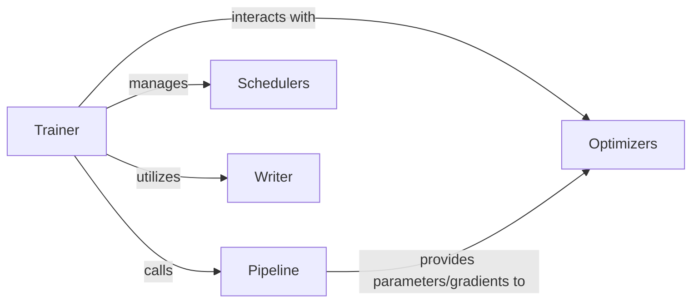

## Details

This subsystem is the core of the `nerfstudio` project's machine learning pipeline, responsible for orchestrating the entire training and evaluation workflow. It connects data handling with the neural rendering engine, manages the optimization process, and handles persistent state management through checkpointing and logging.

### Trainer
The central orchestrator of the training and evaluation loop. It manages the overall iteration control, handles checkpointing, and updates the viewer state. It drives the training process by initiating steps within the `Pipeline`.

**Related Classes/Methods**:

- <a href="https://github.com/autonomousvision/sdfstudio/blob/master/nerfstudio/engine/trainer.py" target="_blank" rel="noopener noreferrer">`nerfstudio/engine/trainer.py`</a>

### Pipeline
Encapsulates the logic for a single forward and backward pass (training step) or a single forward pass (evaluation step). It is responsible for computing losses and metrics based on the model's output and providing gradients for optimization.

**Related Classes/Methods**:

- <a href="https://github.com/autonomousvision/sdfstudio/blob/master/nerfstudio/pipelines/base_pipeline.py" target="_blank" rel="noopener noreferrer">`nerfstudio/pipelines/base_pipeline.py`</a>

### Optimizers
Manages and applies the chosen optimization algorithms (e.g., Adam, SGD) to update the parameters of the neural rendering `Model` based on the gradients computed by the `Pipeline`.

**Related Classes/Methods**:

- <a href="https://github.com/autonomousvision/sdfstudio/blob/master/nerfstudio/engine/optimizers.py" target="_blank" rel="noopener noreferrer">`nerfstudio/engine/optimizers.py`</a>

### Schedulers
Adjusts the learning rates of the `Optimizers` over time according to a predefined schedule (e.g., exponential decay, cosine annealing). This component helps in fine-tuning the training process for better convergence.

**Related Classes/Methods**:

- <a href="https://github.com/autonomousvision/sdfstudio/blob/master/nerfstudio/engine/schedulers.py" target="_blank" rel="noopener noreferrer">`nerfstudio/engine/schedulers.py`</a>

### Writer
Provides functionalities for logging scalar metrics, time-based events, and managing event writers (e.g., Tensorboard, Weights & Biases). It is also responsible for saving and loading model checkpoints, ensuring training progress can be resumed.

**Related Classes/Methods**:

- <a href="https://github.com/autonomousvision/sdfstudio/blob/master/nerfstudio/utils/writer.py" target="_blank" rel="noopener noreferrer">`nerfstudio/utils/writer.py`</a>

### [FAQ](https://github.com/CodeBoarding/GeneratedOnBoardings/tree/main?tab=readme-ov-file#faq)