```mermaid
graph LR
    Command_Line_Interface_CLI_["Command-Line Interface (CLI)"]
    Data_Management["Data Management"]
    Core_Neural_Rendering_Engine["Core Neural Rendering Engine"]
    Training_Optimization["Training & Optimization"]
    Interactive_Viewer["Interactive Viewer"]
    Model_Export_Reconstruction["Model Export & Reconstruction"]
    Command_Line_Interface_CLI_ -- "initiates data processing workflows in" --> Data_Management
    Command_Line_Interface_CLI_ -- "triggers training runs in" --> Training_Optimization
    Command_Line_Interface_CLI_ -- "initiates model export or mesh extraction in" --> Model_Export_Reconstruction
    Command_Line_Interface_CLI_ -- "launches and connects to" --> Interactive_Viewer
    Data_Management -- "provides processed data batches to" --> Core_Neural_Rendering_Engine
    Core_Neural_Rendering_Engine -- "provides model outputs and losses to" --> Training_Optimization
    Training_Optimization -- "updates parameters of" --> Core_Neural_Rendering_Engine
    Training_Optimization -- "sends real-time training progress to" --> Interactive_Viewer
    Training_Optimization -- "triggers model saving and mesh extraction, providing the trained neural field to" --> Model_Export_Reconstruction
    Interactive_Viewer -- "sends camera pose updates to" --> Data_Management
    Interactive_Viewer -- "requests new renders from" --> Core_Neural_Rendering_Engine
    Core_Neural_Rendering_Engine -- "provides the trained neural field to" --> Model_Export_Reconstruction
    click Command_Line_Interface_CLI_ href "https://github.com/CodeBoarding/GeneratedOnBoardings/blob/main/sdfstudio/Command_Line_Interface_CLI_.md" "Details"
    click Data_Management href "https://github.com/CodeBoarding/GeneratedOnBoardings/blob/main/sdfstudio/Data_Management.md" "Details"
    click Core_Neural_Rendering_Engine href "https://github.com/CodeBoarding/GeneratedOnBoardings/blob/main/sdfstudio/Core_Neural_Rendering_Engine.md" "Details"
    click Training_Optimization href "https://github.com/CodeBoarding/GeneratedOnBoardings/blob/main/sdfstudio/Training_Optimization.md" "Details"
    click Interactive_Viewer href "https://github.com/CodeBoarding/GeneratedOnBoardings/blob/main/sdfstudio/Interactive_Viewer.md" "Details"
    click Model_Export_Reconstruction href "https://github.com/CodeBoarding/GeneratedOnBoardings/blob/main/sdfstudio/Model_Export_Reconstruction.md" "Details"
```

## Details

The `sdfstudio` architecture is structured around a central Core Neural Rendering Engine that implicitly represents 3D scenes. User interaction primarily occurs via the Command-Line Interface (CLI), which orchestrates the entire pipeline. Data is prepared by the Data Management component before being fed into the rendering engine. The Training & Optimization component drives the learning process, iteratively refining the engine's parameters. For real-time monitoring and interaction, the Interactive Viewer provides a visual interface, receiving updates from the training process and allowing dynamic scene exploration. Finally, the Model Export & Reconstruction component handles the extraction of 3D meshes and export of trained models, completing the end-to-end workflow. This modular design facilitates the integration of various neural rendering methods and components, making `sdfstudio` a flexible framework for 3D reconstruction research and application.

### Command-Line Interface (CLI) [[Expand]](./Command_Line_Interface_CLI_.md)
The primary user interface for `sdfstudio`, providing entry points for various operations such as training models, rendering scenes, processing data, and exporting results.

**Related Classes/Methods**:

- <a href="https://github.com/autonomousvision/sdfstudio/blob/master/scripts/train.py" target="_blank" rel="noopener noreferrer">`scripts/train.py`</a>
- <a href="https://github.com/autonomousvision/sdfstudio/blob/master/scripts/render.py" target="_blank" rel="noopener noreferrer">`scripts/render.py`</a>
- <a href="https://github.com/autonomousvision/sdfstudio/blob/master/scripts/extract_mesh.py" target="_blank" rel="noopener noreferrer">`scripts/extract_mesh.py`</a>

### Data Management [[Expand]](./Data_Management.md)
Responsible for all aspects of input data handling, from loading and parsing raw data (images, camera poses, 3D points) to structuring it for the neural rendering pipeline, including camera intrinsics/extrinsics and ray generation.

**Related Classes/Methods**:

- <a href="https://github.com/autonomousvision/sdfstudio/blob/master/nerfstudio/data/datamanagers/base_datamanager.py" target="_blank" rel="noopener noreferrer">`nerfstudio/data/datamanagers/base_datamanager.py`</a>
- <a href="https://github.com/autonomousvision/sdfstudio/blob/master/nerfstudio/cameras/cameras.py" target="_blank" rel="noopener noreferrer">`nerfstudio/cameras/cameras.py`</a>
- <a href="https://github.com/autonomousvision/sdfstudio/blob/master/nerfstudio/cameras/rays.py" target="_blank" rel="noopener noreferrer">`nerfstudio/cameras/rays.py`</a>

### Core Neural Rendering Engine [[Expand]](./Core_Neural_Rendering_Engine.md)
The computational core of `sdfstudio`, encapsulating the neural network architectures that implicitly represent the 3D scene (e.g., NeRF, SDF fields), the overall model logic, and the components for sampling points along rays and rendering outputs.

**Related Classes/Methods**:

- <a href="https://github.com/autonomousvision/sdfstudio/blob/master/nerfstudio/models/base_model.py" target="_blank" rel="noopener noreferrer">`nerfstudio/models/base_model.py`</a>
- <a href="https://github.com/autonomousvision/sdfstudio/blob/master/nerfstudio/fields/base_field.py" target="_blank" rel="noopener noreferrer">`nerfstudio/fields/base_field.py`</a>
- <a href="https://github.com/autonomousvision/sdfstudio/blob/master/nerfstudio/model_components/ray_samplers.py" target="_blank" rel="noopener noreferrer">`nerfstudio/model_components/ray_samplers.py`</a>
- <a href="https://github.com/autonomousvision/sdfstudio/blob/master/nerfstudio/model_components/renderers.py" target="_blank" rel="noopener noreferrer">`nerfstudio/model_components/renderers.py`</a>

### Training & Optimization [[Expand]](./Training_Optimization.md)
Orchestrates the entire training and evaluation workflow. It connects data managers with the neural rendering engine, manages the optimization process (optimizers, schedulers), and handles checkpointing and logging.

**Related Classes/Methods**:

- <a href="https://github.com/autonomousvision/sdfstudio/blob/master/nerfstudio/pipelines/base_pipeline.py" target="_blank" rel="noopener noreferrer">`nerfstudio/pipelines/base_pipeline.py`</a>
- <a href="https://github.com/autonomousvision/sdfstudio/blob/master/nerfstudio/engine/trainer.py" target="_blank" rel="noopener noreferrer">`nerfstudio/engine/trainer.py`</a>

### Interactive Viewer [[Expand]](./Interactive_Viewer.md)
Provides a real-time, interactive web-based visualization tool for monitoring training progress, inspecting rendered outputs, and exploring the reconstructed 3D scene. It operates as a client-server application.

**Related Classes/Methods**:

- <a href="https://github.com/autonomousvision/sdfstudio/blob/master/nerfstudio/viewer/server/server.py" target="_blank" rel="noopener noreferrer">`nerfstudio/viewer/server/server.py`</a>
- <a href="https://github.com/autonomousvision/sdfstudio/blob/master/nerfstudio/viewer/server/visualizer.py" target="_blank" rel="noopener noreferrer">`nerfstudio/viewer/server/visualizer.py`</a>

### Model Export & Reconstruction [[Expand]](./Model_Export_Reconstruction.md)
Facilitates the extraction of 3D meshes from trained neural fields (especially SDFs) and the export of models or textured meshes into standard formats for external use.

**Related Classes/Methods**:

- <a href="https://github.com/autonomousvision/sdfstudio/blob/master/nerfstudio/exporter/tsdf_utils.py" target="_blank" rel="noopener noreferrer">`nerfstudio/exporter/tsdf_utils.py`</a>
- <a href="https://github.com/autonomousvision/sdfstudio/blob/master/nerfstudio/exporter/exporter_utils.py" target="_blank" rel="noopener noreferrer">`nerfstudio/exporter/exporter_utils.py`</a>

### [FAQ](https://github.com/CodeBoarding/GeneratedOnBoardings/tree/main?tab=readme-ov-file#faq)