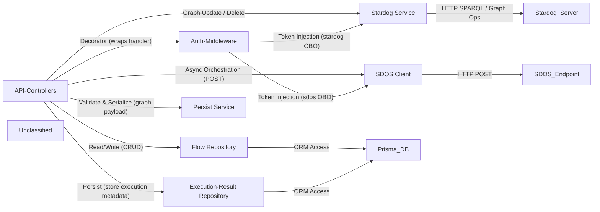

## Details

The Flow‑Orchestration subsystem provides a set of Next.js API routes that act as thin controllers for HTTP requests related to workflow management. Each request is first wrapped by an authentication middleware that validates the Next‑Auth session and injects Azure‑AD OBO tokens for downstream services. Controllers delegate CRUD operations to a Prisma‑based Flow Repository, store execution metadata via an Execution‑Result Repository, validate and serialize graph payloads through a Persist Service, and interact with external systems: the Stardog Service for RDF graph management and the SDOS Client for asynchronous orchestration calls to the Scania Data Orchestration Service. The overall flow is: client → API‑Controller → Auth‑Middleware → (Flow Repository | Execution‑Result Repository | Stardog Service | SDOS Client) → persistence layers (PostgreSQL via Prisma, Stardog RDF store).

### API-Controllers [[Expand]](./API_Controllers.md)
Thin façade for HTTP requests. Parses payloads, validates methods, invokes auth middleware, and delegates work to repositories, services, and external adapters, returning JSON responses.

**Related Classes/Methods**:

- <a href="https://github.com/scania/sdos-orchestration-flow-designer/blob/develop/src/pages/api/flow/[id].ts" target="_blank" rel="noopener noreferrer">`src/pages/api/flow/[id].ts`</a>
- <a href="https://github.com/scania/sdos-orchestration-flow-designer/blob/develop/src/pages/api/flows/index.ts" target="_blank" rel="noopener noreferrer">`src/pages/api/flows/index.ts`</a>
- <a href="https://github.com/scania/sdos-orchestration-flow-designer/blob/develop/src/pages/api/persist/index.ts" target="_blank" rel="noopener noreferrer">`src/pages/api/persist/index.ts`</a>
- <a href="https://github.com/scania/sdos-orchestration-flow-designer/blob/develop/src/pages/api/execute/async.ts" target="_blank" rel="noopener noreferrer">`src/pages/api/execute/async.ts`</a>

### Auth-Middleware
Higher‑order function that extracts the Next‑Auth session, injects Azure‑AD OBO tokens for Stardog and SDOS, and aborts unauthenticated calls.

**Related Classes/Methods**:

- <a href="https://github.com/scania/sdos-orchestration-flow-designer/blob/develop/src/lib/backend/withAuth.ts" target="_blank" rel="noopener noreferrer">`src/lib/backend/withAuth.ts`</a>

### Flow Repository
Prisma‑based data‑access layer that performs CRUD operations on the Flow table (metadata, versioning, draft flag) in PostgreSQL.

**Related Classes/Methods**:

- <a href="https://github.com/scania/sdos-orchestration-flow-designer/blob/develop/src/pages/api/flow/[id].ts" target="_blank" rel="noopener noreferrer">`prisma.flow`</a>
- <a href="https://github.com/scania/sdos-orchestration-flow-designer/blob/develop/src/pages/api/flows/index.ts" target="_blank" rel="noopener noreferrer">`prisma.flow`</a>

### Execution-Result Repository
Prisma‑based repository that stores execution metadata (IRI, result‑graph URI, database, parameters) after an async orchestration request.

**Related Classes/Methods**:

- <a href="https://github.com/scania/sdos-orchestration-flow-designer/blob/develop/src/pages/api/execute/async.ts" target="_blank" rel="noopener noreferrer">`prisma.executionResult`</a>

### Stardog Service
Wrapper around the Stardog JavaScript client; provides methods to fetch classes, update, delete, and retrieve graphs in the external RDF store.

**Related Classes/Methods**:

- <a href="https://github.com/scania/sdos-orchestration-flow-designer/blob/develop/src/services/stardogService.ts" target="_blank" rel="noopener noreferrer">`src/services/stardogService.ts`</a>

### SDOS Client
Inline Axios call that posts orchestration requests to the external Scania Data Orchestration Service (SDOS) endpoint, returning execution IDs and result‑graph information.

**Related Classes/Methods**:

- <a href="https://github.com/scania/sdos-orchestration-flow-designer/blob/develop/src/pages/api/execute/async.ts" target="_blank" rel="noopener noreferrer">`axios.post`</a>

### Persist Service
Utility that validates incoming graph payloads and converts UI state (nodes, edges) into JSON‑LD for storage in Stardog.

**Related Classes/Methods**:

- <a href="https://github.com/scania/sdos-orchestration-flow-designer/blob/develop/src/services/graphSchema.ts" target="_blank" rel="noopener noreferrer">`src/services/graphSchema.ts`</a>

### Unclassified
Component for all unclassified files and utility functions (Utility functions/External Libraries/Dependencies)

**Related Classes/Methods**: _None_

### [FAQ](https://github.com/CodeBoarding/GeneratedOnBoardings/tree/main?tab=readme-ov-file#faq)