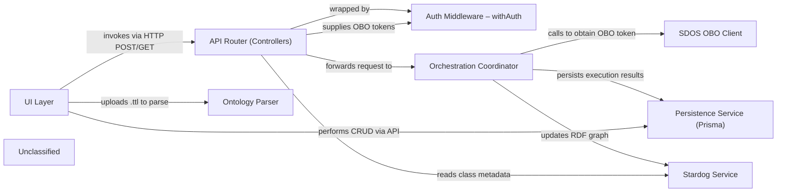

## Details

The SDOS Orchestration Flow Designer subsystem enables users to author, validate, persist and execute IRIS‑Orchestration flows. The front‑end UI (Ofd.tsx) drives the experience, invoking a set of thin Next‑JS API controllers that are wrapped by the withAuth middleware to inject Azure‑AD OBO tokens for Stardog and SDOS. The Orchestration Coordinator (sync/async handlers) orchestrates a run by calling the external SDOS engine via the SDOS OBO client, recording execution metadata in Prisma, and optionally updating the RDF graph through the Stardog Service. Ontology files are parsed by the Ontology Parser endpoint, providing a class hierarchy for UI validation. All flow definitions, parameters and execution results are persisted via the Prisma schema, forming a clear, high‑level flow from UI → API → Auth → Coordinator → (SDOS, Prisma, Stardog) with auxiliary support from the Ontology Parser.

### UI Layer
React/Next‑JS page that renders the flow‑designer canvas, calls back‑end APIs, and shows validation / toast feedback.

**Related Classes/Methods**:

- <a href="https://github.com/scania/sdos-orchestration-flow-designer/blob/develop/src/pages/ofd/Ofd.tsx" target="_blank" rel="noopener noreferrer">`src/pages/ofd/Ofd.tsx`</a>

### API Router (Controllers)
Thin Next‑JS API façade; each file validates the request, extracts the auth context (via withAuth) and forwards to the domain services.

**Related Classes/Methods**:

- <a href="https://github.com/scania/sdos-orchestration-flow-designer/blob/develop/src/pages/api/execute/sync.ts" target="_blank" rel="noopener noreferrer">`src/pages/api/execute/sync.ts`</a>
- <a href="https://github.com/scania/sdos-orchestration-flow-designer/blob/develop/src/pages/api/execute/async.ts" target="_blank" rel="noopener noreferrer">`src/pages/api/execute/async.ts`</a>
- <a href="https://github.com/scania/sdos-orchestration-flow-designer/blob/develop/src/pages/api/generate-context/index.ts" target="_blank" rel="noopener noreferrer">`src/pages/api/generate-context/index.ts`</a>
- <a href="https://github.com/scania/sdos-orchestration-flow-designer/blob/develop/src/pages/api/parse-ttl/index.ts" target="_blank" rel="noopener noreferrer">`src/pages/api/parse-ttl/index.ts`</a>
- <a href="https://github.com/scania/sdos-orchestration-flow-designer/blob/develop/src/pages/api/persist/index.ts" target="_blank" rel="noopener noreferrer">`src/pages/api/persist/index.ts`</a>
- <a href="https://github.com/scania/sdos-orchestration-flow-designer/blob/develop/src/pages/api/flows/index.ts" target="_blank" rel="noopener noreferrer">`src/pages/api/flows/index.ts`</a>
- <a href="https://github.com/scania/sdos-orchestration-flow-designer/blob/develop/src/pages/api/flow/[id].ts" target="_blank" rel="noopener noreferrer">`src/pages/api/flow/[id].ts`</a>
- <a href="https://github.com/scania/sdos-orchestration-flow-designer/blob/develop/src/pages/api/parameter/index.ts" target="_blank" rel="noopener noreferrer">`src/pages/api/parameter/index.ts`</a>

### Auth Middleware – withAuth
Wraps every controller, obtains Azure‑AD OBO tokens (Stardog + SDOS) and injects them into the request‑handling context (AuthContext).

**Related Classes/Methods**:

- <a href="https://github.com/scania/sdos-orchestration-flow-designer/blob/develop/src/lib/backend/withAuth.ts" target="_blank" rel="noopener noreferrer">`src/lib/backend/withAuth.ts`</a>

### Orchestration Coordinator
Business‑logic service that receives a run request, calls the SDOS OBO client, persists execution results (Prisma), and updates the Stardog graph when needed.

**Related Classes/Methods**:

- <a href="https://github.com/scania/sdos-orchestration-flow-designer/blob/develop/src/pages/api/execute/sync.ts" target="_blank" rel="noopener noreferrer">`src/pages/api/execute/sync.ts`</a>
- <a href="https://github.com/scania/sdos-orchestration-flow-designer/blob/develop/src/pages/api/execute/async.ts" target="_blank" rel="noopener noreferrer">`src/pages/api/execute/async.ts`</a>

### Stardog Service
Low‑level adapter around the Stardog JS client; provides fetchClasses, updateGraph, deleteGraph, fetchResultGraph, deleteResultGraph.

**Related Classes/Methods**:

- <a href="https://github.com/scania/sdos-orchestration-flow-designer/blob/develop/src/services/stardogService.ts" target="_blank" rel="noopener noreferrer">`src/services/stardogService.ts`</a>

### SDOS OBO Client
Retrieves an OBO token for the SDOS orchestration engine (getSDOSOBOToken).

**Related Classes/Methods**:

- <a href="https://github.com/scania/sdos-orchestration-flow-designer/blob/develop/src/lib/backend/sdosOBO.ts" target="_blank" rel="noopener noreferrer">`src/lib/backend/sdosOBO.ts`</a>

### Persistence Service (Prisma)
Defines the relational schema (flow metadata, execution results, parameters) and is used via the generated Prisma client.

**Related Classes/Methods**:

- <a href="https://github.com/scania/sdos-orchestration-flow-designer/blob/develop/prisma/schema.prisma" target="_blank" rel="noopener noreferrer">`prisma/schema.prisma`</a>

### Ontology Parser
Parses a supplied .ttl file, builds an in‑memory class‑hierarchy and returns it to the UI (used by the Generate‑Context controller).

**Related Classes/Methods**:

- <a href="https://github.com/scania/sdos-orchestration-flow-designer/blob/develop/src/pages/api/parse-ttl/index.ts" target="_blank" rel="noopener noreferrer">`src/pages/api/parse-ttl/index.ts`</a>

### Unclassified
Component for all unclassified files and utility functions (Utility functions/External Libraries/Dependencies)

**Related Classes/Methods**: _None_

### [FAQ](https://github.com/CodeBoarding/GeneratedOnBoardings/tree/main?tab=readme-ov-file#faq)