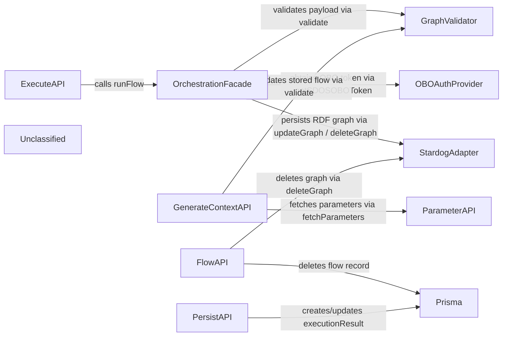

## Details

The system orchestrates execution of JSON‑LD defined flows by coordinating several thin services. An HTTP request hits ExecuteAPI, which authenticates the user, obtains an Azure AD On‑Behalf‑Of token via OBOAuthProvider, and forwards the payload to OrchestrationFacade. The facade validates the flow definition using GraphValidator, invokes the SDOS run‑flow endpoint, and persists the resulting RDF graph in Stardog through StardogAdapter. Supporting APIs assemble execution context (GenerateContextAPI) by merging stored flow data (validated by GraphValidator) with runtime parameters fetched from ParameterAPI, manage flow CRUD (FlowAPI) and clean up associated graphs, and record execution metadata in PostgreSQL via Prisma (PersistAPI). External services (Azure AD, Stardog, Prisma) are treated as dependencies, keeping domain components focused on orchestration logic.

### GraphValidator
Provides a Zod schema (graphSave) to validate JSON‑LD flow definitions before any orchestration step.

**Related Classes/Methods**:

- <a href="https://github.com/scania/sdos-orchestration-flow-designer/blob/develop/src/services/graphSchema.ts" target="_blank" rel="noopener noreferrer">`src/services/graphSchema.GraphValidator`</a>

### StardogAdapter
Wraps the Stardog HTTP API to create, update, delete RDF graphs, convert JSON‑LD to N‑Quads, and run SPARQL queries.

**Related Classes/Methods**:

- <a href="https://github.com/scania/sdos-orchestration-flow-designer/blob/develop/src/services/stardogService.ts" target="_blank" rel="noopener noreferrer">`src/services/stardogService.StardogAdapter`</a>

### OBOAuthProvider
Performs Azure‑AD On‑Behalf‑Of token exchange and caches the bearer token for SDOS calls.

**Related Classes/Methods**:

- <a href="https://github.com/scania/sdos-orchestration-flow-designer/blob/develop/src/lib/backend/sdosOBO.ts" target="_blank" rel="noopener noreferrer">`src/lib/backend/sdosOBO.OBOAuthProvider`</a>

### OrchestrationFacade
Coordinates validation, token acquisition, SDOS run‑flow invocation, and RDF persistence; the core use‑case driver.

**Related Classes/Methods**:

- `src/lib/backend/orchestrationFacade.OrchestrationFacade`

### ExecuteAPI
HTTP entry point (POST /api/execute/async) that extracts the user session, streams logs, and records execution metadata via Prisma.

**Related Classes/Methods**:

- <a href="https://github.com/scania/sdos-orchestration-flow-designer/blob/develop/src/pages/api/execute/async.ts" target="_blank" rel="noopener noreferrer">`src/pages/api/execute/async.ExecuteAPI`</a>

### GenerateContextAPI
Builds the execution context for SDOS by validating stored flow definitions and merging runtime parameters.

**Related Classes/Methods**:

- <a href="https://github.com/scania/sdos-orchestration-flow-designer/blob/develop/src/pages/api/generate-context/index.ts" target="_blank" rel="noopener noreferrer">`src/pages/api/generate-context/index.GenerateContextAPI`</a>

### FlowAPI
Provides CRUD operations for a single flow definition; on deletion removes the Prisma record and calls StardogAdapter to delete the associated RDF graph.

**Related Classes/Methods**:

- <a href="https://github.com/scania/sdos-orchestration-flow-designer/blob/develop/src/pages/api/flow/[id].ts" target="_blank" rel="noopener noreferrer">`src/pages/api/flow/[id].FlowAPI`</a>

### PersistAPI
Persists execution logs, status and result metadata in PostgreSQL via Prisma; consumed by ExecuteAPI for streaming logs.

**Related Classes/Methods**:

- <a href="https://github.com/scania/sdos-orchestration-flow-designer/blob/develop/src/pages/api/persist/index.ts" target="_blank" rel="noopener noreferrer">`src/pages/api/persist/index.PersistAPI`</a>

### ParameterAPI
CRUD service for flow parameters; used by GenerateContextAPI to fetch runtime parameters.

**Related Classes/Methods**:

- <a href="https://github.com/scania/sdos-orchestration-flow-designer/blob/develop/src/pages/api/parameters/index.ts" target="_blank" rel="noopener noreferrer">`src/pages/api/parameters/index.ParameterAPI`</a>

### Unclassified
Component for all unclassified files and utility functions (Utility functions/External Libraries/Dependencies)

**Related Classes/Methods**: _None_

### [FAQ](https://github.com/CodeBoarding/GeneratedOnBoardings/tree/main?tab=readme-ov-file#faq)