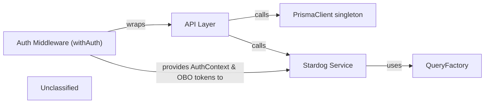

## Details

The Data‑Access & Orchestration Subsystem provides persistence, authentication, and graph‑store orchestration for the Flow Designer UI. A singleton PrismaClient supplies PostgreSQL CRUD for flows, parameters, execution results and users. All public HTTP endpoints reside in the Next.js API Layer, each wrapped by the Auth Middleware which extracts the Next‑Auth session and OBO tokens, injecting an AuthContext into handlers. Handlers validate requests, use helper utilities, and either perform relational data operations via PrismaClient or orchestrate RDF‑graph actions through the Stardog Service. The Stardog Service is a thin adapter that executes SPARQL queries generated by the QueryFactory. This separation of authentication, API orchestration, relational persistence, and RDF‑graph interaction yields a clear, testable architecture.

### PrismaClient singleton
Singleton instance of PrismaClient providing CRUD access to PostgreSQL tables for flows, parameters, execution results, and users.

**Related Classes/Methods**:

- <a href="https://github.com/scania/sdos-orchestration-flow-designer/blob/develop/src/lib/prisma.ts" target="_blank" rel="noopener noreferrer">`src/lib/prisma`</a>

### Auth Middleware (withAuth)
Facade/context provider that wraps each API handler, extracts the Next‑Auth session, obtains OBO tokens, and injects an AuthContext for downstream services.

**Related Classes/Methods**:

- <a href="https://github.com/scania/sdos-orchestration-flow-designer/blob/develop/src/lib/backend/withAuth.ts" target="_blank" rel="noopener noreferrer">`src/lib/backend/withAuth`</a>

### API Layer
Collection of Next.js API route handlers (flows, parameters, execute‑result, generate‑context) that implement the business logic, validate requests, and coordinate persistence and graph‑store actions.

**Related Classes/Methods**:

- <a href="https://github.com/scania/sdos-orchestration-flow-designer/blob/develop/src/pages/api" target="_blank" rel="noopener noreferrer">`src/pages/api`</a>

### Stardog Service
Adapter that opens a connection to the Stardog RDF store, executes SPARQL queries (SELECT, CONSTRUCT, INSERT, DROP, CLEAR) and handles JSON‑LD to N‑Quads conversion.

**Related Classes/Methods**:

- <a href="https://github.com/scania/sdos-orchestration-flow-designer/blob/develop/src/services/stardogService.ts" target="_blank" rel="noopener noreferrer">`src/services/stardogService`</a>

### QueryFactory
Utility builder that provides static methods returning ready‑to‑run SPARQL strings for various operations (drop graph, insert data, fetch classes, result graph, delete result graph).

**Related Classes/Methods**:

- <a href="https://github.com/scania/sdos-orchestration-flow-designer/blob/develop/src/queryFactory.ts" target="_blank" rel="noopener noreferrer">`src/queryFactory`</a>

### Unclassified
Component for all unclassified files and utility functions (Utility functions/External Libraries/Dependencies)

**Related Classes/Methods**: _None_

### [FAQ](https://github.com/CodeBoarding/GeneratedOnBoardings/tree/main?tab=readme-ov-file#faq)