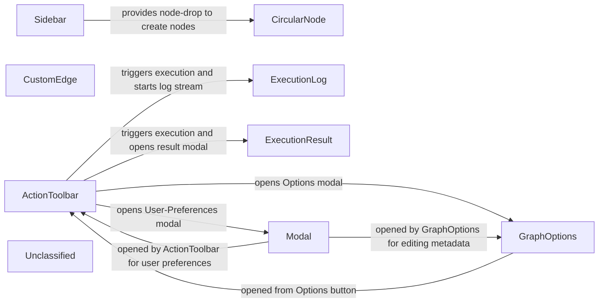

## Details

The Graph‑Designer UI subsystem, located under `src/components/`, provides a set of focused React components that together enable a user to compose, configure, execute and inspect a knowledge‑graph workflow. The top‑level ActionToolbar offers navigation and primary commands (Execute, Save, Options, User‑Preferences), opening modals such as GraphOptions and a generic Modal. The Sidebar supplies a palette of node types that can be dragged onto the canvas, where CircularNode and CustomEdge render the visual graph elements. Execution of the graph is triggered from the toolbar; the surrounding page streams real‑time logs to ExecutionLog and displays the final outcome in ExecutionResult. All components are stateless UI widgets that receive data via props and emit events through callbacks, keeping the architecture simple and diagram‑friendly.

### ActionToolbar
Provides the top‑level command bar (back navigation, Execute, Save Draft/Save, Options and User‑Preferences). It opens modal dialogs and forwards user intents to the surrounding page (or to a global UI‑state store).

**Related Classes/Methods**:

- <a href="https://github.com/scania/sdos-orchestration-flow-designer/blob/develop/src/components/ActionToolbar/ActionToolbar.tsx" target="_blank" rel="noopener noreferrer">`ActionToolbar`</a>

### GraphOptions
Modal that lets the user edit graph metadata (title, description, author). It is a pure presentational component; the values are supplied by the page and any changes are persisted by the page’s save‑handler.

**Related Classes/Methods**:

- <a href="https://github.com/scania/sdos-orchestration-flow-designer/blob/develop/src/components/GraphOptions/GraphOptions.tsx" target="_blank" rel="noopener noreferrer">`GraphOptions`</a>

### CircularNode
Renders a single node as a circle, shows its label, status badge and action icons. Emits drag‑start / drag‑end and click events that bubble up to the canvas (or to a UI‑state store).

**Related Classes/Methods**:

- <a href="https://github.com/scania/sdos-orchestration-flow-designer/blob/develop/src/components/CircularNode.tsx/index.tsx" target="_blank" rel="noopener noreferrer">`CircularNode`</a>

### CustomEdge
Draws a curved edge between two nodes, displays optional labels, and handles hover / click events. It is a pure visual component that notifies its parent about edge‑level interactions.

**Related Classes/Methods**:

- <a href="https://github.com/scania/sdos-orchestration-flow-designer/blob/develop/src/components/CustomEdge/CustomEdge.js#L15-L37" target="_blank" rel="noopener noreferrer">`CustomEdge`:15-37</a>

### ExecutionLog
Sidebar panel that streams real‑time execution logs (stdout, errors, step‑by‑step messages). The page supplies the log data (via a WebSocket / SSE subscription) and the component simply renders it.

**Related Classes/Methods**:

- <a href="https://github.com/scania/sdos-orchestration-flow-designer/blob/develop/src/components/ExecutionLog/ExecutionLog.tsx" target="_blank" rel="noopener noreferrer">`ExecutionLog`</a>

### ExecutionResult
Modal that shows the final result of a synchronous execution (graph URI, status, returned data). It is opened by the Execute callback once the API response arrives.

**Related Classes/Methods**:

- <a href="https://github.com/scania/sdos-orchestration-flow-designer/blob/develop/src/components/ExecutionResult/ExecutionResult.tsx" target="_blank" rel="noopener noreferrer">`ExecutionResult`</a>

### Sidebar
Hosts the Palette‑like list of available node types. Users drag items from here onto the canvas to create new nodes.

**Related Classes/Methods**:

- <a href="https://github.com/scania/sdos-orchestration-flow-designer/blob/develop/src/components/Sidebar/Sidebar.tsx" target="_blank" rel="noopener noreferrer">`Sidebar`</a>

### Modal
Generic reusable modal wrapper used by ActionToolbar (User‑Preferences) and any other component that needs a dialog.

**Related Classes/Methods**:

- <a href="https://github.com/scania/sdos-orchestration-flow-designer/blob/develop/src/components/Modal/CustomModal.tsx" target="_blank" rel="noopener noreferrer">`Modal`</a>

### Unclassified
Component for all unclassified files and utility functions (Utility functions/External Libraries/Dependencies)

**Related Classes/Methods**: _None_

### [FAQ](https://github.com/CodeBoarding/GeneratedOnBoardings/tree/main?tab=readme-ov-file#faq)