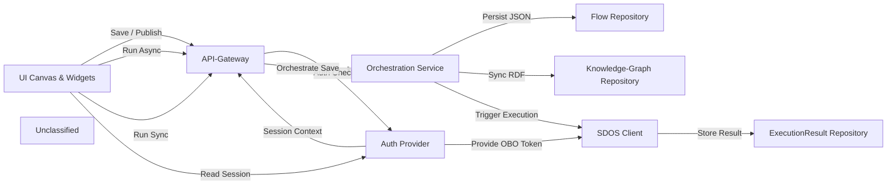

## Details

The SDOS Orchestration Flow Designer provides an interactive front‑end where users build workflow graphs using a React‑Flow canvas. User actions on the canvas trigger HTTP calls to a thin API‑gateway, which first passes through an authentication layer that validates Azure‑AD sessions and supplies OBO tokens. The orchestration service validates the graph, serialises it to JSON‑LD, and persists the data both as raw JSON in a Prisma‑backed flow repository and as RDF in a Stardog knowledge‑graph repository. Execution requests are forwarded to an external Scania Data Orchestration Service (SDOS) via a lightweight Axios client, and the results are stored back in Prisma. The overall flow is a clear, directed data pipeline: UI → API → Auth → Orchestration → (Prisma ↔ Stardog) → SDOS, with each step represented by a distinct component and well‑named interactions.

### UI Canvas & Widgets
Front‑end React‑Flow canvas and supporting widgets that allow users to drag‑and‑drop nodes, create connections, and trigger save or execution actions.

**Related Classes/Methods**:

- <a href="https://github.com/scania/sdos-orchestration-flow-designer/blob/develop/src/pages/ofd/Ofd.tsx" target="_blank" rel="noopener noreferrer">`src/pages/ofd/Ofd.tsx`</a>
- <a href="https://github.com/scania/sdos-orchestration-flow-designer/blob/develop/src/components/CustomEdge/CustomEdge.js" target="_blank" rel="noopener noreferrer">`src/components/CustomEdge/CustomEdge.js`</a>
- <a href="https://github.com/scania/sdos-orchestration-flow-designer/blob/develop/src/components/ConnectionLine/ConnectionLine.tsx" target="_blank" rel="noopener noreferrer">`src/components/ConnectionLine/ConnectionLine.tsx`</a>
- <a href="https://github.com/scania/sdos-orchestration-flow-designer/blob/develop/src/components/CircularNode.tsx/index.tsx" target="_blank" rel="noopener noreferrer">`src/components/CircularNode.tsx/index.tsx`</a>
- <a href="https://github.com/scania/sdos-orchestration-flow-designer/blob/develop/src/components/ActionToolbar/ActionToolbar.tsx" target="_blank" rel="noopener noreferrer">`src/components/ActionToolbar/ActionToolbar.tsx`</a>
- <a href="https://github.com/scania/sdos-orchestration-flow-designer/blob/develop/src/components/Sidebar/Sidebar.tsx" target="_blank" rel="noopener noreferrer">`src/components/Sidebar/Sidebar.tsx`</a>

### Auth Provider
Authentication layer using NextAuth and a server‑side wrapper that extracts the session, builds a JWT, and injects OBO tokens for downstream services.

**Related Classes/Methods**:

- <a href="https://github.com/scania/sdos-orchestration-flow-designer/blob/develop/src/pages/api/auth/[...nextauth].ts" target="_blank" rel="noopener noreferrer">`src/pages/api/auth/[...nextauth].ts`</a>
- <a href="https://github.com/scania/sdos-orchestration-flow-designer/blob/develop/src/lib/backend/withAuth.ts" target="_blank" rel="noopener noreferrer">`src/lib/backend/withAuth.ts`</a>

### API‑Gateway
Thin REST façade exposing routes for persisting flows and triggering synchronous or asynchronous execution; each route validates the request, invokes the auth wrapper, and forwards to domain services.

**Related Classes/Methods**:

- <a href="https://github.com/scania/sdos-orchestration-flow-designer/blob/develop/src/pages/api/persist/index.ts" target="_blank" rel="noopener noreferrer">`src/pages/api/persist/index.ts`</a>
- <a href="https://github.com/scania/sdos-orchestration-flow-designer/blob/develop/src/pages/api/flows/index.ts" target="_blank" rel="noopener noreferrer">`src/pages/api/flows/index.ts`</a>
- <a href="https://github.com/scania/sdos-orchestration-flow-designer/blob/develop/src/pages/api/execute/async.ts" target="_blank" rel="noopener noreferrer">`src/pages/api/execute/async.ts`</a>
- <a href="https://github.com/scania/sdos-orchestration-flow-designer/blob/develop/src/pages/api/execute/sync.ts" target="_blank" rel="noopener noreferrer">`src/pages/api/execute/sync.ts`</a>

### Orchestration Service
Coordinates graph validation, JSON‑LD generation, and persistence to both the Prisma flow repository and the Stardog knowledge‑graph repository.

**Related Classes/Methods**:

- <a href="https://github.com/scania/sdos-orchestration-flow-designer/blob/develop/src/pages/api/persist/index.ts" target="_blank" rel="noopener noreferrer">`src/pages/api/persist/index.ts`</a>
- <a href="https://github.com/scania/sdos-orchestration-flow-designer/blob/develop/src/services/graphSchema.ts" target="_blank" rel="noopener noreferrer">`src/services/graphSchema.ts`</a>
- <a href="https://github.com/scania/sdos-orchestration-flow-designer/blob/develop/src/utils/index.ts" target="_blank" rel="noopener noreferrer">`src/utils/index.ts`</a>

### Flow Repository
Prisma‑backed storage for raw JSON graph state; implements simple upsert logic (find‑first → update / create).

**Related Classes/Methods**:

- <a href="https://github.com/scania/sdos-orchestration-flow-designer/blob/develop/src/pages/api/persist/index.ts" target="_blank" rel="noopener noreferrer">`src/pages/api/persist/index.ts`</a>

### Knowledge‑Graph Repository
Abstraction over Stardog RDF store; provides a single `updateGraph` call to persist generated JSON‑LD as RDF.

**Related Classes/Methods**:

- <a href="https://github.com/scania/sdos-orchestration-flow-designer/blob/develop/src/services/stardogService.ts" target="_blank" rel="noopener noreferrer">`src/services/stardogService.ts`</a>

### SDOS Client
Thin Axios wrapper that forwards execution requests to the external Scania Data Orchestration Service, handling OBO token injection and result recording.

**Related Classes/Methods**:

- <a href="https://github.com/scania/sdos-orchestration-flow-designer/blob/develop/src/pages/api/execute/async.ts" target="_blank" rel="noopener noreferrer">`src/pages/api/execute/async.ts`</a>
- <a href="https://github.com/scania/sdos-orchestration-flow-designer/blob/develop/src/pages/api/execute/sync.ts" target="_blank" rel="noopener noreferrer">`src/pages/api/execute/sync.ts`</a>
- <a href="https://github.com/scania/sdos-orchestration-flow-designer/blob/develop/src/lib/backend/sdosOBO.ts" target="_blank" rel="noopener noreferrer">`src/lib/backend/sdosOBO.ts`</a>

### ExecutionResult Repository
Prisma table that stores the outcome of asynchronous execution calls.

**Related Classes/Methods**: _None_

### Unclassified
Component for all unclassified files and utility functions (Utility functions/External Libraries/Dependencies)

**Related Classes/Methods**: _None_

### [FAQ](https://github.com/CodeBoarding/GeneratedOnBoardings/tree/main?tab=readme-ov-file#faq)