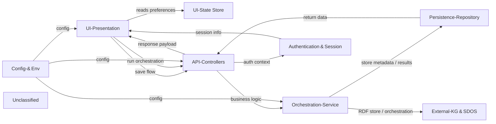

## Details

The SDOS Orchestration Flow Designer follows a clean, layered architecture. The React UI‑Presentation layer renders the graph canvas, nodes, edges and execution logs, pulling UI preferences from a persisted Zustand UI‑State Store. User actions (save, execute) are sent to thin Next.js API‑Controllers, which first run through the Authentication & Session middleware (Azure AD + OBO token injection). Controllers delegate to the Orchestration‑Service, where the graph payload is validated against a Zod schema (graphSchema.ts) and then either persisted in the relational Persistence‑Repository (Prisma) or pushed to the external Stardog RDF store via stardogService.ts. Asynchronous orchestration requests are forwarded to the SDOS engine using an OBO token obtained from sdosOBO.ts. All external‑system interactions are encapsulated in the External‑KG & SDOS services, keeping the core domain logic independent of third‑party APIs. Configuration and runtime environment validation are performed by src/lib/env.js and the top‑level validateEnv.js. Logging (src/lib/logger.js) is woven throughout for observability. This separation of concerns yields a clear, arrow‑driven data flow that can be directly mapped to a high‑level flow‑graph diagram.

### UI‑Presentation [[Expand]](./UI_Presentation.md)
React/Next.js SPA components that render the graph canvas, nodes, edges, toolbars and execution logs, receiving data via props or the UI‑State Store.

**Related Classes/Methods**:

- <a href="https://github.com/scania/sdos-orchestration-flow-designer/blob/develop/src/components/CustomEdge/CustomEdge.js" target="_blank" rel="noopener noreferrer">`src/components/CustomEdge/CustomEdge.js`</a>
- <a href="https://github.com/scania/sdos-orchestration-flow-designer/blob/develop/src/components/CircularNode.tsx/index.tsx" target="_blank" rel="noopener noreferrer">`src/components/CircularNode.tsx/index.tsx`</a>
- <a href="https://github.com/scania/sdos-orchestration-flow-designer/blob/develop/src/components/ActionToolbar/ActionToolbar.tsx" target="_blank" rel="noopener noreferrer">`src/components/ActionToolbar/ActionToolbar.tsx`</a>
- <a href="https://github.com/scania/sdos-orchestration-flow-designer/blob/develop/src/components/ExecutionLog/ExecutionLog.tsx" target="_blank" rel="noopener noreferrer">`src/components/ExecutionLog/ExecutionLog.tsx`</a>

### UI‑State Store
Zustand store that holds UI‑wide preferences such as connection type and double‑click mode, persisted in localStorage.

**Related Classes/Methods**:

- <a href="https://github.com/scania/sdos-orchestration-flow-designer/blob/develop/src/store/userPreferencesStore.ts" target="_blank" rel="noopener noreferrer">`src/store/userPreferencesStore.ts`</a>

### API‑Controllers [[Expand]](./API_Controllers.md)
Next.js API route handlers that validate requests, apply authentication middleware, and delegate business logic to the Orchestration‑Service.

**Related Classes/Methods**:

- <a href="https://github.com/scania/sdos-orchestration-flow-designer/blob/develop/src/pages/api/flow/[id].ts" target="_blank" rel="noopener noreferrer">`src/pages/api/flow/[id].ts`</a>
- <a href="https://github.com/scania/sdos-orchestration-flow-designer/blob/develop/src/pages/api/execute/async.ts" target="_blank" rel="noopener noreferrer">`src/pages/api/execute/async.ts`</a>
- <a href="https://github.com/scania/sdos-orchestration-flow-designer/blob/develop/src/pages/api/persist/index.ts" target="_blank" rel="noopener noreferrer">`src/pages/api/persist/index.ts`</a>
- <a href="https://github.com/scania/sdos-orchestration-flow-designer/blob/develop/src/pages/api/flows/index.ts" target="_blank" rel="noopener noreferrer">`src/pages/api/flows/index.ts`</a>

### Orchestration‑Service [[Expand]](./Orchestration_Service.md)
Core domain layer that validates graph payloads with Zod, interacts with the Stardog RDF store, and obtains OBO tokens for SDOS orchestration.

**Related Classes/Methods**:

- <a href="https://github.com/scania/sdos-orchestration-flow-designer/blob/develop/src/services/graphSchema.ts" target="_blank" rel="noopener noreferrer">`src/services/graphSchema.ts`</a>
- <a href="https://github.com/scania/sdos-orchestration-flow-designer/blob/develop/src/services/stardogService.ts" target="_blank" rel="noopener noreferrer">`src/services/stardogService.ts`</a>
- <a href="https://github.com/scania/sdos-orchestration-flow-designer/blob/develop/src/lib/backend/sdosOBO.ts" target="_blank" rel="noopener noreferrer">`src/lib/backend/sdosOBO.ts`</a>

### Persistence‑Repository [[Expand]](./Persistence_Repository.md)
Prisma‑based data‑access layer that defines the relational schema and provides a singleton client for CRUD operations on flow metadata and execution results.

**Related Classes/Methods**:

- <a href="https://github.com/scania/sdos-orchestration-flow-designer/blob/develop/prisma/schema.prisma" target="_blank" rel="noopener noreferrer">`prisma/schema.prisma`</a>
- <a href="https://github.com/scania/sdos-orchestration-flow-designer/blob/develop/src/lib/prisma.ts" target="_blank" rel="noopener noreferrer">`src/lib/prisma.ts`</a>

### Authentication & Session
Next‑Auth configuration for Azure AD, plus custom middleware that injects OBO tokens into request context for downstream services.

**Related Classes/Methods**:

- <a href="https://github.com/scania/sdos-orchestration-flow-designer/blob/develop/src/pages/api/auth/[...nextauth].ts" target="_blank" rel="noopener noreferrer">`src/pages/api/auth/[...nextauth].ts`</a>
- <a href="https://github.com/scania/sdos-orchestration-flow-designer/blob/develop/src/pages/api/auth/stardog.ts" target="_blank" rel="noopener noreferrer">`src/pages/api/auth/stardog.ts`</a>
- <a href="https://github.com/scania/sdos-orchestration-flow-designer/blob/develop/src/lib/backend/withAuth.ts" target="_blank" rel="noopener noreferrer">`src/lib/backend/withAuth.ts`</a>

### External‑KG & SDOS [[Expand]](./External_KG_SDOS.md)
Service layer that encapsulates all interactions with the external Stardog RDF store and the SDOS orchestration engine, re‑using the same implementations as the Orchestration‑Service.

**Related Classes/Methods**:

- <a href="https://github.com/scania/sdos-orchestration-flow-designer/blob/develop/src/services/stardogService.ts" target="_blank" rel="noopener noreferrer">`src/services/stardogService.ts`</a>
- <a href="https://github.com/scania/sdos-orchestration-flow-designer/blob/develop/src/lib/backend/sdosOBO.ts" target="_blank" rel="noopener noreferrer">`src/lib/backend/sdosOBO.ts`</a>

### Config‑& Env
Utility modules that load, validate, and expose environment variables at runtime, and provide a logger for observability.

**Related Classes/Methods**:

- <a href="https://github.com/scania/sdos-orchestration-flow-designer/blob/develop/src/lib/env.js" target="_blank" rel="noopener noreferrer">`src/lib/env.js`</a>
- <a href="https://github.com/scania/sdos-orchestration-flow-designer/blob/develop/validateEnv.js" target="_blank" rel="noopener noreferrer">`validateEnv.js`</a>
- <a href="https://github.com/scania/sdos-orchestration-flow-designer/blob/develop/src/lib/logger.js" target="_blank" rel="noopener noreferrer">`src/lib/logger.js`</a>

### Unclassified
Component for all unclassified files and utility functions (Utility functions/External Libraries/Dependencies)

**Related Classes/Methods**: _None_

### [FAQ](https://github.com/CodeBoarding/GeneratedOnBoardings/tree/main?tab=readme-ov-file#faq)