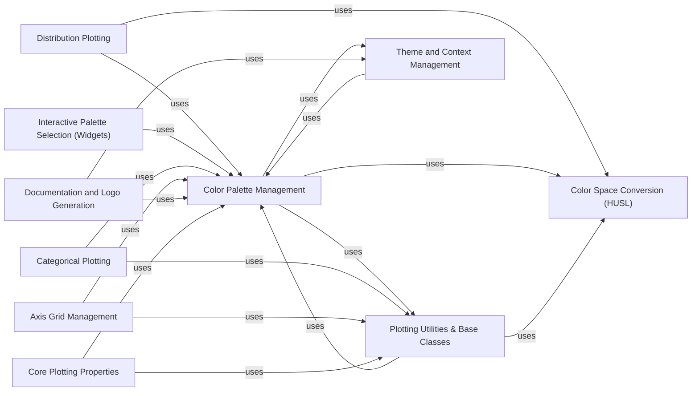

## Component Details

The Color & Style Management subsystem in Seaborn is responsible for the comprehensive handling of visual aesthetics, primarily focusing on color palettes and stylistic elements for data visualization. Its main flow involves generating diverse color palettes, converting colors between various color spaces (notably HUSL for perceptual uniformity), and applying these styles consistently across different plot types. The purpose of this subsystem is to provide a flexible and robust framework for users to control the visual appearance of their plots, ensuring both aesthetic appeal and effective communication of data.

### Color Palette Management
This component is responsible for generating, manipulating, and managing color palettes within Seaborn. It provides functions to create various types of palettes (e.g., HLS, HUSL, sequential, diverging, blended) and integrates with Matplotlib's color cycle. It also includes a context manager for temporary palette changes.

**Related Classes/Methods**:

- <a href="https://github.com/mwaskom/seaborn/blob/master/seaborn/palettes.py#L122-L255" target="_blank" rel="noopener noreferrer">`seaborn.seaborn.palettes.color_palette` (122:255)</a>
- <a href="https://github.com/mwaskom/seaborn/blob/master/seaborn/palettes.py#L258-L309" target="_blank" rel="noopener noreferrer">`seaborn.seaborn.palettes.hls_palette` (258:309)</a>
- <a href="https://github.com/mwaskom/seaborn/blob/master/seaborn/palettes.py#L312-L363" target="_blank" rel="noopener noreferrer">`seaborn.seaborn.palettes.husl_palette` (312:363)</a>
- <a href="https://github.com/mwaskom/seaborn/blob/master/seaborn/palettes.py#L366-L417" target="_blank" rel="noopener noreferrer">`seaborn.seaborn.palettes.mpl_palette` (366:417)</a>
- <a href="https://github.com/mwaskom/seaborn/blob/master/seaborn/palettes.py#L433-L481" target="_blank" rel="noopener noreferrer">`seaborn.seaborn.palettes.dark_palette` (433:481)</a>
- <a href="https://github.com/mwaskom/seaborn/blob/master/seaborn/palettes.py#L484-L529" target="_blank" rel="noopener noreferrer">`seaborn.seaborn.palettes.light_palette` (484:529)</a>
- <a href="https://github.com/mwaskom/seaborn/blob/master/seaborn/palettes.py#L532-L578" target="_blank" rel="noopener noreferrer">`seaborn.seaborn.palettes.diverging_palette` (532:578)</a>
- <a href="https://github.com/mwaskom/seaborn/blob/master/seaborn/palettes.py#L581-L609" target="_blank" rel="noopener noreferrer">`seaborn.seaborn.palettes.blend_palette` (581:609)</a>
- <a href="https://github.com/mwaskom/seaborn/blob/master/seaborn/palettes.py#L612-L635" target="_blank" rel="noopener noreferrer">`seaborn.seaborn.palettes.xkcd_palette` (612:635)</a>
- <a href="https://github.com/mwaskom/seaborn/blob/master/seaborn/palettes.py#L638-L662" target="_blank" rel="noopener noreferrer">`seaborn.seaborn.palettes.crayon_palette` (638:662)</a>
- <a href="https://github.com/mwaskom/seaborn/blob/master/seaborn/palettes.py#L665-L761" target="_blank" rel="noopener noreferrer">`seaborn.seaborn.palettes.cubehelix_palette` (665:761)</a>
- <a href="https://github.com/mwaskom/seaborn/blob/master/seaborn/palettes.py#L61-L91" target="_blank" rel="noopener noreferrer">`seaborn.seaborn.palettes._ColorPalette` (61:91)</a>
- <a href="https://github.com/mwaskom/seaborn/blob/master/seaborn/palettes.py#L420-L430" target="_blank" rel="noopener noreferrer">`seaborn.seaborn.palettes._color_to_rgb` (420:430)</a>
- <a href="https://github.com/mwaskom/seaborn/blob/master/seaborn/palettes.py#L764-L796" target="_blank" rel="noopener noreferrer">`seaborn.seaborn.palettes._parse_cubehelix_args` (764:796)</a>
- <a href="https://github.com/mwaskom/seaborn/blob/master/seaborn/palettes.py#L799-L841" target="_blank" rel="noopener noreferrer">`seaborn.seaborn.palettes.set_color_codes` (799:841)</a>

### Color Space Conversion (HUSL)
This component handles the conversion of colors between different color spaces, with a strong focus on the HUSL (Hue-Saturation-Lightness) color space. It provides functions for converting between HUSL, RGB, LCH, LUV, XYZ, and Hex color representations, ensuring perceptually uniform color transformations.

**Related Classes/Methods**:

- <a href="https://github.com/mwaskom/seaborn/blob/master/seaborn/external/husl.py#L31-L32" target="_blank" rel="noopener noreferrer">`seaborn.seaborn.external.husl.husl_to_rgb` (31:32)</a>
- <a href="https://github.com/mwaskom/seaborn/blob/master/seaborn/external/husl.py#L39-L40" target="_blank" rel="noopener noreferrer">`seaborn.seaborn.external.husl.rgb_to_husl` (39:40)</a>
- <a href="https://github.com/mwaskom/seaborn/blob/master/seaborn/external/husl.py#L35-L36" target="_blank" rel="noopener noreferrer">`seaborn.seaborn.external.husl.husl_to_hex` (35:36)</a>
- <a href="https://github.com/mwaskom/seaborn/blob/master/seaborn/external/husl.py#L43-L44" target="_blank" rel="noopener noreferrer">`seaborn.seaborn.external.husl.hex_to_husl` (43:44)</a>
- <a href="https://github.com/mwaskom/seaborn/blob/master/seaborn/external/husl.py#L47-L48" target="_blank" rel="noopener noreferrer">`seaborn.seaborn.external.husl.huslp_to_rgb` (47:48)</a>
- <a href="https://github.com/mwaskom/seaborn/blob/master/seaborn/external/husl.py#L55-L56" target="_blank" rel="noopener noreferrer">`seaborn.seaborn.external.husl.rgb_to_huslp` (55:56)</a>
- <a href="https://github.com/mwaskom/seaborn/blob/master/seaborn/external/husl.py#L59-L60" target="_blank" rel="noopener noreferrer">`seaborn.seaborn.external.husl.hex_to_huslp` (59:60)</a>
- <a href="https://github.com/mwaskom/seaborn/blob/master/seaborn/external/husl.py#L63-L64" target="_blank" rel="noopener noreferrer">`seaborn.seaborn.external.husl.lch_to_rgb` (63:64)</a>
- <a href="https://github.com/mwaskom/seaborn/blob/master/seaborn/external/husl.py#L67-L68" target="_blank" rel="noopener noreferrer">`seaborn.seaborn.external.husl.rgb_to_lch` (67:68)</a>
- <a href="https://github.com/mwaskom/seaborn/blob/master/seaborn/external/husl.py#L71-L91" target="_blank" rel="noopener noreferrer">`seaborn.seaborn.external.husl.max_chroma` (71:91)</a>
- <a href="https://github.com/mwaskom/seaborn/blob/master/seaborn/external/husl.py#L117-L119" target="_blank" rel="noopener noreferrer">`seaborn.seaborn.external.husl.max_chroma_pastel` (117:119)</a>
- <a href="https://github.com/mwaskom/seaborn/blob/master/seaborn/external/husl.py#L122-L123" target="_blank" rel="noopener noreferrer">`seaborn.seaborn.external.husl.dot_product` (122:123)</a>
- <a href="https://github.com/mwaskom/seaborn/blob/master/seaborn/external/husl.py#L126-L130" target="_blank" rel="noopener noreferrer">`seaborn.seaborn.external.husl.f` (126:130)</a>
- <a href="https://github.com/mwaskom/seaborn/blob/master/seaborn/external/husl.py#L133-L137" target="_blank" rel="noopener noreferrer">`seaborn.seaborn.external.husl.f_inv` (133:137)</a>
- <a href="https://github.com/mwaskom/seaborn/blob/master/seaborn/external/husl.py#L140-L144" target="_blank" rel="noopener noreferrer">`seaborn.seaborn.external.husl.from_linear` (140:144)</a>
- <a href="https://github.com/mwaskom/seaborn/blob/master/seaborn/external/husl.py#L147-L153" target="_blank" rel="noopener noreferrer">`seaborn.seaborn.external.husl.to_linear` (147:153)</a>
- <a href="https://github.com/mwaskom/seaborn/blob/master/seaborn/external/husl.py#L156-L175" target="_blank" rel="noopener noreferrer">`seaborn.seaborn.external.husl.rgb_prepare` (156:175)</a>
- <a href="https://github.com/mwaskom/seaborn/blob/master/seaborn/external/husl.py#L178-L184" target="_blank" rel="noopener noreferrer">`seaborn.seaborn.external.husl.hex_to_rgb` (178:184)</a>
- <a href="https://github.com/mwaskom/seaborn/blob/master/seaborn/external/husl.py#L187-L189" target="_blank" rel="noopener noreferrer">`seaborn.seaborn.external.husl.rgb_to_hex` (187:189)</a>
- <a href="https://github.com/mwaskom/seaborn/blob/master/seaborn/external/husl.py#L192-L194" target="_blank" rel="noopener noreferrer">`seaborn.seaborn.external.husl.xyz_to_rgb` (192:194)</a>
- <a href="https://github.com/mwaskom/seaborn/blob/master/seaborn/external/husl.py#L197-L199" target="_blank" rel="noopener noreferrer">`seaborn.seaborn.external.husl.rgb_to_xyz` (197:199)</a>
- <a href="https://github.com/mwaskom/seaborn/blob/master/seaborn/external/husl.py#L202-L219" target="_blank" rel="noopener noreferrer">`seaborn.seaborn.external.husl.xyz_to_luv` (202:219)</a>
- <a href="https://github.com/mwaskom/seaborn/blob/master/seaborn/external/husl.py#L222-L235" target="_blank" rel="noopener noreferrer">`seaborn.seaborn.external.husl.luv_to_xyz` (222:235)</a>
- <a href="https://github.com/mwaskom/seaborn/blob/master/seaborn/external/husl.py#L238-L247" target="_blank" rel="noopener noreferrer">`seaborn.seaborn.external.husl.luv_to_lch` (238:247)</a>
- <a href="https://github.com/mwaskom/seaborn/blob/master/seaborn/external/husl.py#L250-L257" target="_blank" rel="noopener noreferrer">`seaborn.seaborn.external.husl.lch_to_luv` (250:257)</a>
- <a href="https://github.com/mwaskom/seaborn/blob/master/seaborn/external/husl.py#L260-L271" target="_blank" rel="noopener noreferrer">`seaborn.seaborn.external.husl.husl_to_lch` (260:271)</a>
- <a href="https://github.com/mwaskom/seaborn/blob/master/seaborn/external/husl.py#L274-L285" target="_blank" rel="noopener noreferrer">`seaborn.seaborn.external.husl.lch_to_husl` (274:285)</a>
- <a href="https://github.com/mwaskom/seaborn/blob/master/seaborn/external/husl.py#L288-L299" target="_blank" rel="noopener noreferrer">`seaborn.seaborn.external.husl.huslp_to_lch` (288:299)</a>
- <a href="https://github.com/mwaskom/seaborn/blob/master/seaborn/external/husl.py#L302-L313" target="_blank" rel="noopener noreferrer">`seaborn.seaborn.external.husl.lch_to_huslp` (302:313)</a>

### Plotting Utilities & Base Classes
This component provides general utility functions and base classes that support various plotting functionalities across Seaborn. This includes functions for desaturating colors, retrieving color cycles, and base classes for semantic mapping of data to visual attributes like hue and style.

**Related Classes/Methods**:

- <a href="https://github.com/mwaskom/seaborn/blob/master/seaborn/utils.py#L147-L183" target="_blank" rel="noopener noreferrer">`seaborn.seaborn.utils.desaturate` (147:183)</a>
- <a href="https://github.com/mwaskom/seaborn/blob/master/seaborn/utils.py#L260-L274" target="_blank" rel="noopener noreferrer">`seaborn.seaborn.utils.get_color_cycle` (260:274)</a>
- <a href="https://github.com/mwaskom/seaborn/blob/master/seaborn/utils.py#L750-L761" target="_blank" rel="noopener noreferrer">`seaborn.seaborn.utils._check_argument` (750:761)</a>
- <a href="https://github.com/mwaskom/seaborn/blob/master/seaborn/utils.py#L203-L227" target="_blank" rel="noopener noreferrer">`seaborn.seaborn.utils.set_hls_values` (203:227)</a>
- <a href="https://github.com/mwaskom/seaborn/blob/master/seaborn/utils.py#L69-L144" target="_blank" rel="noopener noreferrer">`seaborn.seaborn.utils._default_color` (69:144)</a>
- <a href="https://github.com/mwaskom/seaborn/blob/master/seaborn/utils.py#L186-L200" target="_blank" rel="noopener noreferrer">`seaborn.seaborn.utils.saturate` (186:200)</a>
- <a href="https://github.com/mwaskom/seaborn/blob/master/seaborn/utils.py#L243-L257" target="_blank" rel="noopener noreferrer">`seaborn.seaborn.utils.remove_na` (243:257)</a>
- <a href="https://github.com/mwaskom/seaborn/blob/master/seaborn/utils.py#L828-L832" target="_blank" rel="noopener noreferrer">`seaborn.seaborn.utils._get_transform_functions` (828:832)</a>
- <a href="https://github.com/mwaskom/seaborn/blob/master/seaborn/utils.py#L883-L897" target="_blank" rel="noopener noreferrer">`seaborn.seaborn.utils._get_patch_legend_artist` (883:897)</a>
- <a href="https://github.com/mwaskom/seaborn/blob/master/seaborn/_base.py#L88-L295" target="_blank" rel="noopener noreferrer">`seaborn.seaborn._base.HueMapping` (88:295)</a>
- <a href="https://github.com/mwaskom/seaborn/blob/master/seaborn/_base.py#L519-L610" target="_blank" rel="noopener noreferrer">`seaborn.seaborn._base.StyleMapping` (519:610)</a>
- <a href="https://github.com/mwaskom/seaborn/blob/master/seaborn/_base.py#L29-L85" target="_blank" rel="noopener noreferrer">`seaborn.seaborn._base.SemanticMapping` (29:85)</a>
- <a href="https://github.com/mwaskom/seaborn/blob/master/seaborn/_base.py#L1744-L1777" target="_blank" rel="noopener noreferrer">`seaborn.seaborn._base.categorical_order` (1744:1777)</a>
- <a href="https://github.com/mwaskom/seaborn/blob/master/seaborn/_base.py#L1472-L1561" target="_blank" rel="noopener noreferrer">`seaborn.seaborn._base.variable_type` (1472:1561)</a>
- <a href="https://github.com/mwaskom/seaborn/blob/master/seaborn/_base.py#L1698-L1741" target="_blank" rel="noopener noreferrer">`seaborn.seaborn._base.unique_markers` (1698:1741)</a>
- <a href="https://github.com/mwaskom/seaborn/blob/master/seaborn/_base.py#L1647-L1695" target="_blank" rel="noopener noreferrer">`seaborn.seaborn._base.unique_dashes` (1647:1695)</a>

### Interactive Palette Selection (Widgets)
This component offers interactive widgets for users to choose and customize color palettes, primarily for use within interactive environments like Jupyter notebooks. It leverages the core palette generation functions to provide a user-friendly interface for palette selection.

**Related Classes/Methods**:

- <a href="https://github.com/mwaskom/seaborn/blob/master/seaborn/widgets.py#L22-L28" target="_blank" rel="noopener noreferrer">`seaborn.seaborn.widgets._init_mutable_colormap` (22:28)</a>
- <a href="https://github.com/mwaskom/seaborn/blob/master/seaborn/widgets.py#L47-L140" target="_blank" rel="noopener noreferrer">`seaborn.seaborn.widgets.choose_colorbrewer_palette` (47:140)</a>
- <a href="https://github.com/mwaskom/seaborn/blob/master/seaborn/widgets.py#L143-L225" target="_blank" rel="noopener noreferrer">`seaborn.seaborn.widgets.choose_dark_palette` (143:225)</a>
- <a href="https://github.com/mwaskom/seaborn/blob/master/seaborn/widgets.py#L228-L310" target="_blank" rel="noopener noreferrer">`seaborn.seaborn.widgets.choose_light_palette` (228:310)</a>
- <a href="https://github.com/mwaskom/seaborn/blob/master/seaborn/widgets.py#L313-L369" target="_blank" rel="noopener noreferrer">`seaborn.seaborn.widgets.choose_diverging_palette` (313:369)</a>
- <a href="https://github.com/mwaskom/seaborn/blob/master/seaborn/widgets.py#L372-L426" target="_blank" rel="noopener noreferrer">`seaborn.seaborn.widgets.choose_cubehelix_palette` (372:426)</a>

### Core Plotting Properties
This component defines and manages core visual properties used in plotting, such as color and line style. It includes logic for inferring appropriate scales for data and mapping data values to visual attributes, ensuring consistent and flexible property application across plots.

**Related Classes/Methods**:

- <a href="https://github.com/mwaskom/seaborn/blob/master/seaborn/_core/properties.py#L558-L724" target="_blank" rel="noopener noreferrer">`seaborn.seaborn._core.properties.Color` (558:724)</a>
- <a href="https://github.com/mwaskom/seaborn/blob/master/seaborn/_core/properties.py#L438-L532" target="_blank" rel="noopener noreferrer">`seaborn.seaborn._core.properties.LineStyle` (438:532)</a>
- <a href="https://github.com/mwaskom/seaborn/blob/master/seaborn/_core/properties.py#L44-L132" target="_blank" rel="noopener noreferrer">`seaborn.seaborn._core.properties.Property` (44:132)</a>

### Theme and Context Management
This component is responsible for setting and managing the overall visual theme and plotting context for Seaborn plots. It allows users to configure global aesthetic parameters, including styles, contexts, and default color palettes, ensuring a consistent look and feel across visualizations.

**Related Classes/Methods**:

- <a href="https://github.com/mwaskom/seaborn/blob/master/seaborn/rcmod.py#L82-L123" target="_blank" rel="noopener noreferrer">`seaborn.seaborn.rcmod.set_theme` (82:123)</a>
- <a href="https://github.com/mwaskom/seaborn/blob/master/seaborn/rcmod.py#L435-L469" target="_blank" rel="noopener noreferrer">`seaborn.seaborn.rcmod.set_context` (435:469)</a>
- <a href="https://github.com/mwaskom/seaborn/blob/master/seaborn/rcmod.py#L303-L332" target="_blank" rel="noopener noreferrer">`seaborn.seaborn.rcmod.set_style` (303:332)</a>
- <a href="https://github.com/mwaskom/seaborn/blob/master/seaborn/rcmod.py#L501-L533" target="_blank" rel="noopener noreferrer">`seaborn.seaborn.rcmod.set_palette` (501:533)</a>
- <a href="https://github.com/mwaskom/seaborn/blob/master/seaborn/rcmod.py#L146-L300" target="_blank" rel="noopener noreferrer">`seaborn.seaborn.rcmod.axes_style` (146:300)</a>
- <a href="https://github.com/mwaskom/seaborn/blob/master/seaborn/rcmod.py#L335-L432" target="_blank" rel="noopener noreferrer">`seaborn.seaborn.rcmod.plotting_context` (335:432)</a>
- <a href="https://github.com/mwaskom/seaborn/blob/master/seaborn/_core/plot.py#L91-L106" target="_blank" rel="noopener noreferrer">`seaborn.seaborn._core.plot.theme_context` (91:106)</a>
- <a href="https://github.com/mwaskom/seaborn/blob/master/seaborn/_core/plot.py#L144-L206" target="_blank" rel="noopener noreferrer">`seaborn.seaborn._core.plot.ThemeConfig` (144:206)</a>

### Distribution Plotting
This component focuses on the functionalities related to plotting statistical distributions. It includes methods for generating various types of distribution plots, such as bivariate histograms and densities, and relies on other components for color mapping and general plotting utilities.

**Related Classes/Methods**:

- <a href="https://github.com/mwaskom/seaborn/blob/master/seaborn/distributions.py#L99-L1351" target="_blank" rel="noopener noreferrer">`seaborn.seaborn.distributions._DistributionPlotter` (99:1351)</a>
- <a href="https://github.com/mwaskom/seaborn/blob/master/seaborn/distributions.py#L740-L895" target="_blank" rel="noopener noreferrer">`seaborn.seaborn.distributions._DistributionPlotter:plot_bivariate_histogram` (740:895)</a>
- <a href="https://github.com/mwaskom/seaborn/blob/master/seaborn/distributions.py#L1028-L1208" target="_blank" rel="noopener noreferrer">`seaborn.seaborn.distributions._DistributionPlotter:plot_bivariate_density` (1028:1208)</a>
- <a href="https://github.com/mwaskom/seaborn/blob/master/seaborn/distributions.py#L203-L215" target="_blank" rel="noopener noreferrer">`seaborn.seaborn.distributions._DistributionPlotter:_cmap_from_color` (203:215)</a>

### Categorical Plotting
This component is dedicated to plotting categorical data. It provides methods for creating various categorical plots, such as boxenplots, and integrates with base plotting utilities and semantic mapping for data visualization.

**Related Classes/Methods**:

- <a href="https://github.com/mwaskom/seaborn/blob/master/seaborn/categorical.py#L49-L1360" target="_blank" rel="noopener noreferrer">`seaborn.seaborn.categorical._CategoricalPlotter` (49:1360)</a>
- <a href="https://github.com/mwaskom/seaborn/blob/master/seaborn/categorical.py#L755-L894" target="_blank" rel="noopener noreferrer">`seaborn.seaborn.categorical._CategoricalPlotter:plot_boxens` (755:894)</a>
- <a href="https://github.com/mwaskom/seaborn/blob/master/seaborn/categorical.py#L394-L407" target="_blank" rel="noopener noreferrer">`seaborn.seaborn.categorical._CategoricalPlotter._dodge` (394:407)</a>
- <a href="https://github.com/mwaskom/seaborn/blob/master/seaborn/categorical.py#L421-L430" target="_blank" rel="noopener noreferrer">`seaborn.seaborn.categorical._CategoricalPlotter._configure_legend` (421:430)</a>

### Axis Grid Management
This component is responsible for creating and managing multi-plot grids, allowing for the arrangement of multiple plots on a single figure. It includes functionalities for setting up joint plots and retrieving appropriate color palettes for the grid.

**Related Classes/Methods**:

- <a href="https://github.com/mwaskom/seaborn/blob/master/seaborn/axisgrid.py#L103-L306" target="_blank" rel="noopener noreferrer">`seaborn.seaborn.axisgrid.Grid` (103:306)</a>
- <a href="https://github.com/mwaskom/seaborn/blob/master/seaborn/axisgrid.py#L249-L277" target="_blank" rel="noopener noreferrer">`seaborn.seaborn.axisgrid.Grid:_get_palette` (249:277)</a>
- <a href="https://github.com/mwaskom/seaborn/blob/master/seaborn/axisgrid.py#L2184-L2341" target="_blank" rel="noopener noreferrer">`seaborn.seaborn.axisgrid:jointplot` (2184:2341)</a>

### Documentation and Logo Generation
This component contains utilities primarily used for generating documentation and visual assets like logos for the Seaborn library. It leverages Seaborn's plotting and palette capabilities to create illustrative examples and branding elements.

**Related Classes/Methods**:

- <a href="https://github.com/mwaskom/seaborn/blob/master/doc/sphinxext/tutorial_builder.py#L79-L92" target="_blank" rel="noopener noreferrer">`seaborn.doc.sphinxext.tutorial_builder:write_thumbnail` (79:92)</a>
- <a href="https://github.com/mwaskom/seaborn/blob/master/doc/sphinxext/tutorial_builder.py#L130-L179" target="_blank" rel="noopener noreferrer">`seaborn.doc.sphinxext.tutorial_builder:function_overview` (130:179)</a>
- <a href="https://github.com/mwaskom/seaborn/blob/master/doc/sphinxext/tutorial_builder.py#L182-L201" target="_blank" rel="noopener noreferrer">`seaborn.doc.sphinxext.tutorial_builder:data_structure` (182:201)</a>
- <a href="https://github.com/mwaskom/seaborn/blob/master/doc/sphinxext/tutorial_builder.py#L352-L362" target="_blank" rel="noopener noreferrer">`seaborn.doc.sphinxext.tutorial_builder:color_palettes` (352:362)</a>
- <a href="https://github.com/mwaskom/seaborn/blob/master/doc/tools/generate_logos.py#L61-L156" target="_blank" rel="noopener noreferrer">`seaborn.doc.tools.generate_logos:logo` (61:156)</a>
- <a href="https://github.com/mwaskom/seaborn/blob/master/doc/tools/generate_logos.py#L15-L58" target="_blank" rel="noopener noreferrer">`seaborn.doc.tools.generate_logos.poisson_disc_sample` (15:58)</a>

### [FAQ](https://github.com/CodeBoarding/GeneratedOnBoardings/tree/main?tab=readme-ov-file#faq)