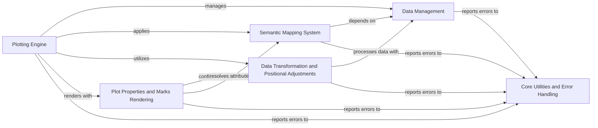

## Component Details

The Core Plotting Framework in Seaborn serves as the foundational layer for generating statistical graphics. It encompasses data handling, variable mapping to visual attributes, axis scaling, data grouping, and the orchestration of rendering visual marks. The main flow involves preparing input data, assigning variables to plot roles, applying semantic mappings for visual encoding, transforming data for appropriate scales and positions, and finally rendering the geometric marks onto a Matplotlib figure. Its purpose is to provide a robust and flexible system for declarative plot specification and compilation.

### Data Management
This component is responsible for handling raw input data, converting it into a standardized format (PlotData), assigning variables (x, y, hue, etc.), and inferring variable types (numeric, categorical, datetime). It also includes utilities for converting data to pandas DataFrames.

**Related Classes/Methods**:

- <a href="https://github.com/mwaskom/seaborn/blob/master/seaborn/_core/data.py#L17-L267" target="_blank" rel="noopener noreferrer">`seaborn.seaborn._core.data.PlotData` (17:267)</a>
- <a href="https://github.com/mwaskom/seaborn/blob/master/seaborn/_core/data.py#L270-L280" target="_blank" rel="noopener noreferrer">`seaborn.seaborn._core.data:handle_data_source` (270:280)</a>
- <a href="https://github.com/mwaskom/seaborn/blob/master/seaborn/_core/data.py#L283-L319" target="_blank" rel="noopener noreferrer">`seaborn.seaborn._core.data:convert_dataframe_to_pandas` (283:319)</a>
- <a href="https://github.com/mwaskom/seaborn/blob/master/seaborn/_base.py#L666-L693" target="_blank" rel="noopener noreferrer">`seaborn.seaborn._base.VectorPlotter:assign_variables` (666:693)</a>
- <a href="https://github.com/mwaskom/seaborn/blob/master/seaborn/_base.py#L695-L835" target="_blank" rel="noopener noreferrer">`seaborn.seaborn._base.VectorPlotter:_assign_variables_wideform` (695:835)</a>
- <a href="https://github.com/mwaskom/seaborn/blob/master/seaborn/_base.py#L1472-L1561" target="_blank" rel="noopener noreferrer">`seaborn.seaborn._base:variable_type` (1472:1561)</a>
- <a href="https://github.com/mwaskom/seaborn/blob/master/seaborn/_core/rules.py#L38-L142" target="_blank" rel="noopener noreferrer">`seaborn.seaborn._core.rules:variable_type` (38:142)</a>

### Semantic Mapping System
This component defines how data values are mapped to visual plot attributes like color (hue), size, and style (markers, dashes). It includes base classes for semantic mappings and specific implementations for different attribute types, along with utilities for ordering categorical data and generating unique visual elements.

**Related Classes/Methods**:

- <a href="https://github.com/mwaskom/seaborn/blob/master/seaborn/_base.py#L29-L85" target="_blank" rel="noopener noreferrer">`seaborn.seaborn._base.SemanticMapping` (29:85)</a>
- <a href="https://github.com/mwaskom/seaborn/blob/master/seaborn/_base.py#L88-L295" target="_blank" rel="noopener noreferrer">`seaborn.seaborn._base.HueMapping` (88:295)</a>
- <a href="https://github.com/mwaskom/seaborn/blob/master/seaborn/_base.py#L298-L516" target="_blank" rel="noopener noreferrer">`seaborn.seaborn._base.SizeMapping` (298:516)</a>
- <a href="https://github.com/mwaskom/seaborn/blob/master/seaborn/_base.py#L519-L610" target="_blank" rel="noopener noreferrer">`seaborn.seaborn._base.StyleMapping` (519:610)</a>
- <a href="https://github.com/mwaskom/seaborn/blob/master/seaborn/_base.py#L1744-L1777" target="_blank" rel="noopener noreferrer">`seaborn.seaborn._base:categorical_order` (1744:1777)</a>
- <a href="https://github.com/mwaskom/seaborn/blob/master/seaborn/_core/rules.py#L145-L173" target="_blank" rel="noopener noreferrer">`seaborn.seaborn._core.rules:categorical_order` (145:173)</a>
- <a href="https://github.com/mwaskom/seaborn/blob/master/seaborn/_base.py#L1698-L1741" target="_blank" rel="noopener noreferrer">`seaborn.seaborn._base:unique_markers` (1698:1741)</a>
- <a href="https://github.com/mwaskom/seaborn/blob/master/seaborn/_base.py#L1647-L1695" target="_blank" rel="noopener noreferrer">`seaborn.seaborn._base:unique_dashes` (1647:1695)</a>

### Plotting Engine
This is the central component responsible for orchestrating the plotting process. It manages plot configuration, theme settings, figure and axes setup, data processing (stats, grouping), rendering plot layers, and legend generation. It provides the main interface for users to create and customize plots.

**Related Classes/Methods**:

- <a href="https://github.com/mwaskom/seaborn/blob/master/seaborn/_core/plot.py#L253-L968" target="_blank" rel="noopener noreferrer">`seaborn.seaborn._core.plot.Plot` (253:968)</a>
- <a href="https://github.com/mwaskom/seaborn/blob/master/seaborn/_core/plot.py#L974-L1830" target="_blank" rel="noopener noreferrer">`seaborn.seaborn._core.plot.Plotter` (974:1830)</a>
- <a href="https://github.com/mwaskom/seaborn/blob/master/seaborn/_core/plot.py#L144-L206" target="_blank" rel="noopener noreferrer">`seaborn.seaborn._core.plot.ThemeConfig` (144:206)</a>
- <a href="https://github.com/mwaskom/seaborn/blob/master/seaborn/_core/plot.py#L216-L246" target="_blank" rel="noopener noreferrer">`seaborn.seaborn._core.plot.PlotConfig` (216:246)</a>
- <a href="https://github.com/mwaskom/seaborn/blob/master/seaborn/_core/plot.py#L91-L106" target="_blank" rel="noopener noreferrer">`seaborn.seaborn._core.plot:theme_context` (91:106)</a>
- <a href="https://github.com/mwaskom/seaborn/blob/master/seaborn/_core/subplots.py#L16-L263" target="_blank" rel="noopener noreferrer">`seaborn.seaborn._core.subplots.Subplots` (16:263)</a>

### Data Transformation and Positional Adjustments
This component handles the scaling and transformation of data for plot axes, including continuous, nominal, and boolean scales. It also provides mechanisms for grouping data and applying positional adjustments to avoid overplotting or to stack elements.

**Related Classes/Methods**:

- <a href="https://github.com/mwaskom/seaborn/blob/master/seaborn/_core/scales.py#L55-L145" target="_blank" rel="noopener noreferrer">`seaborn.seaborn._core.scales.Scale` (55:145)</a>
- <a href="https://github.com/mwaskom/seaborn/blob/master/seaborn/_core/scales.py#L149-L238" target="_blank" rel="noopener noreferrer">`seaborn.seaborn._core.scales.Boolean` (149:238)</a>
- <a href="https://github.com/mwaskom/seaborn/blob/master/seaborn/_core/scales.py#L242-L398" target="_blank" rel="noopener noreferrer">`seaborn.seaborn._core.scales.Nominal` (242:398)</a>
- <a href="https://github.com/mwaskom/seaborn/blob/master/seaborn/_core/scales.py#L414-L522" target="_blank" rel="noopener noreferrer">`seaborn.seaborn._core.scales.ContinuousBase` (414:522)</a>
- <a href="https://github.com/mwaskom/seaborn/blob/master/seaborn/_core/scales.py#L526-L758" target="_blank" rel="noopener noreferrer">`seaborn.seaborn._core.scales.Continuous` (526:758)</a>
- <a href="https://github.com/mwaskom/seaborn/blob/master/seaborn/_core/scales.py#L889-L992" target="_blank" rel="noopener noreferrer">`seaborn.seaborn._core.scales.PseudoAxis` (889:992)</a>
- <a href="https://github.com/mwaskom/seaborn/blob/master/seaborn/_core/scales.py#L1007-L1019" target="_blank" rel="noopener noreferrer">`seaborn.seaborn._core.scales:_make_logit_transforms` (1007:1019)</a>
- <a href="https://github.com/mwaskom/seaborn/blob/master/seaborn/_core/scales.py#L1047-L1064" target="_blank" rel="noopener noreferrer">`seaborn.seaborn._core.scales:_make_symlog_transforms` (1047:1064)</a>
- <a href="https://github.com/mwaskom/seaborn/blob/master/seaborn/_core/scales.py#L1022-L1044" target="_blank" rel="noopener noreferrer">`seaborn.seaborn._core.scales:_make_log_transforms` (1022:1044)</a>
- <a href="https://github.com/mwaskom/seaborn/blob/master/seaborn/_core/scales.py#L999-L1004" target="_blank" rel="noopener noreferrer">`seaborn.seaborn._core.scales:_make_identity_transforms` (999:1004)</a>
- <a href="https://github.com/mwaskom/seaborn/blob/master/seaborn/_core/scales.py#L1078-L1086" target="_blank" rel="noopener noreferrer">`seaborn.seaborn._core.scales:_make_power_transforms` (1078:1086)</a>
- <a href="https://github.com/mwaskom/seaborn/blob/master/seaborn/_core/scales.py#L1067-L1075" target="_blank" rel="noopener noreferrer">`seaborn.seaborn._core.scales:_make_sqrt_transforms` (1067:1075)</a>
- <a href="https://github.com/mwaskom/seaborn/blob/master/seaborn/_core/groupby.py#L16-L129" target="_blank" rel="noopener noreferrer">`seaborn.seaborn._core.groupby.GroupBy` (16:129)</a>
- <a href="https://github.com/mwaskom/seaborn/blob/master/seaborn/_core/moves.py#L28-L77" target="_blank" rel="noopener noreferrer">`seaborn.seaborn._core.moves.Jitter` (28:77)</a>
- <a href="https://github.com/mwaskom/seaborn/blob/master/seaborn/_core/moves.py#L81-L150" target="_blank" rel="noopener noreferrer">`seaborn.seaborn._core.moves.Dodge` (81:150)</a>
- <a href="https://github.com/mwaskom/seaborn/blob/master/seaborn/_core/moves.py#L154-L190" target="_blank" rel="noopener noreferrer">`seaborn.seaborn._core.moves.Stack` (154:190)</a>

### Plot Properties and Marks Rendering
This component defines and manages various plot properties (e.g., color, line style, fill) and their inference/mapping to visual attributes. It also includes the implementation for rendering different geometric marks (area, text, dot, line, bar) on the plot, handling their specific drawing logic and property resolution.

**Related Classes/Methods**:

- <a href="https://github.com/mwaskom/seaborn/blob/master/seaborn/_core/properties.py#L44-L132" target="_blank" rel="noopener noreferrer">`seaborn.seaborn._core.properties.Property` (44:132)</a>
- <a href="https://github.com/mwaskom/seaborn/blob/master/seaborn/_core/properties.py#L151-L267" target="_blank" rel="noopener noreferrer">`seaborn.seaborn._core.properties.IntervalProperty` (151:267)</a>
- <a href="https://github.com/mwaskom/seaborn/blob/master/seaborn/_core/properties.py#L334-L391" target="_blank" rel="noopener noreferrer">`seaborn.seaborn._core.properties.ObjectProperty` (334:391)</a>
- <a href="https://github.com/mwaskom/seaborn/blob/master/seaborn/_core/properties.py#L438-L532" target="_blank" rel="noopener noreferrer">`seaborn.seaborn._core.properties.LineStyle` (438:532)</a>
- <a href="https://github.com/mwaskom/seaborn/blob/master/seaborn/_core/properties.py#L558-L724" target="_blank" rel="noopener noreferrer">`seaborn.seaborn._core.properties.Color` (558:724)</a>
- <a href="https://github.com/mwaskom/seaborn/blob/master/seaborn/_core/properties.py#L732-L793" target="_blank" rel="noopener noreferrer">`seaborn.seaborn._core.properties.Fill` (732:793)</a>
- <a href="https://github.com/mwaskom/seaborn/blob/master/seaborn/_marks/area.py#L21-L86" target="_blank" rel="noopener noreferrer">`seaborn.seaborn._marks.area.AreaBase` (21:86)</a>
- <a href="https://github.com/mwaskom/seaborn/blob/master/seaborn/_marks/text.py#L23-L76" target="_blank" rel="noopener noreferrer">`seaborn.seaborn._marks.text.Text` (23:76)</a>
- <a href="https://github.com/mwaskom/seaborn/blob/master/seaborn/_marks/dot.py#L27-L103" target="_blank" rel="noopener noreferrer">`seaborn.seaborn._marks.dot.DotBase` (27:103)</a>
- <a href="https://github.com/mwaskom/seaborn/blob/master/seaborn/_marks/dot.py#L108-L157" target="_blank" rel="noopener noreferrer">`seaborn.seaborn._marks.dot.Dot` (108:157)</a>
- <a href="https://github.com/mwaskom/seaborn/blob/master/seaborn/_marks/dot.py#L162-L200" target="_blank" rel="noopener noreferrer">`seaborn.seaborn._marks.dot.Dots` (162:200)</a>
- <a href="https://github.com/mwaskom/seaborn/blob/master/seaborn/_marks/base.py#L105-L229" target="_blank" rel="noopener noreferrer">`seaborn.seaborn._marks.base.Mark` (105:229)</a>
- <a href="https://github.com/mwaskom/seaborn/blob/master/seaborn/_marks/base.py#L242-L292" target="_blank" rel="noopener noreferrer">`seaborn.seaborn._marks.base:resolve_color` (242:292)</a>
- <a href="https://github.com/mwaskom/seaborn/blob/master/seaborn/_marks/base.py#L232-L239" target="_blank" rel="noopener noreferrer">`seaborn.seaborn._marks.base:resolve_properties` (232:239)</a>
- <a href="https://github.com/mwaskom/seaborn/blob/master/seaborn/_marks/line.py#L22-L108" target="_blank" rel="noopener noreferrer">`seaborn.seaborn._marks.line.Path` (22:108)</a>
- <a href="https://github.com/mwaskom/seaborn/blob/master/seaborn/_marks/line.py#L132-L218" target="_blank" rel="noopener noreferrer">`seaborn.seaborn._marks.line.Paths` (132:218)</a>
- <a href="https://github.com/mwaskom/seaborn/blob/master/seaborn/_marks/bar.py#L27-L108" target="_blank" rel="noopener noreferrer">`seaborn.seaborn._marks.bar.BarBase` (27:108)</a>
- <a href="https://github.com/mwaskom/seaborn/blob/master/seaborn/_marks/bar.py#L113-L175" target="_blank" rel="noopener noreferrer">`seaborn.seaborn._marks.bar.Bar` (113:175)</a>
- <a href="https://github.com/mwaskom/seaborn/blob/master/seaborn/_marks/bar.py#L180-L252" target="_blank" rel="noopener noreferrer">`seaborn.seaborn._marks.bar.Bars` (180:252)</a>

### Core Utilities and Error Handling
This component provides general utility functions, such as inferring plot orientation, and defines custom exceptions for handling specific plotting-related errors.

**Related Classes/Methods**:

- <a href="https://github.com/mwaskom/seaborn/blob/master/seaborn/_base.py#L1564-L1644" target="_blank" rel="noopener noreferrer">`seaborn.seaborn._base:infer_orient` (1564:1644)</a>
- <a href="https://github.com/mwaskom/seaborn/blob/master/seaborn/_core/exceptions.py#L10-L32" target="_blank" rel="noopener noreferrer">`seaborn.seaborn._core.exceptions.PlotSpecError` (10:32)</a>

### [FAQ](https://github.com/CodeBoarding/GeneratedOnBoardings/tree/main?tab=readme-ov-file#faq)