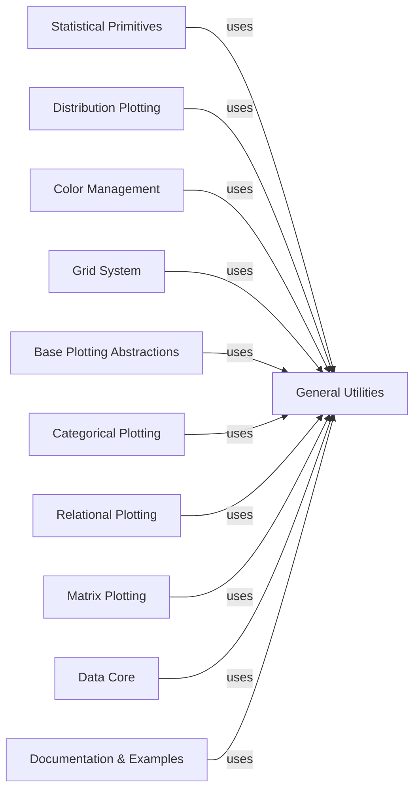

## Component Details

This system provides a comprehensive data visualization library, Seaborn, built upon a modular architecture. It encompasses components for statistical computations, various plotting types (distribution, categorical, relational, matrix), a flexible grid system for multi-panel plots, robust color management, and foundational plotting abstractions. Core data handling and utility functions support all these functionalities, with dedicated components for documentation and examples.

### Statistical Primitives
This component encapsulates the fundamental statistical calculations and data transformations required for various Seaborn plots. It includes classes for computing histograms, empirical cumulative distribution functions (ECDFs), and handling error bar validation, providing the statistical backbone for data visualization.

**Related Classes/Methods**:

- <a href="https://github.com/mwaskom/seaborn/blob/master/seaborn/_statistics.py#L202-L253" target="_blank" rel="noopener noreferrer">`seaborn.seaborn._statistics.Histogram:__init__` (202:253)</a>
- <a href="https://github.com/mwaskom/seaborn/blob/master/seaborn/_statistics.py#L404-L417" target="_blank" rel="noopener noreferrer">`seaborn.seaborn._statistics.ECDF:__init__` (404:417)</a>
- <a href="https://github.com/mwaskom/seaborn/blob/master/seaborn/_statistics.py#L581-L617" target="_blank" rel="noopener noreferrer">`seaborn.seaborn._statistics.LetterValues:__init__` (581:617)</a>
- <a href="https://github.com/mwaskom/seaborn/blob/master/seaborn/_statistics.py#L670-L698" target="_blank" rel="noopener noreferrer">`seaborn.seaborn._statistics:_validate_errorbar_arg` (670:698)</a>
- <a href="https://github.com/mwaskom/seaborn/blob/master/seaborn/_stats/order.py#L62-L71" target="_blank" rel="noopener noreferrer">`seaborn.seaborn._stats.order.Perc:_percentile` (62:71)</a>

### Distribution Plotting
This component is dedicated to visualizing the distribution of univariate and bivariate datasets. It provides classes and functions for creating various types of distribution plots, such as histograms, kernel density estimates, and empirical cumulative distribution plots, allowing users to understand the underlying patterns and shapes of their data.

**Related Classes/Methods**:

- <a href="https://github.com/mwaskom/seaborn/blob/master/seaborn/distributions.py#L376-L738" target="_blank" rel="noopener noreferrer">`seaborn.seaborn.distributions._DistributionPlotter:plot_univariate_histogram` (376:738)</a>
- <a href="https://github.com/mwaskom/seaborn/blob/master/seaborn/distributions.py#L740-L895" target="_blank" rel="noopener noreferrer">`seaborn.seaborn.distributions._DistributionPlotter:plot_bivariate_histogram` (740:895)</a>
- <a href="https://github.com/mwaskom/seaborn/blob/master/seaborn/distributions.py#L897-L1026" target="_blank" rel="noopener noreferrer">`seaborn.seaborn.distributions._DistributionPlotter:plot_univariate_density` (897:1026)</a>
- <a href="https://github.com/mwaskom/seaborn/blob/master/seaborn/distributions.py#L1028-L1208" target="_blank" rel="noopener noreferrer">`seaborn.seaborn.distributions._DistributionPlotter:plot_bivariate_density` (1028:1208)</a>
- <a href="https://github.com/mwaskom/seaborn/blob/master/seaborn/distributions.py#L1210-L1279" target="_blank" rel="noopener noreferrer">`seaborn.seaborn.distributions._DistributionPlotter:plot_univariate_ecdf` (1210:1279)</a>
- <a href="https://github.com/mwaskom/seaborn/blob/master/seaborn/distributions.py#L1315-L1351" target="_blank" rel="noopener noreferrer">`seaborn.seaborn.distributions._DistributionPlotter:_plot_single_rug` (1315:1351)</a>
- <a href="https://github.com/mwaskom/seaborn/blob/master/seaborn/distributions.py#L1358-L1449" target="_blank" rel="noopener noreferrer">`seaborn.seaborn.distributions:histplot` (1358:1449)</a>
- <a href="https://github.com/mwaskom/seaborn/blob/master/seaborn/distributions.py#L1581-L1730" target="_blank" rel="noopener noreferrer">`seaborn.seaborn.distributions:kdeplot` (1581:1730)</a>
- <a href="https://github.com/mwaskom/seaborn/blob/master/seaborn/distributions.py#L1861-L1914" target="_blank" rel="noopener noreferrer">`seaborn.seaborn.distributions:ecdfplot` (1861:1914)</a>
- <a href="https://github.com/mwaskom/seaborn/blob/master/seaborn/distributions.py#L1973-L2050" target="_blank" rel="noopener noreferrer">`seaborn.seaborn.distributions:rugplot` (1973:2050)</a>
- <a href="https://github.com/mwaskom/seaborn/blob/master/seaborn/distributions.py#L2094-L2283" target="_blank" rel="noopener noreferrer">`seaborn.seaborn.distributions:displot` (2094:2283)</a>
- <a href="https://github.com/mwaskom/seaborn/blob/master/seaborn/distributions.py#L2390-L2531" target="_blank" rel="noopener noreferrer">`seaborn.seaborn.distributions:distplot` (2390:2531)</a>

### Categorical Plotting
This component specializes in creating visualizations for categorical data, enabling the comparison and representation of data across different categories. It offers a wide range of plot types, including box plots, violin plots, swarm plots, and bar plots, along with a dedicated plotter class and a beeswarm algorithm for precise point placement.

**Related Classes/Methods**:

- <a href="https://github.com/mwaskom/seaborn/blob/master/seaborn/categorical.py#L409-L419" target="_blank" rel="noopener noreferrer">`seaborn.seaborn.categorical._CategoricalPlotter:_invert_scale` (409:419)</a>
- <a href="https://github.com/mwaskom/seaborn/blob/master/seaborn/categorical.py#L517-L589" target="_blank" rel="noopener noreferrer">`seaborn.seaborn.categorical._CategoricalPlotter:plot_swarms` (517:589)</a>
- <a href="https://github.com/mwaskom/seaborn/blob/master/seaborn/categorical.py#L591-L753" target="_blank" rel="noopener noreferrer">`seaborn.seaborn.categorical._CategoricalPlotter:plot_boxes` (591:753)</a>
- <a href="https://github.com/mwaskom/seaborn/blob/master/seaborn/categorical.py#L755-L894" target="_blank" rel="noopener noreferrer">`seaborn.seaborn.categorical._CategoricalPlotter:plot_boxens` (755:894)</a>
- <a href="https://github.com/mwaskom/seaborn/blob/master/seaborn/categorical.py#L896-L1170" target="_blank" rel="noopener noreferrer">`seaborn.seaborn.categorical._CategoricalPlotter:plot_violins` (896:1170)</a>
- <a href="https://github.com/mwaskom/seaborn/blob/master/seaborn/categorical.py#L1172-L1250" target="_blank" rel="noopener noreferrer">`seaborn.seaborn.categorical._CategoricalPlotter:plot_points` (1172:1250)</a>
- <a href="https://github.com/mwaskom/seaborn/blob/master/seaborn/categorical.py#L1252-L1332" target="_blank" rel="noopener noreferrer">`seaborn.seaborn.categorical._CategoricalPlotter:plot_bars` (1252:1332)</a>
- <a href="https://github.com/mwaskom/seaborn/blob/master/seaborn/categorical.py#L1334-L1360" target="_blank" rel="noopener noreferrer">`seaborn.seaborn.categorical._CategoricalPlotter:plot_errorbars` (1334:1360)</a>
- <a href="https://github.com/mwaskom/seaborn/blob/master/seaborn/categorical.py#L1597-L1658" target="_blank" rel="noopener noreferrer">`seaborn.seaborn.categorical:boxplot` (1597:1658)</a>
- <a href="https://github.com/mwaskom/seaborn/blob/master/seaborn/categorical.py#L1722-L1798" target="_blank" rel="noopener noreferrer">`seaborn.seaborn.categorical:violinplot` (1722:1798)</a>
- <a href="https://github.com/mwaskom/seaborn/blob/master/seaborn/categorical.py#L1912-L1985" target="_blank" rel="noopener noreferrer">`seaborn.seaborn.categorical:boxenplot` (1912:1985)</a>
- <a href="https://github.com/mwaskom/seaborn/blob/master/seaborn/categorical.py#L2082-L2140" target="_blank" rel="noopener noreferrer">`seaborn.seaborn.categorical:stripplot` (2082:2140)</a>
- <a href="https://github.com/mwaskom/seaborn/blob/master/seaborn/categorical.py#L2207-L2268" target="_blank" rel="noopener noreferrer">`seaborn.seaborn.categorical:swarmplot` (2207:2268)</a>
- <a href="https://github.com/mwaskom/seaborn/blob/master/seaborn/categorical.py#L2336-L2406" target="_blank" rel="noopener noreferrer">`seaborn.seaborn.categorical:barplot` (2336:2406)</a>
- <a href="https://github.com/mwaskom/seaborn/blob/master/seaborn/categorical.py#L2478-L2541" target="_blank" rel="noopener noreferrer">`seaborn.seaborn.categorical:pointplot` (2478:2541)</a>
- <a href="https://github.com/mwaskom/seaborn/blob/master/seaborn/categorical.py#L2627-L2702" target="_blank" rel="noopener noreferrer">`seaborn.seaborn.categorical:countplot` (2627:2702)</a>
- <a href="https://github.com/mwaskom/seaborn/blob/master/seaborn/categorical.py#L2761-L3148" target="_blank" rel="noopener noreferrer">`seaborn.seaborn.categorical:catplot` (2761:3148)</a>
- `seaborn.seaborn.categorical:relplot` (full file reference)
- <a href="https://github.com/mwaskom/seaborn/blob/master/seaborn/categorical.py#L3240-L3298" target="_blank" rel="noopener noreferrer">`seaborn.seaborn.categorical.Beeswarm:__call__` (3240:3298)</a>

### Relational Plotting
This component focuses on visualizing the relationships between two or more variables, typically for continuous data. It provides specialized plotter classes for line and scatter plots, along with high-level functions to easily create these common relational visualizations.

**Related Classes/Methods**:

- <a href="https://github.com/mwaskom/seaborn/blob/master/seaborn/relational.py#L229-L380" target="_blank" rel="noopener noreferrer">`seaborn.seaborn.relational._LinePlotter:plot` (229:380)</a>
- <a href="https://github.com/mwaskom/seaborn/blob/master/seaborn/relational.py#L400-L468" target="_blank" rel="noopener noreferrer">`seaborn.seaborn.relational._ScatterPlotter:plot` (400:468)</a>
- <a href="https://github.com/mwaskom/seaborn/blob/master/seaborn/relational.py#L471-L516" target="_blank" rel="noopener noreferrer">`seaborn.seaborn.relational:lineplot` (471:516)</a>
- <a href="https://github.com/mwaskom/seaborn/blob/master/seaborn/relational.py#L606-L638" target="_blank" rel="noopener noreferrer">`seaborn.seaborn.relational:scatterplot` (606:638)</a>

### Matrix Plotting
This component is designed for creating visualizations that represent data in a matrix format, such as heatmaps and cluster maps. It includes plotter classes for handling heatmaps and dendrograms, as well as a ClusterGrid class for combining these visualizations to show hierarchical relationships.

**Related Classes/Methods**:

- <a href="https://github.com/mwaskom/seaborn/blob/master/seaborn/matrix.py#L294-L352" target="_blank" rel="noopener noreferrer">`seaborn.seaborn.matrix._HeatMapper:plot` (294:352)</a>
- <a href="https://github.com/mwaskom/seaborn/blob/master/seaborn/matrix.py#L585-L639" target="_blank" rel="noopener noreferrer">`seaborn.seaborn.matrix._DendrogramPlotter:plot` (585:639)</a>
- <a href="https://github.com/mwaskom/seaborn/blob/master/seaborn/matrix.py#L970-L993" target="_blank" rel="noopener noreferrer">`seaborn.seaborn.matrix.ClusterGrid:plot_dendrograms` (970:993)</a>
- <a href="https://github.com/mwaskom/seaborn/blob/master/seaborn/matrix.py#L995-L1058" target="_blank" rel="noopener noreferrer">`seaborn.seaborn.matrix.ClusterGrid:plot_colors` (995:1058)</a>

### Grid System
This component provides a powerful framework for creating multi-panel plots, allowing users to visualize complex relationships by arranging multiple plots in a grid. It includes classes like FacetGrid and PairGrid for conditional plotting and pairwise relationships, along with a jointplot function for combined univariate and bivariate displays.

**Related Classes/Methods**:

- <a href="https://github.com/mwaskom/seaborn/blob/master/seaborn/axisgrid.py#L126-L228" target="_blank" rel="noopener noreferrer">`seaborn.seaborn.axisgrid.Grid:add_legend` (126:228)</a>
- <a href="https://github.com/mwaskom/seaborn/blob/master/seaborn/axisgrid.py#L230-L247" target="_blank" rel="noopener noreferrer">`seaborn.seaborn.axisgrid.Grid:_update_legend_data` (230:247)</a>
- <a href="https://github.com/mwaskom/seaborn/blob/master/seaborn/axisgrid.py#L371-L549" target="_blank" rel="noopener noreferrer">`seaborn.seaborn.axisgrid.FacetGrid:__init__` (371:549)</a>
- <a href="https://github.com/mwaskom/seaborn/blob/master/seaborn/axisgrid.py#L1191-L1364" target="_blank" rel="noopener noreferrer">`seaborn.seaborn.axisgrid.PairGrid:__init__` (1191:1364)</a>
- <a href="https://github.com/mwaskom/seaborn/blob/master/seaborn/axisgrid.py#L1437-L1517" target="_blank" rel="noopener noreferrer">`seaborn.seaborn.axisgrid.PairGrid:map_diag` (1437:1517)</a>
- <a href="https://github.com/mwaskom/seaborn/blob/master/seaborn/axisgrid.py#L2184-L2341" target="_blank" rel="noopener noreferrer">`seaborn.seaborn.axisgrid:jointplot` (2184:2341)</a>

### Color Management
This component is responsible for generating, manipulating, and applying color palettes within Seaborn. It includes functions for creating color sequences and utilities for converting colors between different color spaces, such as HUSL and RGB, ensuring consistent and visually appealing color schemes across plots.

**Related Classes/Methods**:

- <a href="https://github.com/mwaskom/seaborn/blob/master/seaborn/palettes.py#L122-L255" target="_blank" rel="noopener noreferrer">`seaborn.seaborn.palettes:color_palette` (122:255)</a>
- <a href="https://github.com/mwaskom/seaborn/blob/master/seaborn/palettes.py#L366-L417" target="_blank" rel="noopener noreferrer">`seaborn.seaborn.palettes:mpl_palette` (366:417)</a>
- <a href="https://github.com/mwaskom/seaborn/blob/master/seaborn/external/husl.py#L31-L32" target="_blank" rel="noopener noreferrer">`seaborn.seaborn.external.husl:husl_to_rgb` (31:32)</a>
- <a href="https://github.com/mwaskom/seaborn/blob/master/seaborn/external/husl.py#L35-L36" target="_blank" rel="noopener noreferrer">`seaborn.seaborn.external.husl:husl_to_hex` (35:36)</a>
- <a href="https://github.com/mwaskom/seaborn/blob/master/seaborn/external/husl.py#L39-L40" target="_blank" rel="noopener noreferrer">`seaborn.seaborn.external.husl:rgb_to_husl` (39:40)</a>
- <a href="https://github.com/mwaskom/seaborn/blob/master/seaborn/external/husl.py#L43-L44" target="_blank" rel="noopener noreferrer">`seaborn.seaborn.external.husl:hex_to_husl` (43:44)</a>
- <a href="https://github.com/mwaskom/seaborn/blob/master/seaborn/external/husl.py#L47-L48" target="_blank" rel="noopener noreferrer">`seaborn.seaborn.external.husl:huslp_to_rgb` (47:48)</a>
- <a href="https://github.com/mwaskom/seaborn/blob/master/seaborn/external/husl.py#L51-L52" target="_blank" rel="noopener noreferrer">`seaborn.seaborn.external.husl:huslp_to_hex` (51:52)</a>
- <a href="https://github.com/mwaskom/seaborn/blob/master/seaborn/external/husl.py#L55-L56" target="_blank" rel="noopener noreferrer">`seaborn.seaborn.external.husl:rgb_to_huslp` (55:56)</a>
- <a href="https://github.com/mwaskom/seaborn/blob/master/seaborn/external/husl.py#L59-L60" target="_blank" rel="noopener noreferrer">`seaborn.seaborn.external.husl:hex_to_huslp` (59:60)</a>
- <a href="https://github.com/mwaskom/seaborn/blob/master/seaborn/external/husl.py#L63-L64" target="_blank" rel="noopener noreferrer">`seaborn.seaborn.external.husl:lch_to_rgb` (63:64)</a>
- <a href="https://github.com/mwaskom/seaborn/blob/master/seaborn/external/husl.py#L67-L68" target="_blank" rel="noopener noreferrer">`seaborn.seaborn.external.husl:rgb_to_lch` (67:68)</a>
- <a href="https://github.com/mwaskom/seaborn/blob/master/seaborn/external/husl.py#L94-L114" target="_blank" rel="noopener noreferrer">`seaborn.seaborn.external.husl:_hrad_extremum` (94:114)</a>
- <a href="https://github.com/mwaskom/seaborn/blob/master/seaborn/external/husl.py#L117-L119" target="_blank" rel="noopener noreferrer">`seaborn.seaborn.external.husl:max_chroma_pastel` (117:119)</a>
- <a href="https://github.com/mwaskom/seaborn/blob/master/seaborn/external/husl.py#L187-L189" target="_blank" rel="noopener noreferrer">`seaborn.seaborn.external.husl:rgb_to_hex` (187:189)</a>
- <a href="https://github.com/mwaskom/seaborn/blob/master/seaborn/external/husl.py#L192-L194" target="_blank" rel="noopener noreferrer">`seaborn.seaborn.external.husl:xyz_to_rgb` (192:194)</a>
- <a href="https://github.com/mwaskom/seaborn/blob/master/seaborn/external/husl.py#L197-L199" target="_blank" rel="noopener noreferrer">`seaborn.seaborn.external.husl:rgb_to_xyz` (197:199)</a>
- <a href="https://github.com/mwaskom/seaborn/blob/master/seaborn/external/husl.py#L202-L219" target="_blank" rel="noopener noreferrer">`seaborn.seaborn.external.husl:xyz_to_luv` (202:219)</a>
- <a href="https://github.com/mwaskom/seaborn/blob/master/seaborn/external/husl.py#L222-L235" target="_blank" rel="noopener noreferrer">`seaborn.seaborn.external.husl:luv_to_xyz` (222:235)</a>
- <a href="https://github.com/mwaskom/seaborn/blob/master/seaborn/external/husl.py#L260-L271" target="_blank" rel="noopener noreferrer">`seaborn.seaborn.external.husl:husl_to_lch` (260:271)</a>
- <a href="https://github.com/mwaskom/seaborn/blob/master/seaborn/external/husl.py#L274-L285" target="_blank" rel="noopener noreferrer">`seaborn.seaborn.external.husl:lch_to_husl` (274:285)</a>
- <a href="https://github.com/mwaskom/seaborn/blob/master/seaborn/external/husl.py#L288-L299" target="_blank" rel="noopener noreferrer">`seaborn.seaborn.external.husl:huslp_to_lch` (288:299)</a>
- <a href="https://github.com/mwaskom/seaborn/blob/master/seaborn/external/husl.py#L302-L313" target="_blank" rel="noopener noreferrer">`seaborn.seaborn.external.husl:lch_to_huslp` (302:313)</a>

### Base Plotting Abstractions
This component provides fundamental classes that serve as building blocks for various plot types in Seaborn. It includes abstractions for mapping data attributes like hue and size to visual properties, and a general Plotter class that handles the finalization of figures and setup of split generators, ensuring consistent plotting behavior.

**Related Classes/Methods**:

- <a href="https://github.com/mwaskom/seaborn/blob/master/seaborn/_base.py#L173-L203" target="_blank" rel="noopener noreferrer">`seaborn.seaborn._base.HueMapping:_lookup_single` (173:203)</a>
- <a href="https://github.com/mwaskom/seaborn/blob/master/seaborn/_base.py#L220-L252" target="_blank" rel="noopener noreferrer">`seaborn.seaborn._base.HueMapping:categorical_mapping` (220:252)</a>
- <a href="https://github.com/mwaskom/seaborn/blob/master/seaborn/_base.py#L254-L295" target="_blank" rel="noopener noreferrer">`seaborn.seaborn._base.HueMapping:numeric_mapping` (254:295)</a>
- <a href="https://github.com/mwaskom/seaborn/blob/master/seaborn/_base.py#L439-L516" target="_blank" rel="noopener noreferrer">`seaborn.seaborn._base.SizeMapping:numeric_mapping` (439:516)</a>
- <a href="https://github.com/mwaskom/seaborn/blob/master/seaborn/_base.py#L849-L966" target="_blank" rel="noopener noreferrer">`seaborn.seaborn._base.VectorPlotter:iter_data` (849:966)</a>
- <a href="https://github.com/mwaskom/seaborn/blob/master/seaborn/_base.py#L1202-L1282" target="_blank" rel="noopener noreferrer">`seaborn.seaborn._base.VectorPlotter:add_legend_data` (1202:1282)</a>
- <a href="https://github.com/mwaskom/seaborn/blob/master/seaborn/_base.py#L1284-L1331" target="_blank" rel="noopener noreferrer">`seaborn.seaborn._base.VectorPlotter:_update_legend_data` (1284:1331)</a>
- <a href="https://github.com/mwaskom/seaborn/blob/master/seaborn/_base.py#L1358-L1449" target="_blank" rel="noopener noreferrer">`seaborn.seaborn._base.VectorPlotter:scale_categorical` (1358:1449)</a>
- <a href="https://github.com/mwaskom/seaborn/blob/master/seaborn/_core/plot.py#L1779-L1830" target="_blank" rel="noopener noreferrer">`seaborn.seaborn._core.plot.Plotter:_finalize_figure` (1779:1830)</a>
- <a href="https://github.com/mwaskom/seaborn/blob/master/seaborn/_core/plot.py#L1586-L1664" target="_blank" rel="noopener noreferrer">`seaborn.seaborn._core.plot.Plotter:_setup_split_generator` (1586:1664)</a>

### Data Core
This internal component is responsible for core data handling operations within Seaborn, specifically focusing on the conversion of data structures to pandas DataFrames to ensure compatibility and efficient processing across the library's plotting functions.

**Related Classes/Methods**:

- <a href="https://github.com/mwaskom/seaborn/blob/master/seaborn/_core/data.py#L283-L319" target="_blank" rel="noopener noreferrer">`seaborn.seaborn._core.data:convert_dataframe_to_pandas` (283:319)</a>

### Documentation & Examples
This component is specifically designed to support the generation of Seaborn's documentation and tutorial examples. It includes functions that load example datasets and apply various plotting and styling functions to create reproducible figures for educational and illustrative purposes.

**Related Classes/Methods**:

- <a href="https://github.com/mwaskom/seaborn/blob/master/doc/sphinxext/tutorial_builder.py#L95-L127" target="_blank" rel="noopener noreferrer">`seaborn.doc.sphinxext.tutorial_builder:introduction` (95:127)</a>
- <a href="https://github.com/mwaskom/seaborn/blob/master/doc/sphinxext/tutorial_builder.py#L204-L214" target="_blank" rel="noopener noreferrer">`seaborn.doc.sphinxext.tutorial_builder:error_bars` (204:214)</a>
- <a href="https://github.com/mwaskom/seaborn/blob/master/doc/sphinxext/tutorial_builder.py#L217-L243" target="_blank" rel="noopener noreferrer">`seaborn.doc.sphinxext.tutorial_builder:properties` (217:243)</a>
- <a href="https://github.com/mwaskom/seaborn/blob/master/doc/sphinxext/tutorial_builder.py#L274-L284" target="_blank" rel="noopener noreferrer">`seaborn.doc.sphinxext.tutorial_builder:relational` (274:284)</a>
- <a href="https://github.com/mwaskom/seaborn/blob/master/doc/sphinxext/tutorial_builder.py#L287-L297" target="_blank" rel="noopener noreferrer">`seaborn.doc.sphinxext.tutorial_builder:distributions` (287:297)</a>
- <a href="https://github.com/mwaskom/seaborn/blob/master/doc/sphinxext/tutorial_builder.py#L300-L310" target="_blank" rel="noopener noreferrer">`seaborn.doc.sphinxext.tutorial_builder:categorical` (300:310)</a>
- <a href="https://github.com/mwaskom/seaborn/blob/master/doc/sphinxext/tutorial_builder.py#L313-L324" target="_blank" rel="noopener noreferrer">`seaborn.doc.sphinxext.tutorial_builder:regression` (313:324)</a>
- <a href="https://github.com/mwaskom/seaborn/blob/master/doc/sphinxext/tutorial_builder.py#L327-L337" target="_blank" rel="noopener noreferrer">`seaborn.doc.sphinxext.tutorial_builder:axis_grids` (327:337)</a>
- <a href="https://github.com/mwaskom/seaborn/blob/master/doc/sphinxext/tutorial_builder.py#L340-L349" target="_blank" rel="noopener noreferrer">`seaborn.doc.sphinxext.tutorial_builder:aesthetics` (340:349)</a>

### General Utilities
This component provides a comprehensive set of general-purpose helper functions essential for various aspects of Seaborn's plotting capabilities. It includes functionalities for argument validation, data manipulation, version compatibility checks, legend adjustments, color manipulation, axis management, data loading and validation, and internal plotting mechanics. It also interfaces with external system-level functionalities for managing application-specific cache directories and handling version comparisons of external libraries. This component acts as a foundational layer for other components by abstracting common operations and ensuring compatibility across different library versions.

**Related Classes/Methods**:

- <a href="https://github.com/mwaskom/seaborn/blob/master/seaborn/utils.py#L750-L761" target="_blank" rel="noopener noreferrer">`seaborn.utils._check_argument` (750:761)</a>
- <a href="https://github.com/mwaskom/seaborn/blob/master/seaborn/utils.py#L828-L832" target="_blank" rel="noopener noreferrer">`seaborn.utils._get_transform_functions` (828:832)</a>
- <a href="https://github.com/mwaskom/seaborn/blob/master/seaborn/utils.py#L69-L144" target="_blank" rel="noopener noreferrer">`seaborn.utils._default_color` (69:144)</a>
- <a href="https://github.com/mwaskom/seaborn/blob/master/seaborn/utils.py#L764-L780" target="_blank" rel="noopener noreferrer">`seaborn.utils._assign_default_kwargs` (764:780)</a>
- <a href="https://github.com/mwaskom/seaborn/blob/master/seaborn/utils.py#L243-L257" target="_blank" rel="noopener noreferrer">`seaborn.utils.remove_na` (243:257)</a>
- <a href="https://github.com/mwaskom/seaborn/blob/master/seaborn/utils.py#L478-L484" target="_blank" rel="noopener noreferrer">`seaborn.utils._kde_support` (478:484)</a>
- <a href="https://github.com/mwaskom/seaborn/blob/master/seaborn/utils.py#L260-L274" target="_blank" rel="noopener noreferrer">`seaborn.utils.get_color_cycle` (260:274)</a>
- <a href="https://github.com/mwaskom/seaborn/blob/master/seaborn/utils.py#L147-L183" target="_blank" rel="noopener noreferrer">`seaborn.utils.desaturate` (147:183)</a>
- <a href="https://github.com/mwaskom/seaborn/blob/master/seaborn/utils.py#L783-L800" target="_blank" rel="noopener noreferrer">`seaborn.utils.adjust_legend_subtitles` (783:800)</a>
- <a href="https://github.com/mwaskom/seaborn/blob/master/seaborn/utils.py#L58-L66" target="_blank" rel="noopener noreferrer">`seaborn.utils._draw_figure` (58:66)</a>
- <a href="https://github.com/mwaskom/seaborn/blob/master/seaborn/utils.py#L836-L851" target="_blank" rel="noopener noreferrer">`seaborn.utils._disable_autolayout` (836:851)</a>
- <a href="https://github.com/mwaskom/seaborn/blob/master/seaborn/utils.py#L203-L227" target="_blank" rel="noopener noreferrer">`seaborn.utils.set_hls_values` (203:227)</a>
- <a href="https://github.com/mwaskom/seaborn/blob/master/seaborn/utils.py#L854-L856" target="_blank" rel="noopener noreferrer">`seaborn.utils._version_predates` (854:856)</a>
- <a href="https://github.com/mwaskom/seaborn/blob/master/seaborn/utils.py#L673-L696" target="_blank" rel="noopener noreferrer">`seaborn.utils.locator_to_legend_entries` (673:696)</a>
- <a href="https://github.com/mwaskom/seaborn/blob/master/seaborn/utils.py#L277-L376" target="_blank" rel="noopener noreferrer">`seaborn.utils.despine` (277:376)</a>
- <a href="https://github.com/mwaskom/seaborn/blob/master/seaborn/utils.py#L379-L475" target="_blank" rel="noopener noreferrer">`seaborn.utils.move_legend` (379:475)</a>
- <a href="https://github.com/mwaskom/seaborn/blob/master/seaborn/utils.py#L506-L521" target="_blank" rel="noopener noreferrer">`seaborn.utils.get_data_home` (506:521)</a>
- <a href="https://github.com/mwaskom/seaborn/blob/master/seaborn/utils.py#L493-L503" target="_blank" rel="noopener noreferrer">`seaborn.utils.get_dataset_names` (493:503)</a>
- <a href="https://github.com/mwaskom/seaborn/blob/master/seaborn/utils.py#L524-L629" target="_blank" rel="noopener noreferrer">`seaborn.utils.load_dataset` (524:629)</a>
- <a href="https://github.com/mwaskom/seaborn/blob/master/seaborn/utils.py#L632-L653" target="_blank" rel="noopener noreferrer">`seaborn.utils.axis_ticklabels_overlap` (632:653)</a>
- <a href="https://github.com/mwaskom/seaborn/blob/master/seaborn/utils.py#L656-L670" target="_blank" rel="noopener noreferrer">`seaborn.utils.axes_ticklabels_overlap` (656:670)</a>
- <a href="https://github.com/mwaskom/seaborn/blob/master/seaborn/utils.py#L803-L825" target="_blank" rel="noopener noreferrer">`seaborn.utils._deprecate_ci` (803:825)</a>
- <a href="https://github.com/mwaskom/seaborn/blob/master/seaborn/_compat.py#L112-L117" target="_blank" rel="noopener noreferrer">`seaborn._compat.get_legend_handles` (112:117)</a>
- <a href="https://github.com/mwaskom/seaborn/blob/master/seaborn/_compat.py#L120-L123" target="_blank" rel="noopener noreferrer">`seaborn._compat.groupby_apply_include_groups` (120:123)</a>
- <a href="https://github.com/mwaskom/seaborn/blob/master/seaborn/_compat.py#L103-L109" target="_blank" rel="noopener noreferrer">`seaborn._compat.share_axis` (103:109)</a>
- <a href="https://github.com/mwaskom/seaborn/blob/master/seaborn/_compat.py#L126-L129" target="_blank" rel="noopener noreferrer">`seaborn._compat.get_converter` (126:129)</a>
- <a href="https://github.com/mwaskom/seaborn/blob/master/seaborn/_compat.py#L76-L91" target="_blank" rel="noopener noreferrer">`seaborn._compat.set_layout_engine` (76:91)</a>
- <a href="https://github.com/mwaskom/seaborn/blob/master/seaborn/_compat.py#L94-L100" target="_blank" rel="noopener noreferrer">`seaborn._compat.get_layout_engine` (94:100)</a>
- <a href="https://github.com/mwaskom/seaborn/blob/master/seaborn/external/version.py#L218-L245" target="_blank" rel="noopener noreferrer">`seaborn.external.version.Version:__init__` (218:245)</a>
- <a href="https://github.com/mwaskom/seaborn/blob/master/seaborn/external/appdirs.py#L73-L127" target="_blank" rel="noopener noreferrer">`seaborn.external.appdirs:user_cache_dir` (73:127)</a>
- `seaborn.utils` (full file reference)
- `seaborn._compat` (full file reference)
- `seaborn.external.appdirs` (full file reference)
- `seaborn.external.version` (full file reference)

### [FAQ](https://github.com/CodeBoarding/GeneratedOnBoardings/tree/main?tab=readme-ov-file#faq)