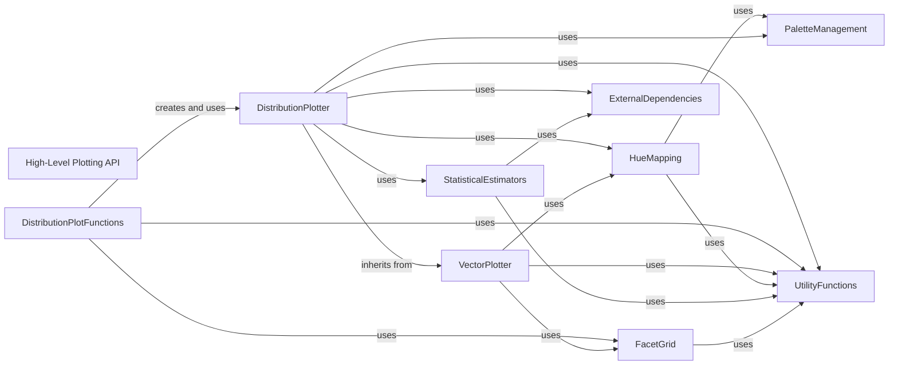

## Component Details

This graph illustrates the high-level architecture of Seaborn's plotting API, focusing on the distribution plotting subsystem. The main flow involves user interaction with high-level plotting functions, which then leverage specialized plotter classes to prepare data, apply statistical estimations, and map visual attributes. Core plotting logic is encapsulated in plotter classes, which in turn rely on utility functions, color palette management, and external statistical libraries. The system's purpose is to provide a user-friendly interface for creating diverse statistical visualizations while abstracting away underlying complexities.

### High-Level Plotting API
Provides a diverse set of user-facing functions for creating various statistical visualizations, including distribution plots (histograms, KDEs), categorical plots (box, violin, bar), relational plots (scatter, line), regression plots, and matrix plots (heatmaps, cluster maps). These functions abstract away the underlying plotting complexities.

**Related Classes/Methods**:

- `seaborn.seaborn.distributions` (full file reference)
- `seaborn.seaborn.categorical` (full file reference)
- `seaborn.seaborn.relational` (full file reference)
- `seaborn.seaborn.regression` (full file reference)
- `seaborn.seaborn.matrix` (full file reference)

### DistributionPlotter
The `_DistributionPlotter` class is a core component for creating various distribution plots. It extends `VectorPlotter` and provides methods for computing and plotting univariate and bivariate histograms, kernel density estimates (KDEs), and empirical cumulative distribution functions (ECDFs). It handles data preparation, semantic mapping (hue, color), and interaction with Matplotlib axes.

**Related Classes/Methods**:

- <a href="https://github.com/mwaskom/seaborn/blob/master/seaborn/distributions.py#L99-L1351" target="_blank" rel="noopener noreferrer">`seaborn.seaborn.distributions._DistributionPlotter` (99:1351)</a>
- <a href="https://github.com/mwaskom/seaborn/blob/master/seaborn/distributions.py#L104-L110" target="_blank" rel="noopener noreferrer">`seaborn.seaborn.distributions._DistributionPlotter.__init__` (104:110)</a>
- <a href="https://github.com/mwaskom/seaborn/blob/master/seaborn/distributions.py#L135-L168" target="_blank" rel="noopener noreferrer">`seaborn.seaborn.distributions._DistributionPlotter._add_legend` (135:168)</a>
- <a href="https://github.com/mwaskom/seaborn/blob/master/seaborn/distributions.py#L170-L191" target="_blank" rel="noopener noreferrer">`seaborn.seaborn.distributions._DistributionPlotter._artist_kws` (170:191)</a>
- <a href="https://github.com/mwaskom/seaborn/blob/master/seaborn/distributions.py#L193-L201" target="_blank" rel="noopener noreferrer">`seaborn.seaborn.distributions._DistributionPlotter._quantile_to_level` (193:201)</a>
- <a href="https://github.com/mwaskom/seaborn/blob/master/seaborn/distributions.py#L203-L215" target="_blank" rel="noopener noreferrer">`seaborn.seaborn.distributions._DistributionPlotter._cmap_from_color` (203:215)</a>
- <a href="https://github.com/mwaskom/seaborn/blob/master/seaborn/distributions.py#L217-L225" target="_blank" rel="noopener noreferrer">`seaborn.seaborn.distributions._DistributionPlotter._default_discrete` (217:225)</a>
- <a href="https://github.com/mwaskom/seaborn/blob/master/seaborn/distributions.py#L227-L292" target="_blank" rel="noopener noreferrer">`seaborn.seaborn.distributions._DistributionPlotter._resolve_multiple` (227:292)</a>
- <a href="https://github.com/mwaskom/seaborn/blob/master/seaborn/distributions.py#L298-L370" target="_blank" rel="noopener noreferrer">`seaborn.seaborn.distributions._DistributionPlotter._compute_univariate_density` (298:370)</a>
- <a href="https://github.com/mwaskom/seaborn/blob/master/seaborn/distributions.py#L376-L738" target="_blank" rel="noopener noreferrer">`seaborn.seaborn.distributions._DistributionPlotter.plot_univariate_histogram` (376:738)</a>
- <a href="https://github.com/mwaskom/seaborn/blob/master/seaborn/distributions.py#L740-L895" target="_blank" rel="noopener noreferrer">`seaborn.seaborn.distributions._DistributionPlotter.plot_bivariate_histogram` (740:895)</a>
- <a href="https://github.com/mwaskom/seaborn/blob/master/seaborn/distributions.py#L897-L1026" target="_blank" rel="noopener noreferrer">`seaborn.seaborn.distributions._DistributionPlotter.plot_univariate_density` (897:1026)</a>
- <a href="https://github.com/mwaskom/seaborn/blob/master/seaborn/distributions.py#L1028-L1208" target="_blank" rel="noopener noreferrer">`seaborn.seaborn.distributions._DistributionPlotter.plot_bivariate_density` (1028:1208)</a>
- <a href="https://github.com/mwaskom/seaborn/blob/master/seaborn/distributions.py#L1210-L1279" target="_blank" rel="noopener noreferrer">`seaborn.seaborn.distributions._DistributionPlotter.plot_univariate_ecdf` (1210:1279)</a>
- <a href="https://github.com/mwaskom/seaborn/blob/master/seaborn/distributions.py#L1281-L1313" target="_blank" rel="noopener noreferrer">`seaborn.seaborn.distributions._DistributionPlotter.plot_rug` (1281:1313)</a>
- <a href="https://github.com/mwaskom/seaborn/blob/master/seaborn/distributions.py#L1315-L1351" target="_blank" rel="noopener noreferrer">`seaborn.seaborn.distributions._DistributionPlotter._plot_single_rug` (1315:1351)</a>

### VectorPlotter
The `VectorPlotter` class serves as a foundational base for various plotting functionalities within Seaborn. It manages the assignment and mapping of data variables (x, y, hue, size, style) to visual attributes. It provides methods for iterating through data subsets, handling axis transformations, and adding legend data.

**Related Classes/Methods**:

- <a href="https://github.com/mwaskom/seaborn/blob/master/seaborn/_base.py#L616-L1449" target="_blank" rel="noopener noreferrer">`seaborn.seaborn._base.VectorPlotter` (616:1449)</a>
- <a href="https://github.com/mwaskom/seaborn/blob/master/seaborn/_base.py#L626-L641" target="_blank" rel="noopener noreferrer">`seaborn.seaborn._base.VectorPlotter.__init__` (626:641)</a>
- <a href="https://github.com/mwaskom/seaborn/blob/master/seaborn/_base.py#L666-L693" target="_blank" rel="noopener noreferrer">`seaborn.seaborn._base.VectorPlotter.assign_variables` (666:693)</a>
- <a href="https://github.com/mwaskom/seaborn/blob/master/seaborn/_base.py#L695-L835" target="_blank" rel="noopener noreferrer">`seaborn.seaborn._base.VectorPlotter._assign_variables_wideform` (695:835)</a>
- <a href="https://github.com/mwaskom/seaborn/blob/master/seaborn/_base.py#L837-L839" target="_blank" rel="noopener noreferrer">`seaborn.seaborn._base.VectorPlotter.map_hue` (837:839)</a>
- <a href="https://github.com/mwaskom/seaborn/blob/master/seaborn/_base.py#L841-L843" target="_blank" rel="noopener noreferrer">`seaborn.seaborn._base.VectorPlotter.map_size` (841:843)</a>
- <a href="https://github.com/mwaskom/seaborn/blob/master/seaborn/_base.py#L845-L847" target="_blank" rel="noopener noreferrer">`seaborn.seaborn._base.VectorPlotter.map_style` (845:847)</a>
- <a href="https://github.com/mwaskom/seaborn/blob/master/seaborn/_base.py#L849-L966" target="_blank" rel="noopener noreferrer">`seaborn.seaborn._base.VectorPlotter.iter_data` (849:966)</a>
- <a href="https://github.com/mwaskom/seaborn/blob/master/seaborn/_base.py#L1013-L1026" target="_blank" rel="noopener noreferrer">`seaborn.seaborn._base.VectorPlotter._get_axes` (1013:1026)</a>
- <a href="https://github.com/mwaskom/seaborn/blob/master/seaborn/_base.py#L1028-L1163" target="_blank" rel="noopener noreferrer">`seaborn.seaborn._base.VectorPlotter._attach` (1028:1163)</a>
- <a href="https://github.com/mwaskom/seaborn/blob/master/seaborn/_base.py#L1167-L1187" target="_blank" rel="noopener noreferrer">`seaborn.seaborn._base.VectorPlotter._get_scale_transforms` (1167:1187)</a>
- <a href="https://github.com/mwaskom/seaborn/blob/master/seaborn/_base.py#L1189-L1200" target="_blank" rel="noopener noreferrer">`seaborn.seaborn._base.VectorPlotter._add_axis_labels` (1189:1200)</a>
- <a href="https://github.com/mwaskom/seaborn/blob/master/seaborn/_base.py#L1202-L1282" target="_blank" rel="noopener noreferrer">`seaborn.seaborn._base.VectorPlotter.add_legend_data` (1202:1282)</a>
- <a href="https://github.com/mwaskom/seaborn/blob/master/seaborn/_base.py#L1284-L1331" target="_blank" rel="noopener noreferrer">`seaborn.seaborn._base.VectorPlotter._update_legend_data` (1284:1331)</a>
- <a href="https://github.com/mwaskom/seaborn/blob/master/seaborn/_base.py#L1338-L1342" target="_blank" rel="noopener noreferrer">`seaborn.seaborn._base.VectorPlotter.scale_native` (1338:1342)</a>
- <a href="https://github.com/mwaskom/seaborn/blob/master/seaborn/_base.py#L1344-L1349" target="_blank" rel="noopener noreferrer">`seaborn.seaborn._base.VectorPlotter.scale_numeric` (1344:1349)</a>
- <a href="https://github.com/mwaskom/seaborn/blob/master/seaborn/_base.py#L1351-L1356" target="_blank" rel="noopener noreferrer">`seaborn.seaborn._base.VectorPlotter.scale_datetime` (1351:1356)</a>
- <a href="https://github.com/mwaskom/seaborn/blob/master/seaborn/_base.py#L1358-L1449" target="_blank" rel="noopener noreferrer">`seaborn.seaborn._base.VectorPlotter.scale_categorical` (1358:1449)</a>

### DistributionPlotFunctions
This component encompasses the high-level functions that users directly call to create distribution plots. These functions (`histplot`, `kdeplot`, `ecdfplot`, `rugplot`, `displot`) act as entry points, setting up the `_DistributionPlotter` and delegating the actual plotting logic to its methods. They also handle argument parsing, default value assignment, and integration with Matplotlib.

**Related Classes/Methods**:

- <a href="https://github.com/mwaskom/seaborn/blob/master/seaborn/distributions.py#L1358-L1449" target="_blank" rel="noopener noreferrer">`seaborn.seaborn.distributions.histplot` (1358:1449)</a>
- <a href="https://github.com/mwaskom/seaborn/blob/master/seaborn/distributions.py#L1581-L1730" target="_blank" rel="noopener noreferrer">`seaborn.seaborn.distributions.kdeplot` (1581:1730)</a>
- <a href="https://github.com/mwaskom/seaborn/blob/master/seaborn/distributions.py#L1861-L1914" target="_blank" rel="noopener noreferrer">`seaborn.seaborn.distributions.ecdfplot` (1861:1914)</a>
- <a href="https://github.com/mwaskom/seaborn/blob/master/seaborn/distributions.py#L1973-L2050" target="_blank" rel="noopener noreferrer">`seaborn.seaborn.distributions.rugplot` (1973:2050)</a>
- <a href="https://github.com/mwaskom/seaborn/blob/master/seaborn/distributions.py#L2094-L2283" target="_blank" rel="noopener noreferrer">`seaborn.seaborn.distributions.displot` (2094:2283)</a>

### StatisticalEstimators
This component provides classes for statistical estimation, specifically for histograms and kernel density estimates. `KDE` is used for continuous density estimation, while `Hist` and `Histogram` are used for binning and counting observations for histograms.

**Related Classes/Methods**:

- <a href="https://github.com/mwaskom/seaborn/blob/master/seaborn/_statistics.py#L42-L195" target="_blank" rel="noopener noreferrer">`seaborn.seaborn._statistics.KDE` (42:195)</a>
- <a href="https://github.com/mwaskom/seaborn/blob/master/seaborn/_statistics.py#L200-L399" target="_blank" rel="noopener noreferrer">`seaborn.seaborn._statistics.Histogram` (200:399)</a>
- <a href="https://github.com/mwaskom/seaborn/blob/master/seaborn/_stats/counting.py#L49-L232" target="_blank" rel="noopener noreferrer">`seaborn.seaborn._stats.counting.Hist` (49:232)</a>
- <a href="https://github.com/mwaskom/seaborn/blob/master/seaborn/_statistics.py#L402-L454" target="_blank" rel="noopener noreferrer">`seaborn.seaborn._statistics.ECDF` (402:454)</a>

### UtilityFunctions
This component groups various utility functions used across the distribution plotting subsystem. These functions provide common functionalities such as argument checking, color handling, data transformation, and legend adjustments.

**Related Classes/Methods**:

- <a href="https://github.com/mwaskom/seaborn/blob/master/seaborn/utils.py#L750-L761" target="_blank" rel="noopener noreferrer">`seaborn.seaborn.utils._check_argument` (750:761)</a>
- <a href="https://github.com/mwaskom/seaborn/blob/master/seaborn/utils.py#L828-L832" target="_blank" rel="noopener noreferrer">`seaborn.seaborn.utils._get_transform_functions` (828:832)</a>
- <a href="https://github.com/mwaskom/seaborn/blob/master/seaborn/utils.py#L478-L484" target="_blank" rel="noopener noreferrer">`seaborn.seaborn.utils._kde_support` (478:484)</a>
- <a href="https://github.com/mwaskom/seaborn/blob/master/seaborn/utils.py#L764-L780" target="_blank" rel="noopener noreferrer">`seaborn.seaborn.utils._assign_default_kwargs` (764:780)</a>
- <a href="https://github.com/mwaskom/seaborn/blob/master/seaborn/utils.py#L69-L144" target="_blank" rel="noopener noreferrer">`seaborn.seaborn.utils._default_color` (69:144)</a>
- <a href="https://github.com/mwaskom/seaborn/blob/master/seaborn/utils.py#L243-L257" target="_blank" rel="noopener noreferrer">`seaborn.seaborn.utils.remove_na` (243:257)</a>
- <a href="https://github.com/mwaskom/seaborn/blob/master/seaborn/utils.py#L147-L183" target="_blank" rel="noopener noreferrer">`seaborn.seaborn.utils.desaturate` (147:183)</a>
- <a href="https://github.com/mwaskom/seaborn/blob/master/seaborn/utils.py#L673-L696" target="_blank" rel="noopener noreferrer">`seaborn.seaborn.utils.locator_to_legend_entries` (673:696)</a>
- <a href="https://github.com/mwaskom/seaborn/blob/master/seaborn/utils.py#L260-L274" target="_blank" rel="noopener noreferrer">`seaborn.seaborn.utils.get_color_cycle` (260:274)</a>
- <a href="https://github.com/mwaskom/seaborn/blob/master/seaborn/utils.py#L854-L856" target="_blank" rel="noopener noreferrer">`seaborn.seaborn.utils._version_predates` (854:856)</a>
- <a href="https://github.com/mwaskom/seaborn/blob/master/seaborn/utils.py#L783-L800" target="_blank" rel="noopener noreferrer">`seaborn.seaborn.utils.adjust_legend_subtitles` (783:800)</a>

### HueMapping
The `HueMapping` class is responsible for mapping data values to colors, enabling the use of the 'hue' semantic in plots. It handles different palette types (categorical, numeric) and manages the lookup table for color assignments.

**Related Classes/Methods**:

- <a href="https://github.com/mwaskom/seaborn/blob/master/seaborn/_base.py#L88-L295" target="_blank" rel="noopener noreferrer">`seaborn.seaborn._base.HueMapping` (88:295)</a>
- <a href="https://github.com/mwaskom/seaborn/blob/master/seaborn/_base.py#L99-L171" target="_blank" rel="noopener noreferrer">`seaborn.seaborn._base.HueMapping.__init__` (99:171)</a>
- <a href="https://github.com/mwaskom/seaborn/blob/master/seaborn/_base.py#L173-L203" target="_blank" rel="noopener noreferrer">`seaborn.seaborn._base.HueMapping._lookup_single` (173:203)</a>
- <a href="https://github.com/mwaskom/seaborn/blob/master/seaborn/_base.py#L205-L218" target="_blank" rel="noopener noreferrer">`seaborn.seaborn._base.HueMapping.infer_map_type` (205:218)</a>
- <a href="https://github.com/mwaskom/seaborn/blob/master/seaborn/_base.py#L220-L252" target="_blank" rel="noopener noreferrer">`seaborn.seaborn._base.HueMapping.categorical_mapping` (220:252)</a>
- <a href="https://github.com/mwaskom/seaborn/blob/master/seaborn/_base.py#L254-L295" target="_blank" rel="noopener noreferrer">`seaborn.seaborn._base.HueMapping.numeric_mapping` (254:295)</a>

### FacetGrid
The `FacetGrid` class from `seaborn.axisgrid` is used for creating multi-panel plots (faceting) based on categorical variables. It manages the layout of subplots and provides methods for setting axis labels and titles across the grid.

**Related Classes/Methods**:

- <a href="https://github.com/mwaskom/seaborn/blob/master/seaborn/axisgrid.py#L368-L1174" target="_blank" rel="noopener noreferrer">`seaborn.seaborn.axisgrid.FacetGrid` (368:1174)</a>
- <a href="https://github.com/mwaskom/seaborn/blob/master/seaborn/axisgrid.py#L883-L892" target="_blank" rel="noopener noreferrer">`seaborn.seaborn.axisgrid.FacetGrid.set_axis_labels` (883:892)</a>
- <a href="https://github.com/mwaskom/seaborn/blob/master/seaborn/axisgrid.py#L944-L1033" target="_blank" rel="noopener noreferrer">`seaborn.seaborn.axisgrid.FacetGrid.set_titles` (944:1033)</a>
- <a href="https://github.com/mwaskom/seaborn/blob/master/seaborn/axisgrid.py#L117-L124" target="_blank" rel="noopener noreferrer">`seaborn.seaborn.axisgrid.Grid.tight_layout` (117:124)</a>
- <a href="https://github.com/mwaskom/seaborn/blob/master/seaborn/axisgrid.py#L126-L228" target="_blank" rel="noopener noreferrer">`seaborn.seaborn.axisgrid.Grid.add_legend` (126:228)</a>
- <a href="https://github.com/mwaskom/seaborn/blob/master/seaborn/axisgrid.py#L230-L247" target="_blank" rel="noopener noreferrer">`seaborn.seaborn.axisgrid.Grid._update_legend_data` (230:247)</a>
- <a href="https://github.com/mwaskom/seaborn/blob/master/seaborn/axisgrid.py#L765-L834" target="_blank" rel="noopener noreferrer">`seaborn.seaborn.axisgrid.FacetGrid.map_dataframe` (765:834)</a>

### PaletteManagement
This component handles the creation and management of color palettes within Seaborn. It provides functions to generate color sequences and colormaps based on various specifications.

**Related Classes/Methods**:

- <a href="https://github.com/mwaskom/seaborn/blob/master/seaborn/palettes.py#L122-L255" target="_blank" rel="noopener noreferrer">`seaborn.seaborn.palettes.color_palette` (122:255)</a>
- <a href="https://github.com/mwaskom/seaborn/blob/master/seaborn/palettes.py#L484-L529" target="_blank" rel="noopener noreferrer">`seaborn.seaborn.palettes.light_palette` (484:529)</a>

### ExternalDependencies
This component represents external libraries and modules that Seaborn's distribution plotting subsystem relies on. This includes `husl` for color conversions and `gaussian_kde` for kernel density estimation.

**Related Classes/Methods**:

- <a href="https://github.com/mwaskom/seaborn/blob/master/seaborn/external/husl.py#L39-L40" target="_blank" rel="noopener noreferrer">`seaborn.seaborn.external.husl.rgb_to_husl` (39:40)</a>
- <a href="https://github.com/mwaskom/seaborn/blob/master/seaborn/external/husl.py#L31-L32" target="_blank" rel="noopener noreferrer">`seaborn.seaborn.external.husl.husl_to_rgb` (31:32)</a>
- <a href="https://github.com/mwaskom/seaborn/blob/master/seaborn/external/kde.py#L81-L380" target="_blank" rel="noopener noreferrer">`seaborn.seaborn.external.kde.gaussian_kde` (81:380)</a>
- <a href="https://github.com/mwaskom/seaborn/blob/master/seaborn/external/kde.py#L270-L278" target="_blank" rel="noopener noreferrer">`seaborn.seaborn.external.kde.gaussian_kde.scotts_factor` (270:278)</a>

### [FAQ](https://github.com/CodeBoarding/GeneratedOnBoardings/tree/main?tab=readme-ov-file#faq)