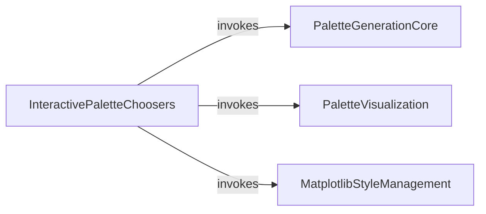

## Component Details

This component provides interactive widgets for users to dynamically select and preview various color palettes within an interactive Python environment. It leverages `ipywidgets` for user input, `matplotlib` for colormap manipulation and visualization, and `seaborn.palettes` for generating different types of color palettes. The main flow involves initializing a mutable colormap, allowing users to adjust palette parameters via sliders, updating the colormap's lookup table in real-time, and displaying the updated palette.

### InteractivePaletteChoosers
This component provides interactive widgets for users to select and customize various types of color palettes, including ColorBrewer, dark, light, diverging, and cubehelix palettes. It initializes mutable colormaps and updates their lookup tables for real-time visualization.

**Related Classes/Methods**:

- <a href="https://github.com/mwaskom/seaborn/blob/master/seaborn/widgets.py#L47-L140" target="_blank" rel="noopener noreferrer">`seaborn.seaborn.widgets.choose_colorbrewer_palette` (47:140)</a>
- <a href="https://github.com/mwaskom/seaborn/blob/master/seaborn/widgets.py#L143-L225" target="_blank" rel="noopener noreferrer">`seaborn.seaborn.widgets.choose_dark_palette` (143:225)</a>
- <a href="https://github.com/mwaskom/seaborn/blob/master/seaborn/widgets.py#L228-L310" target="_blank" rel="noopener noreferrer">`seaborn.seaborn.widgets.choose_light_palette` (228:310)</a>
- <a href="https://github.com/mwaskom/seaborn/blob/master/seaborn/widgets.py#L313-L369" target="_blank" rel="noopener noreferrer">`seaborn.seaborn.widgets.choose_diverging_palette` (313:369)</a>
- <a href="https://github.com/mwaskom/seaborn/blob/master/seaborn/widgets.py#L372-L426" target="_blank" rel="noopener noreferrer">`seaborn.seaborn.widgets.choose_cubehelix_palette` (372:426)</a>
- <a href="https://github.com/mwaskom/seaborn/blob/master/seaborn/widgets.py#L22-L28" target="_blank" rel="noopener noreferrer">`seaborn.seaborn.widgets._init_mutable_colormap` (22:28)</a>
- <a href="https://github.com/mwaskom/seaborn/blob/master/seaborn/widgets.py#L31-L34" target="_blank" rel="noopener noreferrer">`seaborn.seaborn.widgets._update_lut` (31:34)</a>
- <a href="https://github.com/mwaskom/seaborn/blob/master/seaborn/widgets.py#L37-L44" target="_blank" rel="noopener noreferrer">`seaborn.seaborn.widgets._show_cmap` (37:44)</a>
- `ipywidgets.interact` (full file reference)
- `ipywidgets.FloatSlider` (full file reference)
- `ipywidgets.IntSlider` (full file reference)
- `matplotlib.colors.LinearSegmentedColormap` (full file reference)
- `matplotlib.pyplot` (full file reference)
- `numpy` (full file reference)

### PaletteGenerationCore
This component is responsible for the fundamental creation and manipulation of various color palettes. It includes functions to generate general color palettes, sequential dark and light palettes, diverging palettes, and cubehelix palettes, often converting between different color spaces.

**Related Classes/Methods**:

- <a href="https://github.com/mwaskom/seaborn/blob/master/seaborn/palettes.py#L122-L255" target="_blank" rel="noopener noreferrer">`seaborn.seaborn.palettes.color_palette` (122:255)</a>
- <a href="https://github.com/mwaskom/seaborn/blob/master/seaborn/palettes.py#L433-L481" target="_blank" rel="noopener noreferrer">`seaborn.seaborn.palettes.dark_palette` (433:481)</a>
- <a href="https://github.com/mwaskom/seaborn/blob/master/seaborn/palettes.py#L484-L529" target="_blank" rel="noopener noreferrer">`seaborn.seaborn.palettes.light_palette` (484:529)</a>
- <a href="https://github.com/mwaskom/seaborn/blob/master/seaborn/palettes.py#L532-L578" target="_blank" rel="noopener noreferrer">`seaborn.seaborn.palettes.diverging_palette` (532:578)</a>
- <a href="https://github.com/mwaskom/seaborn/blob/master/seaborn/palettes.py#L665-L761" target="_blank" rel="noopener noreferrer">`seaborn.seaborn.palettes.cubehelix_palette` (665:761)</a>

### PaletteVisualization
This component handles the visual representation of color palettes. It provides a function to plot discrete color palettes as a horizontal array, aiding in their inspection and selection.

**Related Classes/Methods**:

- <a href="https://github.com/mwaskom/seaborn/blob/master/seaborn/miscplot.py#L9-L30" target="_blank" rel="noopener noreferrer">`seaborn.seaborn.miscplot.palplot` (9:30)</a>

### MatplotlibStyleManagement
This component manages the integration with Matplotlib's rcParams system to control the aesthetic style of plots. Specifically, it provides functionality to retrieve and apply predefined or custom axes styles, influencing elements like background color and grid visibility.

**Related Classes/Methods**:

- <a href="https://github.com/mwaskom/seaborn/blob/master/seaborn/rcmod.py#L146-L300" target="_blank" rel="noopener noreferrer">`seaborn.seaborn.rcmod.axes_style` (146:300)</a>

### [FAQ](https://github.com/CodeBoarding/GeneratedOnBoardings/tree/main?tab=readme-ov-file#faq)