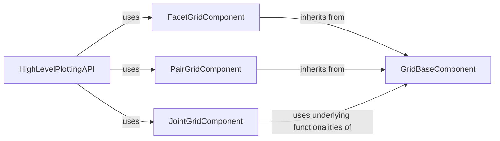

## Component Details

The Multi-Plot Grid System in Seaborn provides a robust framework for creating complex visualizations that display relationships across multiple variables or data subsets. It achieves this by organizing plots into structured grids with shared axes and consistent aesthetics. The system is built upon a foundational `GridBaseComponent` that manages common plotting elements, which is then extended by specialized components like `FacetGridComponent` for conditional relationships, `PairGridComponent` for pairwise variable comparisons, and `JointGridComponent` for combined bivariate and marginal distributions. High-level API functions offer simplified interfaces for common plotting tasks, leveraging these underlying grid components to generate sophisticated statistical graphics.

### GridBaseComponent
This component serves as the foundational layer for all grid-based plots in Seaborn. It provides core functionalities such as managing legends, retrieving color palettes, handling layout adjustments, and basic data ordering, which are inherited and utilized by specialized grid classes.

**Related Classes/Methods**:

- <a href="https://github.com/mwaskom/seaborn/blob/master/seaborn/axisgrid.py#L103-L306" target="_blank" rel="noopener noreferrer">`seaborn.axisgrid.Grid` (103:306)</a>
- <a href="https://github.com/mwaskom/seaborn/blob/master/seaborn/utils.py#L783-L800" target="_blank" rel="noopener noreferrer">`seaborn.utils.adjust_legend_subtitles` (783:800)</a>
- <a href="https://github.com/mwaskom/seaborn/blob/master/seaborn/utils.py#L58-L66" target="_blank" rel="noopener noreferrer">`seaborn.utils._draw_figure` (58:66)</a>
- <a href="https://github.com/mwaskom/seaborn/blob/master/seaborn/palettes.py#L122-L255" target="_blank" rel="noopener noreferrer">`seaborn.palettes.color_palette` (122:255)</a>
- <a href="https://github.com/mwaskom/seaborn/blob/master/seaborn/_base.py#L1744-L1777" target="_blank" rel="noopener noreferrer">`seaborn._base.categorical_order` (1744:1777)</a>
- <a href="https://github.com/mwaskom/seaborn/blob/master/seaborn/utils.py#L836-L851" target="_blank" rel="noopener noreferrer">`seaborn.utils._disable_autolayout` (836:851)</a>
- <a href="https://github.com/mwaskom/seaborn/blob/master/seaborn/_compat.py#L112-L117" target="_blank" rel="noopener noreferrer">`seaborn._compat.get_legend_handles` (112:117)</a>

### FacetGridComponent
This component extends the GridBaseComponent to enable the creation of multi-panel plots, where data is split into subsets based on categorical variables. It handles the mapping of plotting functions to these subsets, managing axis labels, titles, and overall grid finalization for faceted visualizations.

**Related Classes/Methods**:

- <a href="https://github.com/mwaskom/seaborn/blob/master/seaborn/axisgrid.py#L368-L1174" target="_blank" rel="noopener noreferrer">`seaborn.axisgrid.FacetGrid` (368:1174)</a>
- <a href="https://github.com/mwaskom/seaborn/blob/master/seaborn/_core/data.py#L270-L280" target="_blank" rel="noopener noreferrer">`seaborn._core.data.handle_data_source` (270:280)</a>

### PairGridComponent
This component specializes in generating grids of plots that illustrate pairwise relationships between variables in a dataset. It manages the identification of numeric columns, plotting bivariate relationships, and handling diagonal plots for univariate distributions, building upon the GridBaseComponent.

**Related Classes/Methods**:

- <a href="https://github.com/mwaskom/seaborn/blob/master/seaborn/axisgrid.py#L1177-L1676" target="_blank" rel="noopener noreferrer">`seaborn.axisgrid.PairGrid` (1177:1676)</a>
- <a href="https://github.com/mwaskom/seaborn/blob/master/seaborn/_base.py#L1472-L1561" target="_blank" rel="noopener noreferrer">`seaborn._base.variable_type` (1472:1561)</a>
- <a href="https://github.com/mwaskom/seaborn/blob/master/seaborn/_compat.py#L103-L109" target="_blank" rel="noopener noreferrer">`seaborn._compat.share_axis` (103:109)</a>

### JointGridComponent
This component is designed for creating plots that combine a central joint distribution plot with marginal distribution plots along the axes. It focuses on visualizing the relationship between two variables comprehensively, building upon the shared base functionalities provided by `_BaseGrid`, which is also the base for `GridBaseComponent`.

**Related Classes/Methods**:

- <a href="https://github.com/mwaskom/seaborn/blob/master/seaborn/axisgrid.py#L1679-L1964" target="_blank" rel="noopener noreferrer">`seaborn.axisgrid.JointGrid` (1679:1964)</a>
- <a href="https://github.com/mwaskom/seaborn/blob/master/seaborn/_base.py#L616-L1449" target="_blank" rel="noopener noreferrer">`seaborn._base.VectorPlotter` (616:1449)</a>

### HighLevelPlottingAPI
This component provides a set of user-friendly, high-level functions that abstract the complexities of creating various types of statistical plots. These functions internally utilize the specialized GridComponent classes to generate the desired visualizations, offering a simplified interface for common plotting tasks.

**Related Classes/Methods**:

- <a href="https://github.com/mwaskom/seaborn/blob/master/seaborn/distributions.py#L2094-L2283" target="_blank" rel="noopener noreferrer">`seaborn.distributions:displot` (2094:2283)</a>
- <a href="https://github.com/mwaskom/seaborn/blob/master/seaborn/axisgrid.py#L2010-L2181" target="_blank" rel="noopener noreferrer">`seaborn.axisgrid.pairplot` (2010:2181)</a>
- <a href="https://github.com/mwaskom/seaborn/blob/master/seaborn/axisgrid.py#L2184-L2341" target="_blank" rel="noopener noreferrer">`seaborn.axisgrid.jointplot` (2184:2341)</a>
- <a href="https://github.com/mwaskom/seaborn/blob/master/seaborn/categorical.py#L2761-L3148" target="_blank" rel="noopener noreferrer">`seaborn.categorical:catplot` (2761:3148)</a>
- <a href="https://github.com/mwaskom/seaborn/blob/master/seaborn/regression.py#L580-L661" target="_blank" rel="noopener noreferrer">`seaborn.regression:lmplot` (580:661)</a>

### [FAQ](https://github.com/CodeBoarding/GeneratedOnBoardings/tree/main?tab=readme-ov-file#faq)