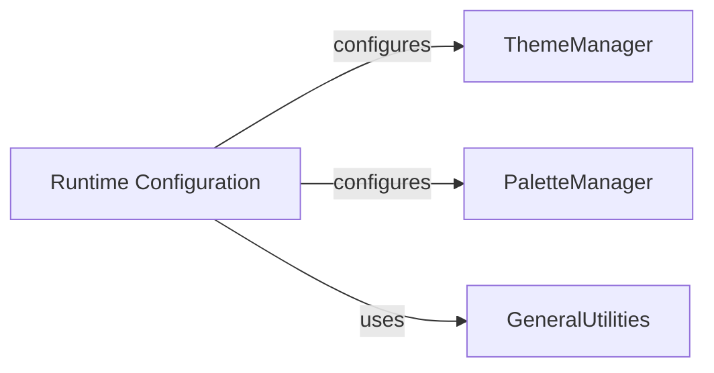

## Component Details

The Runtime Configuration component in Seaborn is responsible for managing and applying global aesthetic settings to plots through Matplotlib's rcParams system. It provides functions to set and retrieve axes styles, plotting contexts, and color palettes, allowing users to control the visual appearance of all Seaborn plots. This component acts as a central point for theme management, ensuring consistency across visualizations. It interacts with the ThemeManager and PaletteManager to apply styles and palettes, and it leverages GeneralUtilities for tasks like color code remapping.

### Runtime Configuration
Controls the global aesthetic settings of matplotlib, allowing users to apply predefined or custom themes, styles, and plotting contexts to influence the visual appearance of all seaborn plots.

**Related Classes/Methods**:

- <a href="https://github.com/mwaskom/seaborn/blob/master/seaborn/rcmod.py#L82-L123" target="_blank" rel="noopener noreferrer">`seaborn.seaborn.rcmod.set_theme` (82:123)</a>
- <a href="https://github.com/mwaskom/seaborn/blob/master/seaborn/rcmod.py#L126-L132" target="_blank" rel="noopener noreferrer">`seaborn.seaborn.rcmod.set` (126:132)</a>
- <a href="https://github.com/mwaskom/seaborn/blob/master/seaborn/rcmod.py#L146-L300" target="_blank" rel="noopener noreferrer">`seaborn.seaborn.rcmod.axes_style` (146:300)</a>
- <a href="https://github.com/mwaskom/seaborn/blob/master/seaborn/rcmod.py#L303-L332" target="_blank" rel="noopener noreferrer">`seaborn.seaborn.rcmod.set_style` (303:332)</a>
- <a href="https://github.com/mwaskom/seaborn/blob/master/seaborn/rcmod.py#L335-L432" target="_blank" rel="noopener noreferrer">`seaborn.seaborn.rcmod.plotting_context` (335:432)</a>
- <a href="https://github.com/mwaskom/seaborn/blob/master/seaborn/rcmod.py#L435-L469" target="_blank" rel="noopener noreferrer">`seaborn.seaborn.rcmod.set_context` (435:469)</a>
- <a href="https://github.com/mwaskom/seaborn/blob/master/seaborn/rcmod.py#L489-L492" target="_blank" rel="noopener noreferrer">`seaborn.seaborn.rcmod._AxesStyle` (489:492)</a>
- <a href="https://github.com/mwaskom/seaborn/blob/master/seaborn/rcmod.py#L495-L498" target="_blank" rel="noopener noreferrer">`seaborn.seaborn.rcmod._PlottingContext` (495:498)</a>
- <a href="https://github.com/mwaskom/seaborn/blob/master/seaborn/rcmod.py#L501-L533" target="_blank" rel="noopener noreferrer">`seaborn.seaborn.rcmod.set_palette` (501:533)</a>

### [FAQ](https://github.com/CodeBoarding/GeneratedOnBoardings/tree/main?tab=readme-ov-file#faq)