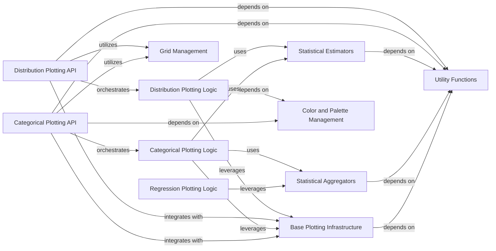

## Component Details

The Statistical Backend component serves as the analytical core for seaborn plots, providing fundamental statistical algorithms for data aggregation, density estimation (KDE), histogram binning, and empirical cumulative distribution functions (ECDF). It underpins various plotting functionalities by offering robust statistical estimations and data processing capabilities.

### Statistical Estimators
This component provides classes for estimating various statistical distributions and properties from data, including Kernel Density Estimation (KDE), Histograms, and Empirical Cumulative Distribution Functions (ECDF). It also includes the underlying gaussian_kde implementation.

**Related Classes/Methods**:

- <a href="https://github.com/mwaskom/seaborn/blob/master/seaborn/_statistics.py#L42-L195" target="_blank" rel="noopener noreferrer">`seaborn.seaborn._statistics.KDE` (42:195)</a>
- <a href="https://github.com/mwaskom/seaborn/blob/master/seaborn/_statistics.py#L200-L399" target="_blank" rel="noopener noreferrer">`seaborn.seaborn._statistics.Histogram` (200:399)</a>
- <a href="https://github.com/mwaskom/seaborn/blob/master/seaborn/_statistics.py#L402-L454" target="_blank" rel="noopener noreferrer">`seaborn.seaborn._statistics.ECDF` (402:454)</a>
- <a href="https://github.com/mwaskom/seaborn/blob/master/seaborn/_stats/density.py#L22-L214" target="_blank" rel="noopener noreferrer">`seaborn.seaborn._stats.density.KDE` (22:214)</a>
- <a href="https://github.com/mwaskom/seaborn/blob/master/seaborn/_stats/counting.py#L49-L232" target="_blank" rel="noopener noreferrer">`seaborn.seaborn._stats.counting.Hist` (49:232)</a>
- <a href="https://github.com/mwaskom/seaborn/blob/master/seaborn/_stats/order.py#L38-L78" target="_blank" rel="noopener noreferrer">`seaborn.seaborn._stats.order.Perc` (38:78)</a>
- <a href="https://github.com/mwaskom/seaborn/blob/master/seaborn/external/kde.py#L81-L380" target="_blank" rel="noopener noreferrer">`seaborn.seaborn.external.kde.gaussian_kde` (81:380)</a>

### Statistical Aggregators
This component focuses on aggregating data and computing statistical estimates along with their associated error bars. It includes general aggregators, weighted aggregators, and methods for calculating letter values and bootstrap confidence intervals.

**Related Classes/Methods**:

- <a href="https://github.com/mwaskom/seaborn/blob/master/seaborn/_statistics.py#L457-L520" target="_blank" rel="noopener noreferrer">`seaborn.seaborn._statistics.EstimateAggregator` (457:520)</a>
- <a href="https://github.com/mwaskom/seaborn/blob/master/seaborn/_statistics.py#L523-L576" target="_blank" rel="noopener noreferrer">`seaborn.seaborn._statistics.WeightedAggregator` (523:576)</a>
- <a href="https://github.com/mwaskom/seaborn/blob/master/seaborn/_statistics.py#L579-L660" target="_blank" rel="noopener noreferrer">`seaborn.seaborn._statistics.LetterValues` (579:660)</a>
- <a href="https://github.com/mwaskom/seaborn/blob/master/seaborn/_statistics.py#L663-L667" target="_blank" rel="noopener noreferrer">`seaborn.seaborn._statistics._percentile_interval` (663:667)</a>
- <a href="https://github.com/mwaskom/seaborn/blob/master/seaborn/_statistics.py#L670-L698" target="_blank" rel="noopener noreferrer">`seaborn.seaborn._statistics._validate_errorbar_arg` (670:698)</a>
- <a href="https://github.com/mwaskom/seaborn/blob/master/seaborn/algorithms.py#L6-L101" target="_blank" rel="noopener noreferrer">`seaborn.seaborn.algorithms.bootstrap` (6:101)</a>
- <a href="https://github.com/mwaskom/seaborn/blob/master/seaborn/algorithms.py#L104-L120" target="_blank" rel="noopener noreferrer">`seaborn.seaborn.algorithms._structured_bootstrap` (104:120)</a>
- <a href="https://github.com/mwaskom/seaborn/blob/master/seaborn/_stats/aggregation.py#L56-L122" target="_blank" rel="noopener noreferrer">`seaborn.seaborn._stats.aggregation.Est` (56:122)</a>

### Distribution Plotting Logic
This component encapsulates the internal logic and methods used by the high-level distribution plotting functions to prepare data, compute densities, and manage plot aesthetics specific to distribution visualizations.

**Related Classes/Methods**:

- <a href="https://github.com/mwaskom/seaborn/blob/master/seaborn/distributions.py#L99-L1351" target="_blank" rel="noopener noreferrer">`seaborn.seaborn.distributions._DistributionPlotter` (99:1351)</a>
- <a href="https://github.com/mwaskom/seaborn/blob/master/seaborn/distributions.py#L2375-L2387" target="_blank" rel="noopener noreferrer">`seaborn.seaborn.distributions._freedman_diaconis_bins` (2375:2387)</a>
- `seaborn.seaborn.distributions._quantile_to_level` (full file reference)
- `seaborn.seaborn.distributions._cmap_from_color` (full file reference)
- `seaborn.seaborn.distributions._default_discrete` (full file reference)

### Distribution Plotting API
This component provides the public-facing functions that users call to create various types of distribution plots, such as histograms, KDE plots, ECDF plots, and combined distribution plots.

**Related Classes/Methods**:

- <a href="https://github.com/mwaskom/seaborn/blob/master/seaborn/distributions.py#L1358-L1449" target="_blank" rel="noopener noreferrer">`seaborn.seaborn.distributions:histplot` (1358:1449)</a>
- <a href="https://github.com/mwaskom/seaborn/blob/master/seaborn/distributions.py#L1581-L1730" target="_blank" rel="noopener noreferrer">`seaborn.seaborn.distributions:kdeplot` (1581:1730)</a>
- <a href="https://github.com/mwaskom/seaborn/blob/master/seaborn/distributions.py#L1861-L1914" target="_blank" rel="noopener noreferrer">`seaborn.seaborn.distributions:ecdfplot` (1861:1914)</a>
- <a href="https://github.com/mwaskom/seaborn/blob/master/seaborn/distributions.py#L2094-L2283" target="_blank" rel="noopener noreferrer">`seaborn.seaborn.distributions:displot` (2094:2283)</a>
- <a href="https://github.com/mwaskom/seaborn/blob/master/seaborn/distributions.py#L2390-L2531" target="_blank" rel="noopener noreferrer">`seaborn.seaborn.distributions:distplot` (2390:2531)</a>
- <a href="https://github.com/mwaskom/seaborn/blob/master/seaborn/distributions.py#L1973-L2050" target="_blank" rel="noopener noreferrer">`seaborn.seaborn.distributions:rugplot` (1973:2050)</a>

### Categorical Plotting Logic
This component contains the internal classes and methods responsible for the data processing, layout, and aesthetic mapping specific to categorical plots, including handling dodging, color palettes, and axis adjustments.

**Related Classes/Methods**:

- <a href="https://github.com/mwaskom/seaborn/blob/master/seaborn/categorical.py#L49-L1360" target="_blank" rel="noopener noreferrer">`seaborn.seaborn.categorical._CategoricalPlotter` (49:1360)</a>
- <a href="https://github.com/mwaskom/seaborn/blob/master/seaborn/categorical.py#L1363-L1365" target="_blank" rel="noopener noreferrer">`seaborn.seaborn.categorical._CategoricalAggPlotter` (1363:1365)</a>
- <a href="https://github.com/mwaskom/seaborn/blob/master/seaborn/categorical.py#L394-L407" target="_blank" rel="noopener noreferrer">`seaborn.seaborn.categorical._CategoricalPlotter._dodge` (394:407)</a>
- <a href="https://github.com/mwaskom/seaborn/blob/master/seaborn/categorical.py#L385-L392" target="_blank" rel="noopener noreferrer">`seaborn.seaborn.categorical._CategoricalPlotter._dodge_needed` (385:392)</a>
- <a href="https://github.com/mwaskom/seaborn/blob/master/seaborn/categorical.py#L187-L205" target="_blank" rel="noopener noreferrer">`seaborn.seaborn.categorical._CategoricalPlotter._palette_without_hue_backcompat` (187:205)</a>
- <a href="https://github.com/mwaskom/seaborn/blob/master/seaborn/categorical.py#L134-L185" target="_blank" rel="noopener noreferrer">`seaborn.seaborn.categorical._CategoricalPlotter._hue_backcompat` (134:185)</a>
- <a href="https://github.com/mwaskom/seaborn/blob/master/seaborn/categorical.py#L296-L310" target="_blank" rel="noopener noreferrer">`seaborn.seaborn.categorical._CategoricalPlotter._boxen_scale_backcompat` (296:310)</a>
- <a href="https://github.com/mwaskom/seaborn/blob/master/seaborn/categorical.py#L312-L336" target="_blank" rel="noopener noreferrer">`seaborn.seaborn.categorical._CategoricalPlotter._complement_color` (312:336)</a>
- <a href="https://github.com/mwaskom/seaborn/blob/master/seaborn/categorical.py#L264-L282" target="_blank" rel="noopener noreferrer">`seaborn.seaborn.categorical._CategoricalPlotter._violin_scale_backcompat` (264:282)</a>
- <a href="https://github.com/mwaskom/seaborn/blob/master/seaborn/categorical.py#L284-L294" target="_blank" rel="noopener noreferrer">`seaborn.seaborn.categorical._CategoricalPlotter._violin_bw_backcompat` (284:294)</a>
- <a href="https://github.com/mwaskom/seaborn/blob/master/seaborn/categorical.py#L207-L235" target="_blank" rel="noopener noreferrer">`seaborn.seaborn.categorical._CategoricalPlotter._point_kwargs_backcompat` (207:235)</a>
- <a href="https://github.com/mwaskom/seaborn/blob/master/seaborn/categorical.py#L237-L262" target="_blank" rel="noopener noreferrer">`seaborn.seaborn.categorical._CategoricalPlotter._err_kws_backcompat` (237:262)</a>
- <a href="https://github.com/mwaskom/seaborn/blob/master/seaborn/categorical.py#L354-L383" target="_blank" rel="noopener noreferrer">`seaborn.seaborn.categorical._CategoricalPlotter._adjust_cat_axis` (354:383)</a>

### Categorical Plotting API
This component exposes the high-level functions for users to generate various categorical plots, such as boxen plots, violin plots, count plots, and the general categorical plot catplot.

**Related Classes/Methods**:

- <a href="https://github.com/mwaskom/seaborn/blob/master/seaborn/categorical.py#L1912-L1985" target="_blank" rel="noopener noreferrer">`seaborn.seaborn.categorical:boxenplot` (1912:1985)</a>
- <a href="https://github.com/mwaskom/seaborn/blob/master/seaborn/categorical.py#L1722-L1798" target="_blank" rel="noopener noreferrer">`seaborn.seaborn.categorical:violinplot` (1722:1798)</a>
- <a href="https://github.com/mwaskom/seaborn/blob/master/seaborn/categorical.py#L2627-L2702" target="_blank" rel="noopener noreferrer">`seaborn.seaborn.categorical:countplot` (2627:2702)</a>
- <a href="https://github.com/mwaskom/seaborn/blob/master/seaborn/categorical.py#L2761-L3148" target="_blank" rel="noopener noreferrer">`seaborn.seaborn.categorical:catplot` (2761:3148)</a>

### Base Plotting Infrastructure
This foundational component provides common plotting utilities, including data iteration, hue mapping, and base statistical transformation mechanisms, which are leveraged by various plotting types.

**Related Classes/Methods**:

- <a href="https://github.com/mwaskom/seaborn/blob/master/seaborn/_base.py#L616-L1449" target="_blank" rel="noopener noreferrer">`seaborn.seaborn._base.VectorPlotter` (616:1449)</a>
- <a href="https://github.com/mwaskom/seaborn/blob/master/seaborn/_base.py#L88-L295" target="_blank" rel="noopener noreferrer">`seaborn.seaborn._base.HueMapping` (88:295)</a>
- <a href="https://github.com/mwaskom/seaborn/blob/master/seaborn/_stats/base.py#L16-L65" target="_blank" rel="noopener noreferrer">`seaborn._stats.base.Stat` (16:65)</a>
- <a href="https://github.com/mwaskom/seaborn/blob/master/seaborn/_core/groupby.py#L16-L129" target="_blank" rel="noopener noreferrer">`seaborn._core.groupby.GroupBy` (16:129)</a>
- <a href="https://github.com/mwaskom/seaborn/blob/master/seaborn/_core/scales.py#L55-L145" target="_blank" rel="noopener noreferrer">`seaborn._core.scales.Scale` (55:145)</a>

### Grid Management
This component is responsible for creating and managing multi-panel plot grids, allowing for the arrangement and customization of subplots within a figure.

**Related Classes/Methods**:

- <a href="https://github.com/mwaskom/seaborn/blob/master/seaborn/axisgrid.py#L368-L1174" target="_blank" rel="noopener noreferrer">`seaborn.seaborn.axisgrid.FacetGrid` (368:1174)</a>
- <a href="https://github.com/mwaskom/seaborn/blob/master/seaborn/axisgrid.py#L103-L306" target="_blank" rel="noopener noreferrer">`seaborn.seaborn.axisgrid.Grid` (103:306)</a>

### Utility Functions
This component comprises a collection of general-purpose helper functions used throughout the Seaborn library for tasks such as argument validation, color handling, data transformations, and default value assignments.

**Related Classes/Methods**:

- <a href="https://github.com/mwaskom/seaborn/blob/master/seaborn/utils.py#L750-L761" target="_blank" rel="noopener noreferrer">`seaborn.seaborn.utils._check_argument` (750:761)</a>
- <a href="https://github.com/mwaskom/seaborn/blob/master/seaborn/utils.py#L69-L144" target="_blank" rel="noopener noreferrer">`seaborn.seaborn.utils._default_color` (69:144)</a>
- <a href="https://github.com/mwaskom/seaborn/blob/master/seaborn/utils.py#L828-L832" target="_blank" rel="noopener noreferrer">`seaborn.seaborn.utils._get_transform_functions` (828:832)</a>
- <a href="https://github.com/mwaskom/seaborn/blob/master/seaborn/utils.py#L243-L257" target="_blank" rel="noopener noreferrer">`seaborn.seaborn.utils.remove_na` (243:257)</a>
- <a href="https://github.com/mwaskom/seaborn/blob/master/seaborn/utils.py#L147-L183" target="_blank" rel="noopener noreferrer">`seaborn.seaborn.utils.desaturate` (147:183)</a>
- <a href="https://github.com/mwaskom/seaborn/blob/master/seaborn/utils.py#L764-L780" target="_blank" rel="noopener noreferrer">`seaborn.seaborn.utils._assign_default_kwargs` (764:780)</a>
- <a href="https://github.com/mwaskom/seaborn/blob/master/seaborn/utils.py#L883-L897" target="_blank" rel="noopener noreferrer">`seaborn.seaborn.utils._get_patch_legend_artist` (883:897)</a>
- <a href="https://github.com/mwaskom/seaborn/blob/master/seaborn/utils.py#L478-L484" target="_blank" rel="noopener noreferrer">`seaborn.seaborn.utils._kde_support` (478:484)</a>
- <a href="https://github.com/mwaskom/seaborn/blob/master/seaborn/utils.py#L854-L856" target="_blank" rel="noopener noreferrer">`seaborn.seaborn.utils._version_predates` (854:856)</a>

### Color and Palette Management
This component handles the generation and manipulation of color palettes, ensuring consistent and aesthetically pleasing color schemes across plots.

**Related Classes/Methods**:

- <a href="https://github.com/mwaskom/seaborn/blob/master/seaborn/palettes.py#L122-L255" target="_blank" rel="noopener noreferrer">`seaborn.seaborn.palettes.color_palette` (122:255)</a>
- <a href="https://github.com/mwaskom/seaborn/blob/master/seaborn/palettes.py#L484-L529" target="_blank" rel="noopener noreferrer">`seaborn.seaborn.palettes.light_palette` (484:529)</a>

### Regression Plotting Logic
This component contains the internal logic for fitting and estimating regression models, including the use of bootstrapping for confidence intervals, primarily used in regression plots.

**Related Classes/Methods**:

- <a href="https://github.com/mwaskom/seaborn/blob/master/seaborn/regression.py#L70-L442" target="_blank" rel="noopener noreferrer">`seaborn.seaborn.regression._RegressionPlotter` (70:442)</a>

### [FAQ](https://github.com/CodeBoarding/GeneratedOnBoardings/tree/main?tab=readme-ov-file#faq)