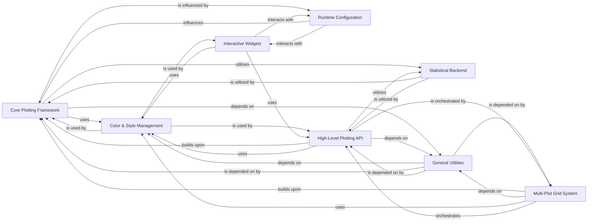

## Component Details

The seaborn library provides a high-level API for drawing attractive and informative statistical graphics in Python. Its architecture is built around a `Core Plotting Framework` that handles the fundamental aspects of plot rendering, supported by a `Statistical Backend` for data analysis and `Color & Style Management` for aesthetics. `General Utilities` provide common helper functions, while `Runtime Configuration` allows global aesthetic adjustments. The `High-Level Plotting API` offers user-friendly functions for various plot types, often orchestrated by the `Multi-Plot Grid System` for complex layouts. `Interactive Widgets` provide dynamic control over certain aspects, primarily color palettes.

### Core Plotting Framework
The foundational layer of seaborn's plotting capabilities, responsible for handling data input, variable mapping (hue, size, style), axis scaling, managing plot element properties, data grouping, and orchestrating the overall rendering process of visual marks. It provides the `VectorPlotter` and `SemanticMapping` classes.

**Related Classes/Methods**:

- `seaborn.seaborn._base` (full file reference)
- `seaborn.seaborn._core.plot` (full file reference)
- `seaborn.seaborn._core.data` (full file reference)
- `seaborn.seaborn._core.scales` (full file reference)
- `seaborn.seaborn._core.properties` (full file reference)
- `seaborn.seaborn._core.rules` (full file reference)
- `seaborn.seaborn._core.groupby` (full file reference)
- `seaborn.seaborn._core.moves` (full file reference)
- `seaborn.seaborn._core.subplots` (full file reference)
- `seaborn.seaborn._core.exceptions` (full file reference)
- `seaborn.seaborn._marks.area` (full file reference)
- `seaborn.seaborn._marks.bar` (full file reference)
- `seaborn.seaborn._marks.base` (full file reference)
- `seaborn.seaborn._marks.dot` (full file reference)
- `seaborn.seaborn._marks.line` (full file reference)
- `seaborn.seaborn._marks.text` (full file reference)

### Statistical Backend
Provides core statistical algorithms for data aggregation, density estimation (KDE), histogram binning, and empirical cumulative distribution functions (ECDF), serving as the analytical foundation for many seaborn plots.

**Related Classes/Methods**:

- `seaborn.seaborn._statistics` (full file reference)
- `seaborn.seaborn._stats.aggregation` (full file reference)
- `seaborn.seaborn._stats.counting` (full file reference)
- `seaborn.seaborn._stats.density` (full file reference)
- `seaborn.seaborn._stats.order` (full file reference)
- `seaborn.seaborn.algorithms` (full file reference)
- `seaborn.seaborn.external.kde` (full file reference)

### Color & Style Management
Manages the generation and application of color palettes, including various color space conversions (e.g., HUSL), and provides utilities for generating unique marker and dash styles to ensure visually appealing and informative data representations.

**Related Classes/Methods**:

- `seaborn.seaborn.palettes` (full file reference)
- `seaborn.seaborn.external.husl` (full file reference)

### General Utilities
A comprehensive collection of helper functions supporting various aspects of the library, such as argument validation, data manipulation, version compatibility checks, and legend adjustments.

**Related Classes/Methods**:

- `seaborn.seaborn.utils` (full file reference)
- `seaborn.seaborn._compat` (full file reference)
- `seaborn.seaborn.external.appdirs` (full file reference)
- `seaborn.seaborn.external.version` (full file reference)

### Runtime Configuration
Controls the global aesthetic settings of matplotlib, allowing users to apply predefined or custom themes, styles, and plotting contexts to influence the visual appearance of all seaborn plots.

**Related Classes/Methods**:

- `seaborn.seaborn.rcmod` (full file reference)

### Multi-Plot Grid System
Facilitates the creation of complex grids of plots, including facet grids, pair plots, and joint plots, enabling the visualization of relationships across multiple variables or subsets of data with shared axes and consistent aesthetics.

**Related Classes/Methods**:

- `seaborn.seaborn.axisgrid` (full file reference)

### High-Level Plotting API
Provides a diverse set of user-facing functions for creating various statistical visualizations, including distribution plots (histograms, KDEs), categorical plots (box, violin, bar), relational plots (scatter, line), regression plots, and matrix plots (heatmaps, cluster maps). These functions abstract away the underlying plotting complexities.

**Related Classes/Methods**:

- `seaborn.seaborn.distributions` (full file reference)
- `seaborn.seaborn.categorical` (full file reference)
- `seaborn.seaborn.relational` (full file reference)
- `seaborn.seaborn.regression` (full file reference)
- `seaborn.seaborn.matrix` (full file reference)

### Interactive Widgets
Offers interactive user interface elements, primarily for dynamic selection and preview of color palettes within an interactive Python environment.

**Related Classes/Methods**:

- `seaborn.seaborn.widgets` (full file reference)

### [FAQ](https://github.com/CodeBoarding/GeneratedOnBoardings/tree/main?tab=readme-ov-file#faq)