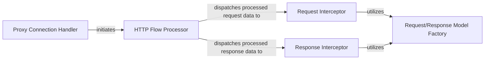

## Details

The `Network Traffic Interception & Dispatcher` subsystem is the core of `selenium-wire`'s functionality, responsible for capturing, processing, and exposing network traffic. It leverages a proxy pattern to intercept raw HTTP/HTTPS requests and responses, transforming them into structured data models for further manipulation and analysis.

### Proxy Connection Handler
This component is responsible for establishing and managing new client connections to the proxy server. It initiates the connection handling process and sets up the appropriate protocol layer (e.g., HTTP) for incoming traffic.

**Related Classes/Methods**:

- <a href="https://github.com/wkeeling/selenium-wire/blob/master/seleniumwire/thirdparty/mitmproxy/server/server.py" target="_blank" rel="noopener noreferrer">`mitmproxy.server.server`</a>

### HTTP Flow Processor
The central orchestrator within the `mitmproxy` core for managing the HTTP request-response lifecycle. It receives raw traffic, parses it, and dispatches the processed requests and responses to `selenium-wire`'s custom handlers for application-specific logic.

**Related Classes/Methods**:

- <a href="https://github.com/wkeeling/selenium-wire/blob/master/seleniumwire/thirdparty/mitmproxy/server/protocol/http.py#L259-L507" target="_blank" rel="noopener noreferrer">`mitmproxy.server.protocol.http._process_flow`:259-507</a>

### Request Interceptor
This component acts as a primary interception point for incoming HTTP requests. It receives parsed request data from the `HTTP Flow Processor`, converts it into `selenium-wire`'s `Request` model, and allows for initial filtering or pre-processing before further dispatch.

**Related Classes/Methods**:

- <a href="https://github.com/wkeeling/selenium-wire/blob/master/seleniumwire/handler.py" target="_blank" rel="noopener noreferrer">`seleniumwire.handler.request`</a>

### Response Interceptor
Similar to the Request Interceptor, this component is the primary interception point for HTTP responses. It receives parsed response data, converts it into `selenium-wire`'s `Response` model, and associates it with its original request, enabling post-processing.

**Related Classes/Methods**:

- <a href="https://github.com/wkeeling/selenium-wire/blob/master/seleniumwire/handler.py" target="_blank" rel="noopener noreferrer">`seleniumwire.handler.response`</a>

### Request/Response Model Factory
This component provides factory methods for instantiating `selenium-wire` specific `Request` and `Response` objects. It enriches the raw data received from `mitmproxy` with additional context and attributes relevant to `selenium-wire`'s API.

**Related Classes/Methods**:

- <a href="https://github.com/wkeeling/selenium-wire/blob/master/seleniumwire/handler.py" target="_blank" rel="noopener noreferrer">`seleniumwire.handler._create_request_response`</a>

### [FAQ](https://github.com/CodeBoarding/GeneratedOnBoardings/tree/main?tab=readme-ov-file#faq)