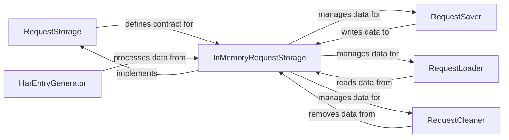

## Details

The `Network Traffic Storage & Export` subsystem is responsible for persisting intercepted network traffic and providing mechanisms for its retrieval and export, particularly in the HTTP Archive (HAR) format.

### RequestStorage
This abstract component defines the contract for how network requests, responses, and related data are stored and retrieved. It serves as the primary interface for data persistence, ensuring that different storage implementations can be used interchangeably.

**Related Classes/Methods**:

- <a href="https://github.com/wkeeling/selenium-wire/blob/master/seleniumwire/storage.py#L49-L346" target="_blank" rel="noopener noreferrer">`RequestStorage`:49-346</a>

### InMemoryRequestStorage
This concrete component provides an in-memory implementation of the `RequestStorage` interface. It manages the actual data structures (e.g., lists, dictionaries) that hold intercepted requests, responses, and HAR entries during the application's runtime.

**Related Classes/Methods**:

- <a href="https://github.com/wkeeling/selenium-wire/blob/master/seleniumwire/storage.py#L349-L527" target="_blank" rel="noopener noreferrer">`InMemoryRequestStorage`:349-527</a>

### RequestSaver
Responsible for the persistence of individual network events. This component handles saving intercepted requests, their corresponding responses, and WebSocket messages to the underlying storage mechanism (e.g., `InMemoryRequestStorage`).

**Related Classes/Methods**:

- <a href="https://github.com/wkeeling/selenium-wire/blob/master/seleniumwire/storage.py" target="_blank" rel="noopener noreferrer">`RequestSaver`</a>

### RequestLoader
Provides functionalities for querying and retrieving stored network traffic data. This includes methods for fetching specific requests, the last intercepted request, or iterating through all stored requests, acting as the read interface to the storage.

**Related Classes/Methods**:

- <a href="https://github.com/wkeeling/selenium-wire/blob/master/seleniumwire/storage.py" target="_blank" rel="noopener noreferrer">`RequestLoader`</a>

### RequestCleaner
Manages the lifecycle and cleanup of stored network traffic data. This component is responsible for clearing all stored requests and performing any necessary resource cleanup to ensure efficient memory usage.

**Related Classes/Methods**:

- <a href="https://github.com/wkeeling/selenium-wire/blob/master/seleniumwire/storage.py" target="_blank" rel="noopener noreferrer">`RequestCleaner`</a>

### HarEntryGenerator
Transforms raw intercepted `Request` and `Response` objects into a standardized HTTP Archive (HAR) entry dictionary, adhering to the HAR specification. This is crucial for exporting network data in a widely recognized format.

**Related Classes/Methods**:

- <a href="https://github.com/wkeeling/selenium-wire/blob/master/seleniumwire/har.py" target="_blank" rel="noopener noreferrer">`HarEntryGenerator`</a>

### [FAQ](https://github.com/CodeBoarding/GeneratedOnBoardings/tree/main?tab=readme-ov-file#faq)