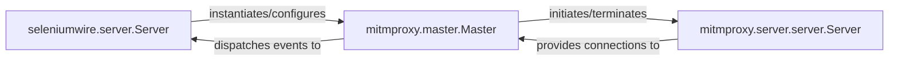

## Details

The `selenium-wire` subsystem primarily functions as a specialized proxy built upon the `mitmproxy` framework. At its core, `seleniumwire.server.Server` acts as the entry point, orchestrating and adapting `mitmproxy`'s functionalities to meet Selenium Wire's specific requirements, such as request/response interception and storage. The `mitmproxy.master.Master` component serves as the central control unit, managing the overall proxy lifecycle and event flow. It interacts closely with `mitmproxy.server.server.Server`, which handles the low-level network operations, accepting client connections and dispatching them for further processing. This architecture allows Selenium Wire to leverage `mitmproxy`'s robust proxy capabilities while adding its unique features for automated web testing.

### seleniumwire.server.Server
This component serves as the Selenium Wire-specific entry point for the proxy. It acts as an orchestrator and adapter, configuring and integrating the underlying mitmproxy components with Selenium Wire's unique features, such as request/response storage and interception. It manages the lifecycle of the Selenium Wire proxy instance.

**Related Classes/Methods**:

- <a href="https://github.com/wkeeling/selenium-wire/blob/master/seleniumwire/server.py" target="_blank" rel="noopener noreferrer">`seleniumwire.server.Server`</a>

### mitmproxy.master.Master
This is the central control unit of the mitmproxy engine. It manages the entire lifecycle of the proxy server, including starting the event loop, coordinating the flow of events (e.g., client connections, HTTP requests/responses), and gracefully shutting down the server and its associated components. It acts as the primary orchestrator for all core proxy operations.

**Related Classes/Methods**:

- <a href="https://github.com/wkeeling/selenium-wire/blob/master/seleniumwire/thirdparty/mitmproxy/master.py#L39-L160" target="_blank" rel="noopener noreferrer">`mitmproxy.master.Master`:39-160</a>

### mitmproxy.server.server.Server
This component handles the low-level network operations of the proxy. It is responsible for listening for incoming client connections, accepting them, and then dispatching these connections to appropriate handlers for further protocol-specific processing (e.g., HTTP, HTTPS). It represents the direct interface with the network.

**Related Classes/Methods**:

- <a href="https://github.com/wkeeling/selenium-wire/blob/master/seleniumwire/thirdparty/mitmproxy/server/server.py" target="_blank" rel="noopener noreferrer">`mitmproxy.server.server.Server`</a>

### [FAQ](https://github.com/CodeBoarding/GeneratedOnBoardings/tree/main?tab=readme-ov-file#faq)