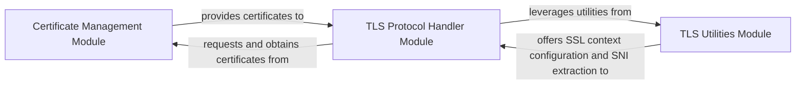

## Details

The SSL/TLS Interception & Certificate Management subsystem is a critical part of selenium-wire, enabling the transparent interception and modification of HTTPS traffic. It achieves this by acting as a man-in-the-middle proxy, dynamically generating and managing SSL/TLS certificates, and orchestrating the secure handshake process.

### Certificate Management Module
This module is responsible for the entire lifecycle of SSL/TLS certificates necessary for the proxy's operation. It handles the generation of a root Certificate Authority (CA), the creation of on-the-fly dummy certificates for intercepted domains, and the storage and retrieval of these certificates. Its role is fundamental in ensuring that the browser trusts the proxy's connection.

**Related Classes/Methods**:

- <a href="https://github.com/wkeeling/selenium-wire/blob/master/seleniumwire/thirdparty/mitmproxy/certs.py#L232-L282" target="_blank" rel="noopener noreferrer">`create_store`:232-282</a>
- <a href="https://github.com/wkeeling/selenium-wire/blob/master/seleniumwire/thirdparty/mitmproxy/certs.py#L39-L80" target="_blank" rel="noopener noreferrer">`create_ca`:39-80</a>
- <a href="https://github.com/wkeeling/selenium-wire/blob/master/seleniumwire/thirdparty/mitmproxy/certs.py" target="_blank" rel="noopener noreferrer">`dummy_cert`</a>
- <a href="https://github.com/wkeeling/selenium-wire/blob/master/seleniumwire/thirdparty/mitmproxy/certs.py#L327-L371" target="_blank" rel="noopener noreferrer">`get_cert`:327-371</a>

### TLS Utilities Module
Provides foundational utilities for low-level TLS operations. This includes configuring SSL contexts for both client and server connections, which are essential for establishing secure communication channels. It also offers functionality to parse initial TLS handshake messages, such as the Client Hello, to extract critical information like Server Name Indication (SNI) for certificate matching.

**Related Classes/Methods**:

- <a href="https://github.com/wkeeling/selenium-wire/blob/master/seleniumwire/thirdparty/mitmproxy/net/tls.py#L227-L299" target="_blank" rel="noopener noreferrer">`create_client_context`:227-299</a>
- <a href="https://github.com/wkeeling/selenium-wire/blob/master/seleniumwire/thirdparty/mitmproxy/net/tls.py#L313-L371" target="_blank" rel="noopener noreferrer">`create_server_context`:313-371</a>
- <a href="https://github.com/wkeeling/selenium-wire/blob/master/seleniumwire/thirdparty/mitmproxy/net/tls.py#L392-L418" target="_blank" rel="noopener noreferrer">`get_client_hello`:392-418</a>

### TLS Protocol Handler Module
This module acts as the central orchestrator for the TLS handshake process within the proxy. It determines the appropriate TLS handshake flow (e.g., client-only, server-only, or full man-in-the-middle), integrates with the Certificate Management Module to obtain the necessary certificates, and utilizes the TLS Utilities Module to establish and manage secure connections. It is the core mechanism that enables the decryption and re-encryption of HTTPS traffic.

**Related Classes/Methods**:

- <a href="https://github.com/wkeeling/selenium-wire/blob/master/seleniumwire/thirdparty/mitmproxy/log.py#L58-L61" target="_blank" rel="noopener noreferrer">`__call__`:58-61</a>
- <a href="https://github.com/wkeeling/selenium-wire/blob/master/seleniumwire/thirdparty/mitmproxy/server/protocol/tls.py#L370-L403" target="_blank" rel="noopener noreferrer">`_establish_tls_with_client`:370-403</a>
- <a href="https://github.com/wkeeling/selenium-wire/blob/master/seleniumwire/thirdparty/mitmproxy/server/protocol/tls.py#L405-L467" target="_blank" rel="noopener noreferrer">`_establish_tls_with_server`:405-467</a>
- <a href="https://github.com/wkeeling/selenium-wire/blob/master/seleniumwire/thirdparty/mitmproxy/server/protocol/tls.py#L469-L508" target="_blank" rel="noopener noreferrer">`_find_cert`:469-508</a>

### [FAQ](https://github.com/CodeBoarding/GeneratedOnBoardings/tree/main?tab=readme-ov-file#faq)