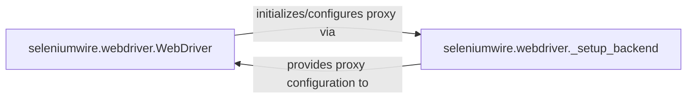

## Details

The Selenium WebDriver Integration subsystem centers around the `seleniumwire.webdriver.WebDriver` component, which serves as the primary interface for users to interact with a web browser while enabling network traffic interception. This component achieves its core functionality by delegating the intricate proxy setup and configuration to the `seleniumwire.webdriver._setup_backend` function. The `_setup_backend` is responsible for creating and configuring the underlying proxy server, generating the necessary proxy settings, and returning them to the `WebDriver` for seamless integration with the browser instance. This clear separation of concerns allows the `WebDriver` to maintain a familiar Selenium interface while `_setup_backend` handles the low-level network plumbing, ensuring robust and efficient traffic interception capabilities.

### seleniumwire.webdriver.WebDriver
This is the core user-facing component of the Selenium WebDriver Integration subsystem. It acts as the primary entry point for users, extending standard Selenium WebDriver classes (e.g., Chrome, Firefox) to enable network traffic interception and manipulation. Its responsibility is to provide a familiar WebDriver interface while seamlessly integrating selenium-wire's proxy functionality by initiating the proxy setup process.

**Related Classes/Methods**: _None_

### seleniumwire.webdriver._setup_backend
An internal helper function within the Selenium WebDriver Integration subsystem. Its responsibility is to manage the intricate, low-level setup and configuration of the selenium-wire proxy. This includes creating the backend proxy server, handling proxy settings, and generating the necessary configuration (e.g., `httpProxy`, `sslProxy`, `acceptInsecureCerts`) that the `WebDriver` uses to direct browser traffic through the proxy.

**Related Classes/Methods**:

- <a href="https://github.com/wkeeling/selenium-wire/blob/master/seleniumwire/webdriver.py#L37-L63" target="_blank" rel="noopener noreferrer">`seleniumwire.webdriver._setup_backend`:37-63</a>

### [FAQ](https://github.com/CodeBoarding/GeneratedOnBoardings/tree/main?tab=readme-ov-file#faq)