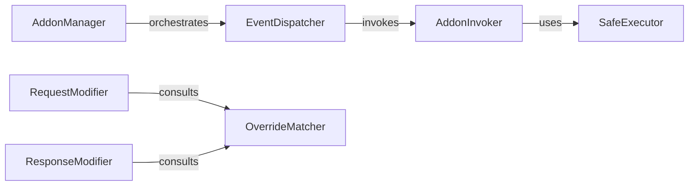

## Details

The `Traffic Modification & Extensibility` subsystem is responsible for managing and applying user-defined interception logic (addons) to modify intercepted requests and responses, leveraging `mitmproxy`'s addon framework.

### AddonManager
The primary interface for users to register, add, remove, and manage custom interception logic (addons). It acts as the central registry for all active addons, orchestrating their lifecycle and event handling.

**Related Classes/Methods**:

- <a href="https://github.com/wkeeling/selenium-wire/blob/master/seleniumwire/thirdparty/mitmproxy/addonmanager.py#L111-L258" target="_blank" rel="noopener noreferrer">`AddonManager`:111-258</a>

### EventDispatcher
Dispatches specific network events (e.g., request, response, error) to all registered addons, ensuring their corresponding handler methods are invoked. This is crucial for implementing the Interceptor Pattern.

**Related Classes/Methods**:

- <a href="https://github.com/wkeeling/selenium-wire/blob/master/seleniumwire/thirdparty/mitmproxy/addonmanager.py" target="_blank" rel="noopener noreferrer">`EventDispatcher`</a>

### AddonInvoker
Encapsulates the logic for executing a specific method on a given addon. It acts as an intermediary to ensure proper execution flow and separation of concerns.

**Related Classes/Methods**:

- <a href="https://github.com/wkeeling/selenium-wire/blob/master/seleniumwire/thirdparty/mitmproxy/addonmanager.py" target="_blank" rel="noopener noreferrer">`AddonInvoker`</a>

### SafeExecutor
Provides a robust execution context for addon methods, catching and handling exceptions to prevent a single faulty addon from disrupting the entire proxy operation. This ensures the stability and reliability of the library.

**Related Classes/Methods**:

- <a href="https://github.com/wkeeling/selenium-wire/blob/master/seleniumwire/thirdparty/mitmproxy/addonmanager.py" target="_blank" rel="noopener noreferrer">`SafeExecutor`</a>

### RequestModifier
Applies predefined and user-defined modifications to outgoing HTTP requests. This component implements the concrete interception logic for requests, allowing for dynamic alteration of request properties.

**Related Classes/Methods**:

- <a href="https://github.com/wkeeling/selenium-wire/blob/master/seleniumwire/modifier.py#L8-L343" target="_blank" rel="noopener noreferrer">`RequestModifier`:8-343</a>

### ResponseModifier
Applies predefined and user-defined modifications to incoming HTTP responses. This component handles the concrete interception logic for responses, enabling manipulation of response content or headers.

**Related Classes/Methods**:

- <a href="https://github.com/wkeeling/selenium-wire/blob/master/seleniumwire/modifier.py" target="_blank" rel="noopener noreferrer">`ResponseModifier`</a>

### OverrideMatcher
Identifies and filters the relevant modification rules or overrides that apply to a given request or response based on specified criteria (e.g., URL patterns, headers). It acts as a decision-making component for applying specific modifications.

**Related Classes/Methods**:

- <a href="https://github.com/wkeeling/selenium-wire/blob/master/seleniumwire/modifier.py" target="_blank" rel="noopener noreferrer">`OverrideMatcher`</a>

### [FAQ](https://github.com/CodeBoarding/GeneratedOnBoardings/tree/main?tab=readme-ov-file#faq)