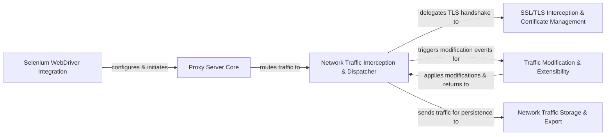

## Details

The `selenium-wire` architecture seamlessly integrates a powerful network proxy with Selenium WebDriver, enabling comprehensive control over browser network traffic. At its core, the **Selenium WebDriver Integration** component sets up and directs browser traffic through the **Proxy Server Core**. This core then funnels all intercepted requests and responses to the **Network Traffic Interception & Dispatcher**, which acts as the central orchestrator. This dispatcher intelligently routes HTTPS traffic through the **SSL/TLS Interception & Certificate Management** for decryption, and dispatches events to the **Traffic Modification & Extensibility** component, allowing users to inject custom logic for altering requests and responses. Finally, all processed traffic is sent to the **Network Traffic Storage & Export** component for persistent storage and the generation of detailed HAR reports. This design creates a robust, extensible pipeline for network traffic analysis and manipulation within a Selenium automation context.

### Selenium WebDriver Integration [[Expand]](./Selenium_WebDriver_Integration.md)
The primary user-facing component that extends Selenium WebDriver, responsible for configuring and initiating the `selenium-wire` proxy to route browser traffic.

**Related Classes/Methods**:

- <a href="https://github.com/wkeeling/selenium-wire/blob/master/seleniumwire/webdriver.py" target="_blank" rel="noopener noreferrer">`seleniumwire/webdriver.py`</a>

### Proxy Server Core [[Expand]](./Proxy_Server_Core.md)
The central proxy engine, built upon `mitmproxy`, responsible for listening for incoming connections, managing the proxy's lifecycle, and dispatching raw network traffic.

**Related Classes/Methods**:

- <a href="https://github.com/wkeeling/selenium-wire/blob/master/seleniumwire/server.py" target="_blank" rel="noopener noreferrer">`seleniumwire/server.py`</a>
- <a href="https://github.com/wkeeling/selenium-wire/blob/master/seleniumwire/thirdparty/mitmproxy/master.py" target="_blank" rel="noopener noreferrer">`seleniumwire/thirdparty/mitmproxy/master.py`</a>

### Network Traffic Interception & Dispatcher [[Expand]](./Network_Traffic_Interception_Dispatcher.md)
Intercepts and processes raw HTTP/HTTPS requests and responses, converting them into structured data models and dispatching them for further processing, including modification and storage.

**Related Classes/Methods**:

- <a href="https://github.com/wkeeling/selenium-wire/blob/master/seleniumwire/handler.py" target="_blank" rel="noopener noreferrer">`seleniumwire/handler.py`</a>
- <a href="https://github.com/wkeeling/selenium-wire/blob/master/seleniumwire/thirdparty/mitmproxy/server/server.py" target="_blank" rel="noopener noreferrer">`seleniumwire/thirdparty/mitmproxy/server/server.py`</a>
- <a href="https://github.com/wkeeling/selenium-wire/blob/master/seleniumwire/thirdparty/mitmproxy/server/protocol/http.py" target="_blank" rel="noopener noreferrer">`seleniumwire/thirdparty/mitmproxy/server/protocol/http.py`</a>

### Traffic Modification & Extensibility [[Expand]](./Traffic_Modification_Extensibility.md)
Manages and applies user-defined interception logic (addons) to modify intercepted requests and responses, leveraging `mitmproxy`'s addon framework.

**Related Classes/Methods**:

- <a href="https://github.com/wkeeling/selenium-wire/blob/master/seleniumwire/modifier.py" target="_blank" rel="noopener noreferrer">`seleniumwire/modifier.py`</a>
- <a href="https://github.com/wkeeling/selenium-wire/blob/master/seleniumwire/thirdparty/mitmproxy/addonmanager.py" target="_blank" rel="noopener noreferrer">`seleniumwire/thirdparty/mitmproxy/addonmanager.py`</a>

### Network Traffic Storage & Export [[Expand]](./Network_Traffic_Storage_Export.md)
Persists intercepted network traffic data and provides functionalities to retrieve and export this data, including generating HTTP Archive (HAR) entries.

**Related Classes/Methods**:

- <a href="https://github.com/wkeeling/selenium-wire/blob/master/seleniumwire/storage.py" target="_blank" rel="noopener noreferrer">`seleniumwire/storage.py`</a>
- <a href="https://github.com/wkeeling/selenium-wire/blob/master/seleniumwire/har.py" target="_blank" rel="noopener noreferrer">`seleniumwire/har.py`</a>

### SSL/TLS Interception & Certificate Management [[Expand]](./SSL_TLS_Interception_Certificate_Management.md)
Handles the secure socket layer (SSL/TLS) handshake for HTTPS traffic, including dynamic certificate generation, to enable transparent interception of encrypted communications.

**Related Classes/Methods**:

- <a href="https://github.com/wkeeling/selenium-wire/blob/master/seleniumwire/thirdparty/mitmproxy/server/protocol/tls.py" target="_blank" rel="noopener noreferrer">`seleniumwire/thirdparty/mitmproxy/server/protocol/tls.py`</a>
- <a href="https://github.com/wkeeling/selenium-wire/blob/master/seleniumwire/thirdparty/mitmproxy/certs.py" target="_blank" rel="noopener noreferrer">`seleniumwire/thirdparty/mitmproxy/certs.py`</a>

### [FAQ](https://github.com/CodeBoarding/GeneratedOnBoardings/tree/main?tab=readme-ov-file#faq)