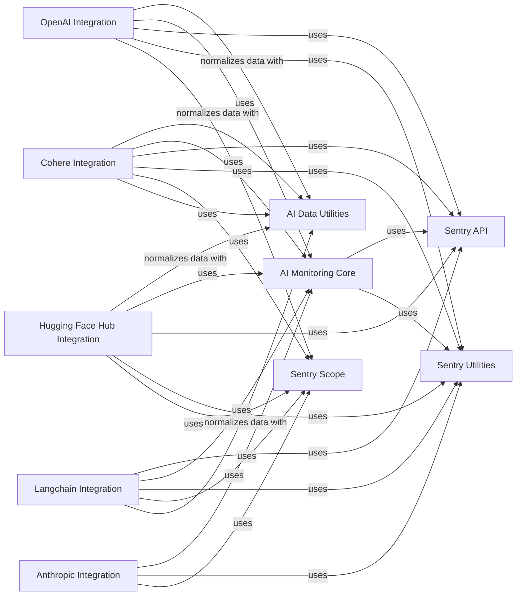

## Component Details

The AI Monitoring component in the Sentry Python SDK provides a comprehensive solution for monitoring AI pipelines. It encompasses functionalities for tracking token usage, capturing exceptions, and setting AI pipeline names. The core of this component lies in its ability to seamlessly integrate with various AI platforms like OpenAI, Cohere, Hugging Face, and Anthropic, as well as frameworks like Langchain. By wrapping key functions of these platforms, the AI Monitoring component automatically captures errors, tracks token usage, and enriches Sentry spans with AI-related data. This allows developers to gain deep insights into the performance and reliability of their AI applications, enabling them to identify and resolve issues quickly.

### AI Monitoring Core
This module provides the core functionality for monitoring AI pipelines, including tracking token usage and setting AI pipeline names. It interacts with the Sentry SDK to start spans and capture events related to AI operations.

**Related Classes/Methods**:

- `sentry_sdk.ai.monitoring:ai_track` (full file reference)
- `sentry_sdk.ai.monitoring:record_token_usage` (full file reference)
- `sentry_sdk.ai.monitoring.get_ai_pipeline_name` (full file reference)
- `sentry_sdk.ai.monitoring.set_ai_pipeline_name` (full file reference)

### AI Data Utilities
This module provides utility functions for working with AI data, including normalizing data and setting the normalized flag. It's used to ensure data is in a consistent format before being sent to Sentry.

**Related Classes/Methods**:

- `sentry_sdk.ai.utils:_normalize_data` (full file reference)
- `sentry_sdk.ai.utils:set_data_normalized` (full file reference)

### OpenAI Integration
This module provides integration with the OpenAI platform. It wraps the OpenAI chat completion and embeddings creation functions to automatically capture errors, track token usage, and add AI-related data to Sentry spans.

**Related Classes/Methods**:

- `sentry_sdk.integrations.openai:_calculate_chat_completion_usage` (full file reference)
- `sentry_sdk.integrations.openai:_new_chat_completion_common` (full file reference)
- `sentry_sdk.integrations.openai:_new_embeddings_create_common` (full file reference)

### Cohere Integration
This module provides integration with the Cohere AI platform. It wraps the Cohere chat and embed functions to automatically capture errors, track token usage, and add AI-related data to Sentry spans.

**Related Classes/Methods**:

- `sentry_sdk.integrations.cohere:_wrap_chat` (full file reference)
- `sentry_sdk.integrations.cohere:_wrap_embed` (full file reference)
- `sentry_sdk.integrations.cohere._capture_exception` (full file reference)

### Hugging Face Hub Integration
This module provides integration with the Hugging Face Hub. It wraps the text generation function to automatically capture errors, track token usage, and add AI-related data to Sentry spans.

**Related Classes/Methods**:

- `sentry_sdk.integrations.huggingface_hub:_wrap_text_generation` (full file reference)
- `sentry_sdk.integrations.huggingface_hub._capture_exception` (full file reference)

### Anthropic Integration
This module provides integration with the Anthropic platform. It calculates token usage and adds AI data to spans.

**Related Classes/Methods**:

- `sentry_sdk.integrations.anthropic:_calculate_token_usage` (full file reference)
- `sentry_sdk.integrations.anthropic:_add_ai_data_to_span` (full file reference)

### Langchain Integration
This module provides integration with the Langchain framework. It provides a callback handler that can be used to automatically track Langchain executions in Sentry.

**Related Classes/Methods**:

- `sentry_sdk.integrations.langchain.SentryLangchainCallback:_create_span` (full file reference)
- `sentry_sdk.integrations.langchain.SentryLangchainCallback:_exit_span` (full file reference)
- `sentry_sdk.integrations.langchain.SentryLangchainCallback:on_llm_start` (full file reference)
- `sentry_sdk.integrations.langchain.SentryLangchainCallback:on_chat_model_start` (full file reference)
- `sentry_sdk.integrations.langchain.SentryLangchainCallback:on_llm_new_token` (full file reference)
- `sentry_sdk.integrations.langchain.SentryLangchainCallback:on_llm_end` (full file reference)
- `sentry_sdk.integrations.langchain.SentryLangchainCallback:on_chain_start` (full file reference)
- `sentry_sdk.integrations.langchain.SentryLangchainCallback:on_agent_action` (full file reference)
- `sentry_sdk.integrations.langchain.SentryLangchainCallback:on_agent_finish` (full file reference)
- `sentry_sdk.integrations.langchain.SentryLangchainCallback:on_tool_start` (full file reference)

### Sentry API
This module provides the core Sentry SDK API, including functions for starting spans, capturing events, and getting the client. It's used by other modules to interact with the Sentry backend.

**Related Classes/Methods**:

- `sentry_sdk.api.start_span` (full file reference)
- `sentry_sdk.api.get_client` (full file reference)
- `sentry_sdk.api.capture_event` (full file reference)

### Sentry Utilities
This module provides utility functions for the Sentry SDK, including functions for creating events from exceptions and capturing internal exceptions.

**Related Classes/Methods**:

- `sentry_sdk.utils.event_from_exception` (full file reference)
- `sentry_sdk.utils.capture_internal_exceptions` (full file reference)

### Sentry Scope
This module provides functionality for managing the Sentry scope, including determining whether to send default PII.

**Related Classes/Methods**:

- `sentry_sdk.scope.should_send_default_pii` (full file reference)