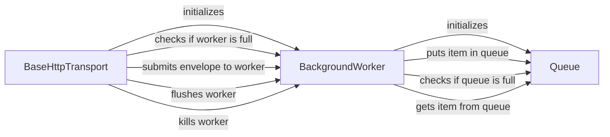

## Component Details

The background processing component in Sentry Python is responsible for asynchronously handling tasks such as sending events and flushing data to the Sentry server. It utilizes a background worker thread and a queue to prevent blocking the main application thread, ensuring that Sentry operations do not negatively impact the performance of the monitored application. The core components involved are the BaseHttpTransport, BackgroundWorker, and Queue, which work together to manage the asynchronous processing of events.

### BaseHttpTransport
The BaseHttpTransport class is responsible for sending envelopes to Sentry over HTTP. It manages a background worker to handle sending events asynchronously, handles rate limiting, and provides methods for capturing and flushing events.

**Related Classes/Methods**:

- <a href="https://github.com/getsentry/sentry-python/blob/master/sentry_sdk/transport.py#L196-L612" target="_blank" rel="noopener noreferrer">`sentry_sdk.transport.BaseHttpTransport` (196:612)</a>
- `sentry_sdk.transport.BaseHttpTransport.__init__` (full file reference)
- `sentry_sdk.transport.BaseHttpTransport._is_worker_full` (full file reference)
- `sentry_sdk.transport.BaseHttpTransport.is_healthy` (full file reference)
- `sentry_sdk.transport.BaseHttpTransport.capture_envelope` (full file reference)
- `sentry_sdk.transport.BaseHttpTransport.flush` (full file reference)
- `sentry_sdk.transport.BaseHttpTransport.kill` (full file reference)

### BackgroundWorker
The BackgroundWorker class manages a background thread that processes events from a queue. It provides methods for submitting events to the queue, flushing the queue, and killing the worker thread.

**Related Classes/Methods**:

- `sentry_sdk.worker.BackgroundWorker` (full file reference)
- `sentry_sdk.worker.BackgroundWorker.__init__` (full file reference)
- `sentry_sdk.worker.BackgroundWorker._ensure_thread` (full file reference)
- `sentry_sdk.worker.BackgroundWorker.kill` (full file reference)
- `sentry_sdk.worker.BackgroundWorker.flush` (full file reference)
- `sentry_sdk.worker.BackgroundWorker.full` (full file reference)
- `sentry_sdk.worker.BackgroundWorker._wait_flush` (full file reference)
- `sentry_sdk.worker.BackgroundWorker.submit` (full file reference)
- `sentry_sdk.worker.BackgroundWorker._target` (full file reference)

### Queue
The Queue class is a queue used for asynchronous event processing. It provides methods for putting items into the queue, getting items from the queue, checking if the queue is full, and getting the queue size.

**Related Classes/Methods**:

- `sentry_sdk._queue.Queue` (full file reference)