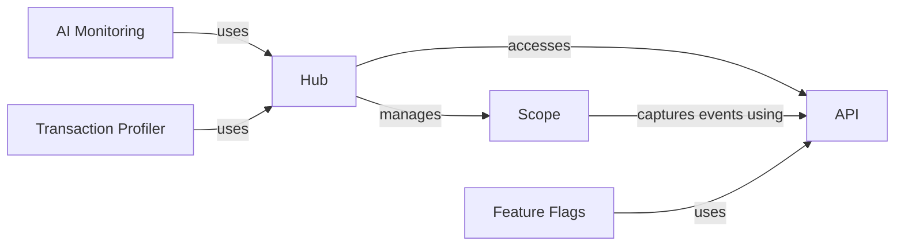

## Component Details

The Context Management subsystem in Sentry Python is responsible for managing the context in which events are captured. The Hub acts as a central access point, holding the current Scope and Client. The Scope stores contextual data like tags, extras, and user information, which are applied to events before they are sent to Sentry. This system provides isolation and ensures that events are enriched with the relevant context.

### Hub
The Hub is the central point of access to the Sentry SDK. It manages the current scope and client, providing methods for capturing events, managing breadcrumbs, and pushing/popping scopes. It acts as a stack of scopes, allowing for nested contexts.

**Related Classes/Methods**:

- `sentry_python.sentry_sdk.hub.Hub` (24:249)
- `sentry_python.sentry_sdk.hub.Hub:__init__` (31:40)
- `sentry_python.sentry_sdk.hub.Hub:capture_event` (124:130)

### Scope
The Scope represents the context for events. It holds information like user, tags, extra data, breadcrumbs, and the client. It's responsible for merging scopes and applying context to events before they are sent to Sentry. Scopes can be pushed onto the Hub's stack to create nested contexts.

**Related Classes/Methods**:

- `sentry_python.sentry_sdk.scope.Scope` (20:348)
- `sentry_python.sentry_sdk.scope.Scope:__init__` (27:40)
- `sentry_python.sentry_sdk.scope.Scope:capture_event` (244:250)

### API
The API module provides functions for accessing and manipulating the current scope and client. It includes functions like `get_current_scope` and `get_isolation_scope` which are used to retrieve the current scope associated with the current hub.

**Related Classes/Methods**:

- `sentry_python.sentry_sdk.api:get_current_scope` (21:24)
- `sentry_python.sentry_sdk.api:get_isolation_scope` (27:30)

### Feature Flags
The Feature Flags module allows adding feature flags to the current scope, which can be used to control the behavior of the application. It uses the API to access the current scope.

**Related Classes/Methods**:

- `sentry_python.sentry_sdk.feature_flags:add_feature_flag` (10:13)

### AI Monitoring
The AI Monitoring module provides functions for tracking AI-related events and errors. It includes the `ai_track` function, which starts spans, captures events, and handles exceptions. It interacts with the Hub to capture events.

**Related Classes/Methods**:

- `sentry_python.sentry_sdk.ai.monitoring:ai_track` (14:40)

### Transaction Profiler
The Transaction Profiler module is responsible for setting up the profiler, which collects performance data for transactions. It uses schedulers to manage the profiling process. It interacts with the Hub to capture profiling data.

**Related Classes/Methods**:

- `sentry_python.sentry_sdk.profiler.transaction_profiler:setup_profiler` (144:201)