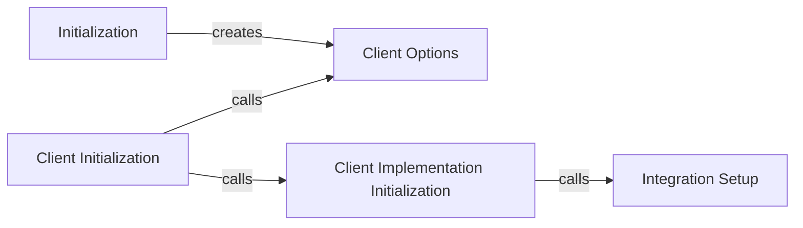

## Component Details

The Sentry SDK Initialization and Configuration component is responsible for setting up the Sentry SDK within a Python application. It begins with the `_init` function, which serves as the entry point for the SDK. This function orchestrates the creation of a `Client` instance and configures it with various options. The client options are retrieved and processed by `get_options`, which handles environment variables and initializes the event scrubber. The `Client`'s initialization involves setting up the transport, monitor, session flusher, metrics aggregator, log batcher, integrations, spotlight, and profiler. Integrations, which provide support for various frameworks and libraries, are set up by the `setup_integrations` function. This entire process ensures that the Sentry SDK is properly configured and ready to capture and report errors and performance data.

### Initialization
The `_init` function is the entry point for initializing the Sentry SDK. It creates a `Client` instance, sets it on the global scope, and performs initial setup tasks.

**Related Classes/Methods**:

- `sentry-python.sentry_sdk._init_implementation:_init` (full file reference)

### Client Options
The `get_options` function retrieves and processes various options for the Sentry client, including the release version and environment variables for boolean flags. It also initializes the event scrubber.

**Related Classes/Methods**:

- `sentry-python.sentry_sdk.client:get_options` (full file reference)

### Client Initialization
The `_Client.__init__` function initializes the Sentry client. It calls the base class constructor, retrieves client options, and then calls `_init_impl` to perform the core initialization logic.

**Related Classes/Methods**:

- `sentry-python.sentry_sdk.client._Client:__init__` (full file reference)

### Client Implementation Initialization
The `_Client._init_impl` function performs the core initialization logic for the Sentry client. It sets up the transport, monitor, session flusher, metrics aggregator, log batcher, integrations, spotlight, and profiler.

**Related Classes/Methods**:

- `sentry-python.sentry_sdk.client._Client:_init_impl` (full file reference)

### Integration Setup
The `setup_integrations` function sets up the default integrations for the Sentry SDK. It iterates through the default integrations and initializes them.

**Related Classes/Methods**:

- `sentry-python.sentry_sdk.integrations:setup_integrations` (full file reference)