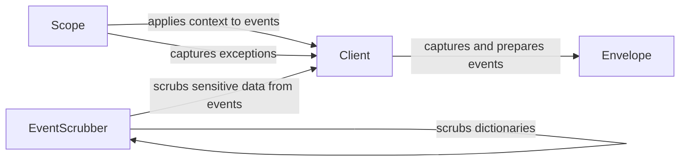

## Component Details

The Event Processing and Capture component is responsible for capturing events (exceptions, messages, etc.) within the Sentry Python SDK, enriching them with contextual information, scrubbing sensitive data, and preparing them for transmission to the Sentry backend. This process involves the Client capturing the event, the Scope applying relevant context, and the EventScrubber removing sensitive information. The prepared event is then encapsulated within an Envelope for efficient transport.

### Client
The Client component in `sentry_sdk.client` is responsible for capturing events, preparing them, and sending them to Sentry. It handles sampling, event processing, and integration with other Sentry features like sessions and envelopes.

**Related Classes/Methods**:

- `sentry_sdk.client._Client:capture_event` (full file reference)
- `sentry_sdk.client._Client:_prepare_event` (full file reference)

### Scope
The Scope component in `sentry_sdk.scope` manages the context of an event, including user information, tags, extra data, and breadcrumbs. It applies these context elements to events before they are sent to Sentry. It also handles running error and event processors.

**Related Classes/Methods**:

- `sentry_sdk.scope.Scope:capture_exception` (full file reference)
- `sentry_sdk.scope.Scope:apply_to_event` (full file reference)

### EventScrubber
The EventScrubber component in `sentry_sdk.scrubber` is responsible for removing sensitive information from events before they are sent to Sentry. It scrubs various parts of the event, including request data, extra data, user information, breadcrumbs, frames, and spans.

**Related Classes/Methods**:

- `sentry_sdk.scrubber.EventScrubber:scrub_event` (full file reference)
- `sentry_sdk.scrubber.EventScrubber:scrub_dict` (full file reference)

### Envelope
The Envelope component in `sentry_sdk.envelope` is responsible for packaging events and other data (like profiles, transactions, and check-ins) into a single structure for efficient transmission to Sentry.

**Related Classes/Methods**:

- `sentry_sdk.envelope.Envelope` (full file reference)