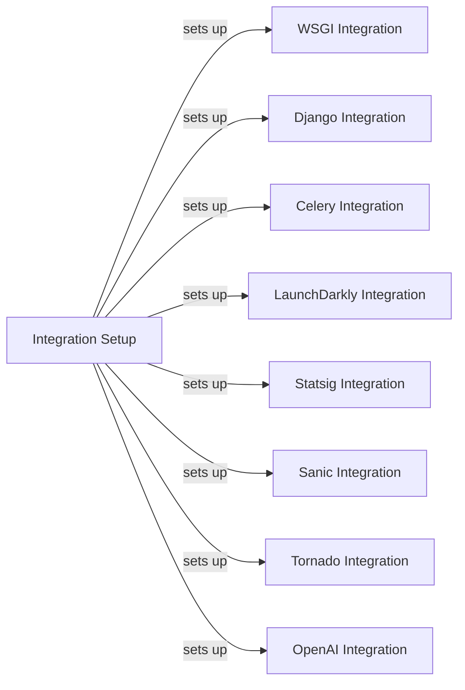

## Component Details

The Integrations and Framework Support subsystem in Sentry Python provides a mechanism to automatically capture events and add contextual data from various frameworks and libraries. This is achieved by patching or wrapping specific functions within these frameworks to capture exceptions, messages, and performance data. The core idea is to provide out-of-the-box support for popular frameworks, reducing the amount of manual instrumentation required by developers.

### Integration Setup
This component is responsible for setting up all the integrations. It iterates through default integrations and sets them up, ensuring that the necessary hooks and patches are applied to the supported frameworks and libraries. This process is crucial for automatically capturing events and adding context data.

**Related Classes/Methods**:

- `sentry-python.sentry_sdk.integrations:setup_integrations` (full file reference)
- `sentry-python.sentry_sdk.integrations._generate_default_integrations_iterator.iter_default_integrations` (full file reference)

### WSGI Integration
The WSGI integration provides support for WSGI-based web applications. It uses middleware to capture exceptions and performance data from incoming requests. The `SentryWsgiMiddleware` wraps the WSGI application and intercepts exceptions, sending them to Sentry.

**Related Classes/Methods**:

- `sentry-python.sentry_sdk.integrations.wsgi.SentryWsgiMiddleware:__call__` (full file reference)

### Django Integration
The Django integration provides support for Django web applications. It sets up request processors, error handlers, and captures exceptions. The `DjangoIntegration` class is responsible for configuring these aspects of the integration.

**Related Classes/Methods**:

- `sentry-python.sentry_sdk.integrations.django.DjangoIntegration:setup_once` (full file reference)

### Celery Integration
The Celery integration provides support for Celery task queues. It captures exceptions that occur during task execution. The `CeleryIntegration` class configures the necessary signal handlers to capture these exceptions.

**Related Classes/Methods**:

- `sentry-python.sentry_sdk.integrations.celery.CeleryIntegration:setup_once` (full file reference)

### LaunchDarkly Integration
The LaunchDarkly integration provides support for the LaunchDarkly feature management platform. It adds feature flags after evaluation, providing context about the feature flags that were active during an event. The `LaunchDarklyHook` class is responsible for adding these flags.

**Related Classes/Methods**:

- `sentry-python.sentry_sdk.integrations.launchdarkly.LaunchDarklyHook:after_evaluation` (full file reference)

### Statsig Integration
The Statsig integration provides support for the Statsig feature management platform. It captures feature flag evaluation data. The `StatsigIntegration` class is responsible for setting up the integration.

**Related Classes/Methods**:

- `sentry-python.sentry_sdk.integrations.statsig.StatsigIntegration:setup_once` (full file reference)

### Sanic Integration
This component provides integration for the Sanic web framework. It sets up request processors, error handlers, and captures exceptions, providing detailed information about the request context when errors occur.

**Related Classes/Methods**:

- `sentry-python.sentry_sdk.integrations.sanic.SanicIntegration:setup_once` (full file reference)

### Tornado Integration
This component provides integration for the Tornado web framework. It handles requests, captures exceptions, and creates event processors, ensuring that errors in Tornado applications are properly reported to Sentry with relevant context.

**Related Classes/Methods**:

- `sentry-python.sentry_sdk.integrations.tornado.TornadoIntegration:setup_once` (full file reference)

### OpenAI Integration
This component provides integration for the OpenAI API. It wraps chat completion and embeddings creation, captures exceptions, and calculates token usage, providing insights into the performance and cost of using OpenAI services.

**Related Classes/Methods**:

- `sentry-python.sentry_sdk.integrations.openai.OpenAIIntegration:setup_once` (full file reference)