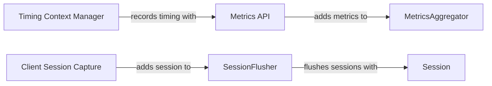

## Component Details

The Metrics Aggregation and Session Management component is responsible for collecting and aggregating metrics data, such as counters, gauges, and distributions, before sending them to Sentry. It also manages user sessions, tracking when users start and end sessions, and sending session data to Sentry. The MetricsAggregator aggregates different types of metrics, while the metrics API provides a simple interface for recording these metrics. The Timing context manager simplifies timing measurements. Session and SessionFlusher manage user sessions and ensure their data is periodically sent to Sentry. The client captures the session and adds it to the SessionFlusher.

### MetricsAggregator
The MetricsAggregator class is responsible for aggregating metrics data (counters, gauges, sets, distributions, timings) before sending it to Sentry. It manages buckets for different time intervals and locations, ensuring efficient data collection and flushing. It interacts with the Sentry client to emit the aggregated metrics.

**Related Classes/Methods**:

- `sentry-python.sentry_sdk.metrics.MetricsAggregator` (full file reference)
- `sentry-python.sentry_sdk.metrics.MetricsAggregator:_flush_loop` (full file reference)
- `sentry-python.sentry_sdk.metrics.MetricsAggregator:_flush` (full file reference)
- `sentry-python.sentry_sdk.metrics.MetricsAggregator:add` (full file reference)
- `sentry-python.sentry_sdk.metrics.MetricsAggregator:record_code_location` (full file reference)
- `sentry-python.sentry_sdk.metrics.MetricsAggregator:flush` (full file reference)
- `sentry-python.sentry_sdk.metrics.MetricsAggregator:_emit` (full file reference)

### Metrics API
The metrics API provides functions (increment, timing, distribution, set, gauge) to record different types of metrics. These functions retrieve the MetricsAggregator instance and update tags before adding the metric to the aggregator. They act as the entry point for recording metrics within the application.

**Related Classes/Methods**:

- `sentry-python.sentry_sdk.metrics:increment` (full file reference)
- `sentry-python.sentry_sdk.metrics:timing` (full file reference)
- `sentry-python.sentry_sdk.metrics:distribution` (full file reference)
- `sentry-python.sentry_sdk.metrics:set` (full file reference)
- `sentry-python.sentry_sdk.metrics:gauge` (full file reference)
- `sentry-python.sentry_sdk.metrics:_get_aggregator_and_update_tags` (full file reference)
- `sentry-python.sentry_sdk.metrics:_get_aggregator` (full file reference)

### Timing Context Manager
The _Timing class is a context manager and decorator used to measure the duration of code blocks. It records the timing metric using the timing function. It interacts with the metrics API to record the duration and can also start and stop spans.

**Related Classes/Methods**:

- `sentry-python.sentry_sdk.metrics._Timing` (full file reference)
- `sentry-python.sentry_sdk.metrics._Timing:__enter__` (full file reference)
- `sentry-python.sentry_sdk.metrics._Timing:__exit__` (full file reference)
- `sentry-python.sentry_sdk.metrics._Timing:__call__` (full file reference)

### Session
The Session class represents a user session and tracks its state (started, errored, crashed, etc.).

**Related Classes/Methods**:

- `sentry-python.sentry_sdk.session.Session` (full file reference)
- `sentry-python.sentry_sdk.session.Session:__init__` (full file reference)
- `sentry-python.sentry_sdk.session.Session:update` (full file reference)

### SessionFlusher
The SessionFlusher class is responsible for periodically flushing session data to Sentry. It aggregates session data and creates envelopes to send to Sentry.

**Related Classes/Methods**:

- `sentry-python.sentry_sdk.sessions.SessionFlusher` (full file reference)
- `sentry-python.sentry_sdk.sessions.SessionFlusher:flush` (full file reference)
- `sentry-python.sentry_sdk.sessions.SessionFlusher:_ensure_running` (full file reference)
- `sentry-python.sentry_sdk.sessions.SessionFlusher:add_session` (full file reference)

### Client Session Capture
The _Client class captures the session and uses SessionFlusher to add the session.

**Related Classes/Methods**:

- `sentry-python.sentry_sdk.client._Client:capture_session` (full file reference)