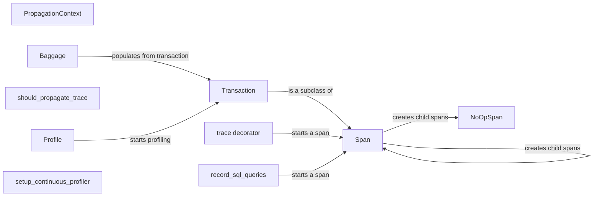

## Component Details

The Performance Monitoring and Profiling component in Sentry provides developers with the tools to track application performance, identify bottlenecks, and gain insights into code execution. It encompasses span and transaction creation, management, and propagation, along with sampling and profiling capabilities. The core functionality revolves around creating spans to measure the duration of code blocks, transactions to represent complete requests or background tasks, and profiles to capture detailed performance data. These components work together to provide a comprehensive view of application performance, enabling developers to optimize their code and improve the user experience.

### Span
The `Span` class represents a unit of work within a trace. It tracks timing information, status, and other metadata. It can be nested to represent parent-child relationships between operations. It interacts with `Scope` to manage the active span and with `Client` to send data to Sentry.

**Related Classes/Methods**:

- `sentry_sdk.tracing.Span:__init__` (full file reference)
- `sentry_sdk.tracing.Span:init_span_recorder` (full file reference)
- `sentry_sdk.tracing.Span:_get_local_aggregator` (full file reference)
- `sentry_sdk.tracing.Span:__enter__` (full file reference)
- `sentry_sdk.tracing.Span:__exit__` (full file reference)
- `sentry_sdk.tracing.Span:start_child` (full file reference)
- `sentry_sdk.tracing.Span:continue_from_environ` (full file reference)
- `sentry_sdk.tracing.Span:continue_from_headers` (full file reference)
- `sentry_sdk.tracing.Span:iter_headers` (full file reference)
- `sentry_sdk.tracing.Span:from_traceparent` (full file reference)
- `sentry_sdk.tracing.Span:set_thread` (full file reference)
- `sentry_sdk.tracing.Span:set_profiler_id` (full file reference)
- `sentry_sdk.tracing.Span:set_http_status` (full file reference)
- `sentry_sdk.tracing.Span:finish` (full file reference)
- `sentry_sdk.tracing.Span:to_json` (full file reference)
- `sentry_sdk.tracing.Span:update_active_thread` (full file reference)

### Transaction
The `Transaction` class is a subclass of `Span` that represents the root span of a trace, typically representing a request or background job. It includes additional functionality for sampling and context management. It interacts with `Client` to send transaction events to Sentry.

**Related Classes/Methods**:

- `sentry_sdk.tracing.Transaction:__init__` (full file reference)
- `sentry_sdk.tracing.Transaction:__enter__` (full file reference)
- `sentry_sdk.tracing.Transaction:__exit__` (full file reference)
- `sentry_sdk.tracing.Transaction:finish` (full file reference)
- `sentry_sdk.tracing.Transaction:set_http_status` (full file reference)
- `sentry_sdk.tracing.Transaction:to_json` (full file reference)
- `sentry_sdk.tracing.Transaction:get_trace_context` (full file reference)
- `sentry_sdk.tracing.Transaction:get_baggage` (full file reference)
- `sentry_sdk.tracing.Transaction:_set_initial_sampling_decision` (full file reference)

### NoOpSpan
The `NoOpSpan` class is a placeholder span that does nothing. It's used when tracing is disabled or when a span is not needed. It avoids the overhead of creating and managing a real span.

**Related Classes/Methods**:

- `sentry_sdk.tracing.NoOpSpan:start_child` (full file reference)

### trace decorator
The `trace` decorator is a function decorator that automatically creates and manages spans for the decorated function. It simplifies the process of adding tracing to existing code.

**Related Classes/Methods**:

- `sentry_sdk.tracing:trace` (full file reference)

### record_sql_queries
The `record_sql_queries` function is used to automatically create spans for SQL queries. It captures the query and its execution time, providing insights into database performance.

**Related Classes/Methods**:

- `sentry_sdk.tracing_utils:record_sql_queries` (full file reference)

### PropagationContext
The `PropagationContext` class manages the propagation of tracing information across service boundaries. It encapsulates the trace ID, span ID, and sampling decision, allowing downstream services to participate in the trace.

**Related Classes/Methods**:

- `sentry_sdk.tracing_utils.PropagationContext:from_incoming_data` (full file reference)
- `sentry_sdk.tracing_utils.PropagationContext:_fill_sample_rand` (full file reference)

### Baggage
The `Baggage` class is responsible for managing baggage data, which is arbitrary key-value pairs that can be propagated along with the trace. It allows services to share contextual information that is not directly related to tracing but is useful for debugging and analysis.

**Related Classes/Methods**:

- `sentry_sdk.tracing_utils.Baggage:from_incoming_header` (full file reference)
- `sentry_sdk.tracing_utils.Baggage:from_options` (full file reference)
- `sentry_sdk.tracing_utils.Baggage:populate_from_transaction` (full file reference)
- `sentry_sdk.tracing_utils.Baggage:serialize` (full file reference)
- `sentry_sdk.tracing_utils.Baggage:_sample_rand` (full file reference)
- `sentry_sdk.tracing_utils.Baggage:__repr__` (full file reference)

### should_propagate_trace
The `should_propagate_trace` function determines whether a trace should be propagated to a given URL. It checks if the URL is in the `tracePropagationTargets` list or matches any of the regular expressions in the list.

**Related Classes/Methods**:

- `sentry_sdk.tracing_utils:should_propagate_trace` (full file reference)

### Profile
The `Profile` class represents a profiling session for a transaction. It collects stack traces and other performance data to identify bottlenecks and performance issues.

**Related Classes/Methods**:

- `sentry_sdk.profiler.transaction_profiler.Profile:__init__` (full file reference)
- `sentry_sdk.profiler.transaction_profiler.Profile:update_active_thread_id` (full file reference)
- `sentry_sdk.profiler.transaction_profiler.Profile:_set_initial_sampling_decision` (full file reference)
- `sentry_sdk.profiler.transaction_profiler.Profile:start` (full file reference)
- `sentry_sdk.profiler.transaction_profiler.Profile:stop` (full file reference)
- `sentry_sdk.profiler.transaction_profiler.Profile:__enter__` (full file reference)
- `sentry_sdk.profiler.transaction_profiler.Profile:__exit__` (full file reference)
- `sentry_sdk.profiler.transaction_profiler.Profile:write` (full file reference)
- `sentry_sdk.profiler.transaction_profiler.Profile:to_json` (full file reference)
- `sentry_sdk.profiler.transaction_profiler.Profile:valid` (full file reference)

### setup_continuous_profiler
The `setup_continuous_profiler` function sets up the continuous profiler, which runs in the background and collects performance data continuously. It's used to identify performance issues that may not be captured by transaction-based profiling.

**Related Classes/Methods**:

- <a href="https://github.com/getsentry/sentry-python/blob/master/sentry_sdk/profiler/continuous_profiler.py#L74-L122" target="_blank" rel="noopener noreferrer">`sentry_sdk.profiler.continuous_profiler:setup_continuous_profiler` (74:122)</a>