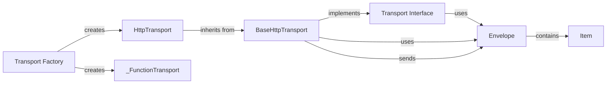

## Component Details

The transport layer is responsible for delivering events, transactions, and other data to the Sentry server. It encapsulates the logic for establishing connections, serializing data into the Sentry envelope format, and managing retries in case of failures. The transport layer abstracts away the underlying communication mechanism, allowing the SDK to support different protocols and configurations. It also handles rate limiting and ensures that events are delivered reliably.

### Transport Interface
Defines the abstract base for sending events to Sentry. It specifies the `capture_event` method, which accepts an event and delivers it to Sentry.

**Related Classes/Methods**:

- <a href="https://github.com/getsentry/sentry-python/blob/master/sentry_sdk/transport.py#L77-L94" target="_blank" rel="noopener noreferrer">`sentry_sdk.transport.Transport:capture_event` (77:94)</a>

### BaseHttpTransport
Provides a base class for transports that use HTTP to send events to Sentry. It handles tasks such as managing a background worker for asynchronous sending, managing rate limits, and serializing envelopes. It defines abstract methods for making HTTP requests, which are implemented by subclasses like HttpTransport.

**Related Classes/Methods**:

- <a href="https://github.com/getsentry/sentry-python/blob/master/sentry_sdk/transport.py#L201-L260" target="_blank" rel="noopener noreferrer">`sentry_sdk.transport.BaseHttpTransport:__init__` (201:260)</a>
- <a href="https://github.com/getsentry/sentry-python/blob/master/sentry_sdk/transport.py#L262-L296" target="_blank" rel="noopener noreferrer">`sentry_sdk.transport.BaseHttpTransport:record_lost_event` (262:296)</a>
- <a href="https://github.com/getsentry/sentry-python/blob/master/sentry_sdk/transport.py#L302-L325" target="_blank" rel="noopener noreferrer">`sentry_sdk.transport.BaseHttpTransport:_update_rate_limits` (302:325)</a>
- <a href="https://github.com/getsentry/sentry-python/blob/master/sentry_sdk/transport.py#L327-L382" target="_blank" rel="noopener noreferrer">`sentry_sdk.transport.BaseHttpTransport:_send_request` (327:382)</a>
- <a href="https://github.com/getsentry/sentry-python/blob/master/sentry_sdk/transport.py#L388-L417" target="_blank" rel="noopener noreferrer">`sentry_sdk.transport.BaseHttpTransport:_fetch_pending_client_report` (388:417)</a>
- <a href="https://github.com/getsentry/sentry-python/blob/master/sentry_sdk/transport.py#L419-L423" target="_blank" rel="noopener noreferrer">`sentry_sdk.transport.BaseHttpTransport:_flush_client_reports` (419:423)</a>
- <a href="https://github.com/getsentry/sentry-python/blob/master/sentry_sdk/transport.py#L425-L438" target="_blank" rel="noopener noreferrer">`sentry_sdk.transport.BaseHttpTransport:_check_disabled` (425:438)</a>
- <a href="https://github.com/getsentry/sentry-python/blob/master/sentry_sdk/transport.py#L446-L448" target="_blank" rel="noopener noreferrer">`sentry_sdk.transport.BaseHttpTransport:_is_worker_full` (446:448)</a>
- <a href="https://github.com/getsentry/sentry-python/blob/master/sentry_sdk/transport.py#L450-L452" target="_blank" rel="noopener noreferrer">`sentry_sdk.transport.BaseHttpTransport:is_healthy` (450:452)</a>
- <a href="https://github.com/getsentry/sentry-python/blob/master/sentry_sdk/transport.py#L454-L505" target="_blank" rel="noopener noreferrer">`sentry_sdk.transport.BaseHttpTransport:_send_envelope` (454:505)</a>
- <a href="https://github.com/getsentry/sentry-python/blob/master/sentry_sdk/transport.py#L558-L571" target="_blank" rel="noopener noreferrer">`sentry_sdk.transport.BaseHttpTransport:capture_envelope` (558:571)</a>
- <a href="https://github.com/getsentry/sentry-python/blob/master/sentry_sdk/transport.py#L573-L583" target="_blank" rel="noopener noreferrer">`sentry_sdk.transport.BaseHttpTransport:flush` (573:583)</a>
- <a href="https://github.com/getsentry/sentry-python/blob/master/sentry_sdk/transport.py#L585-L588" target="_blank" rel="noopener noreferrer">`sentry_sdk.transport.BaseHttpTransport:kill` (585:588)</a>

### HttpTransport
A concrete implementation of BaseHttpTransport that uses the standard `http.client` library to send events to Sentry. It provides methods for creating a connection pool and making HTTP requests.

**Related Classes/Methods**:

- <a href="https://github.com/getsentry/sentry-python/blob/master/sentry_sdk/transport.py#L662-L706" target="_blank" rel="noopener noreferrer">`sentry_sdk.transport.HttpTransport:_make_pool` (662:706)</a>
- <a href="https://github.com/getsentry/sentry-python/blob/master/sentry_sdk/transport.py#L708-L721" target="_blank" rel="noopener noreferrer">`sentry_sdk.transport.HttpTransport:_request` (708:721)</a>

### _FunctionTransport
A transport that sends events using a user-provided function. This is useful for testing or for integrating with other systems.

**Related Classes/Methods**:

- <a href="https://github.com/getsentry/sentry-python/blob/master/sentry_sdk/transport.py#L871-L876" target="_blank" rel="noopener noreferrer">`sentry_sdk.transport._FunctionTransport:__init__` (871:876)</a>
- <a href="https://github.com/getsentry/sentry-python/blob/master/sentry_sdk/transport.py#L885-L891" target="_blank" rel="noopener noreferrer">`sentry_sdk.transport._FunctionTransport:capture_envelope` (885:891)</a>

### Transport Factory
The `make_transport` function is responsible for creating a transport instance based on the DSN (Data Source Name). It determines the appropriate transport type (e.g., HttpTransport, _FunctionTransport) based on the DSN and returns an instance of that transport.

**Related Classes/Methods**:

- <a href="https://github.com/getsentry/sentry-python/blob/master/sentry_sdk/transport.py#L894-L923" target="_blank" rel="noopener noreferrer">`sentry_sdk.transport:make_transport` (894:923)</a>

### Envelope
Represents a Sentry envelope, which is a container for items such as events, transactions, and attachments. It provides methods for adding items, serializing the envelope into a byte stream, and deserializing an envelope from a byte stream.

**Related Classes/Methods**:

- `sentry_sdk.envelope.Envelope:add_event` (full file reference)
- `sentry_sdk.envelope.Envelope:serialize_into` (full file reference)
- `sentry_sdk.envelope.Envelope:serialize` (full file reference)
- `sentry_sdk.envelope.Envelope:deserialize_from` (full file reference)
- `sentry_sdk.envelope.Envelope:deserialize` (full file reference)

### Item
Represents an item within a Sentry envelope. An item can be an event, transaction, or attachment. It provides methods for serializing the item into a byte stream and deserializing an item from a byte stream.

**Related Classes/Methods**:

- `sentry_sdk.envelope.Item:__init__` (full file reference)
- `sentry_sdk.envelope.Item:serialize_into` (full file reference)
- `sentry_sdk.envelope.Item:serialize` (full file reference)
- `sentry_sdk.envelope.Item:deserialize_from` (full file reference)
- `sentry_sdk.envelope.Item:deserialize` (full file reference)