```mermaid
graph LR
    Core_SDK_Initialization_and_Configuration["Core SDK Initialization and Configuration"]
    Context_Management_Hub_and_Scope_["Context Management (Hub and Scope)"]
    Event_Processing_and_Capture["Event Processing and Capture"]
    Transport["Transport"]
    Background_Processing["Background Processing"]
    Integrations_and_Framework_Support["Integrations and Framework Support"]
    Performance_Monitoring_and_Profiling["Performance Monitoring and Profiling"]
    Metrics_Aggregation_and_Session_Management["Metrics Aggregation and Session Management"]
    AI_Monitoring["AI Monitoring"]
    Core_SDK_Initialization_and_Configuration -- "initializes" --> Context_Management_Hub_and_Scope_
    Core_SDK_Initialization_and_Configuration -- "configures" --> Transport
    Context_Management_Hub_and_Scope_ -- "captures events through" --> Event_Processing_and_Capture
    Event_Processing_and_Capture -- "sends events via" --> Transport
    Transport -- "uses" --> Event_Processing_and_Capture
    Integrations_and_Framework_Support -- "are initialized by" --> Core_SDK_Initialization_and_Configuration
    Integrations_and_Framework_Support -- "capture events and enrich context for" --> Event_Processing_and_Capture
    Performance_Monitoring_and_Profiling -- "are used by" --> Integrations_and_Framework_Support
    Metrics_Aggregation_and_Session_Management -- "are used by" --> Integrations_and_Framework_Support
    AI_Monitoring -- "are used by" --> Integrations_and_Framework_Support
    Transport -- "submits tasks to" --> Background_Processing
    Metrics_Aggregation_and_Session_Management -- "submits tasks to" --> Background_Processing
    AI_Monitoring -- "are used by" --> Context_Management_Hub_and_Scope_
    Performance_Monitoring_and_Profiling -- "are used by" --> Context_Management_Hub_and_Scope_
    click Core_SDK_Initialization_and_Configuration href "https://github.com/CodeBoarding/GeneratedOnBoardings/blob/main/sentry-python/Core SDK Initialization and Configuration.md" "Details"
    click Context_Management_Hub_and_Scope_ href "https://github.com/CodeBoarding/GeneratedOnBoardings/blob/main/sentry-python/Context Management (Hub and Scope).md" "Details"
    click Event_Processing_and_Capture href "https://github.com/CodeBoarding/GeneratedOnBoardings/blob/main/sentry-python/Event Processing and Capture.md" "Details"
    click Transport href "https://github.com/CodeBoarding/GeneratedOnBoardings/blob/main/sentry-python/Transport.md" "Details"
    click Background_Processing href "https://github.com/CodeBoarding/GeneratedOnBoardings/blob/main/sentry-python/Background Processing.md" "Details"
    click Integrations_and_Framework_Support href "https://github.com/CodeBoarding/GeneratedOnBoardings/blob/main/sentry-python/Integrations and Framework Support.md" "Details"
    click Performance_Monitoring_and_Profiling href "https://github.com/CodeBoarding/GeneratedOnBoardings/blob/main/sentry-python/Performance Monitoring and Profiling.md" "Details"
    click Metrics_Aggregation_and_Session_Management href "https://github.com/CodeBoarding/GeneratedOnBoardings/blob/main/sentry-python/Metrics Aggregation and Session Management.md" "Details"
    click AI_Monitoring href "https://github.com/CodeBoarding/GeneratedOnBoardings/blob/main/sentry-python/AI Monitoring.md" "Details"
```

## Component Details

The Sentry Python SDK provides comprehensive error tracking and performance monitoring for Python applications. It initializes the SDK, captures and processes events, manages context, and sends data to the Sentry server. Integrations with various frameworks and libraries enable automatic event capture and context enrichment. The SDK also supports performance monitoring, profiling, metrics aggregation, session management, and AI monitoring. Background processing ensures that tasks such as sending events and flushing data do not block the main application thread.

### Core SDK Initialization and Configuration
This component is responsible for initializing the Sentry SDK, configuring its options, and setting up the client, integrations, and other core components based on the provided DSN and options. It acts as the entry point for using the Sentry SDK in a Python application.

**Related Classes/Methods**:

- `sentry-python.sentry_sdk._init_implementation:_init` (full file reference)
- `sentry-python.sentry_sdk.client._Client:__init__` (full file reference)
- `sentry-python.sentry_sdk.client._Client:_init_impl` (full file reference)
- `sentry-python.sentry_sdk.client:get_options` (full file reference)
- `sentry-python.sentry_sdk.integrations:setup_integrations` (full file reference)

### Context Management (Hub and Scope)
The Hub manages the current scope and client, providing a central point of access to the Sentry SDK. The Scope stores context data like tags, extras, and user information, which are applied to events before they are sent to Sentry. It provides isolation for different parts of the application.

**Related Classes/Methods**:

- `sentry-python.sentry_sdk.hub.Hub:__init__` (full file reference)
- `sentry-python.sentry_sdk.hub.Hub:capture_event` (full file reference)
- `sentry-python.sentry_sdk.scope.Scope:__init__` (full file reference)
- `sentry-python.sentry_sdk.scope.Scope:capture_event` (full file reference)
- `sentry-python.sentry_sdk.api:get_current_scope` (full file reference)
- `sentry-python.sentry_sdk.api:get_isolation_scope` (full file reference)
- `sentry-python.sentry_sdk.feature_flags:add_feature_flag` (full file reference)
- `sentry-python.sentry_sdk.ai.monitoring:ai_track` (full file reference)
- `sentry-python.sentry_sdk.profiler.transaction_profiler:setup_profiler` (full file reference)

### Event Processing and Capture
This component captures events (exceptions, messages, etc.) and processes them before sending them to Sentry. It prepares the event data, applies context from the scope, and runs event processors. It also handles scrubbing sensitive data from events.

**Related Classes/Methods**:

- `sentry-python.sentry_sdk.client._Client:capture_event` (full file reference)
- `sentry-python.sentry_sdk.client._Client:_prepare_event` (full file reference)
- `sentry-python.sentry_sdk.scope.Scope:capture_exception` (full file reference)
- `sentry-python.sentry_sdk.scope.Scope:apply_to_event` (full file reference)
- `sentry-python.sentry_sdk.scrubber.EventScrubber:scrub_event` (full file reference)
- `sentry-python.sentry_sdk.scrubber.EventScrubber:scrub_dict` (full file reference)

### Transport
The transport layer handles sending events to the Sentry server. It manages the connection, serialization, and retries. It uses envelopes to package events, transactions, and other data for transmission.

**Related Classes/Methods**:

- <a href="https://github.com/getsentry/sentry-python/blob/master/sentry_sdk/transport.py#L77-L94" target="_blank" rel="noopener noreferrer">`sentry-python.sentry_sdk.transport.Transport:capture_event` (77:94)</a>
- <a href="https://github.com/getsentry/sentry-python/blob/master/sentry_sdk/transport.py#L327-L382" target="_blank" rel="noopener noreferrer">`sentry-python.sentry_sdk.transport.BaseHttpTransport:_send_request` (327:382)</a>
- <a href="https://github.com/getsentry/sentry-python/blob/master/sentry_sdk/transport.py#L558-L571" target="_blank" rel="noopener noreferrer">`sentry-python.sentry_sdk.transport.BaseHttpTransport:capture_envelope` (558:571)</a>
- <a href="https://github.com/getsentry/sentry-python/blob/master/sentry_sdk/transport.py#L894-L923" target="_blank" rel="noopener noreferrer">`sentry-python.sentry_sdk.transport:make_transport` (894:923)</a>
- `sentry-python.sentry_sdk.envelope.Envelope:add_event` (full file reference)
- `sentry-python.sentry_sdk.envelope.Envelope:serialize` (full file reference)
- `sentry-python.sentry_sdk.envelope.Item:serialize` (full file reference)

### Background Processing
This component manages background tasks, such as sending events and flushing data, in a separate thread to avoid blocking the main application thread. It provides a worker thread to handle these tasks asynchronously.

**Related Classes/Methods**:

- `sentry-python.sentry_sdk.worker.BackgroundWorker:submit` (full file reference)
- `sentry-python.sentry_sdk.worker.BackgroundWorker:_target` (full file reference)

### Integrations and Framework Support
Integrations provide support for various frameworks and libraries, automatically capturing events and adding context data. They patch or wrap specific functions to capture exceptions, messages, and performance data. Examples include WSGI, Django, and Celery integrations.

**Related Classes/Methods**:

- `sentry-python.sentry_sdk.integrations.wsgi.SentryWsgiMiddleware:__call__` (full file reference)
- `sentry-python.sentry_sdk.integrations.django.DjangoIntegration:setup_once` (full file reference)
- `sentry-python.sentry_sdk.integrations.celery.CeleryIntegration:setup_once` (full file reference)
- `sentry-python.sentry_sdk.integrations.launchdarkly.LaunchDarklyHook:after_evaluation` (full file reference)
- `sentry-python.sentry_sdk.integrations.statsig.StatsigIntegration:setup_once` (full file reference)

### Performance Monitoring and Profiling
This component provides tracing and performance monitoring capabilities, allowing developers to track the performance of their applications and identify bottlenecks. It includes span creation, transaction management, sampling, and profiling.

**Related Classes/Methods**:

- `sentry-python.sentry_sdk.tracing.Span:__init__` (full file reference)
- `sentry-python.sentry_sdk.tracing.Transaction:__init__` (full file reference)
- `sentry-python.sentry_sdk.api:start_span` (full file reference)
- `sentry-python.sentry_sdk.api:start_transaction` (full file reference)
- `sentry-python.sentry_sdk.tracing_utils:record_sql_queries` (full file reference)
- `sentry-python.sentry_sdk.profiler.transaction_profiler.Profile:__init__` (full file reference)
- <a href="https://github.com/getsentry/sentry-python/blob/master/sentry_sdk/profiler/continuous_profiler.py#L74-L122" target="_blank" rel="noopener noreferrer">`sentry-python.sentry_sdk.profiler.continuous_profiler:setup_continuous_profiler` (74:122)</a>

### Metrics Aggregation and Session Management
This component is responsible for collecting and aggregating metrics data, such as counters, gauges, and distributions, before sending them to Sentry. It also manages user sessions, tracking when users start and end sessions, and sending session data to Sentry.

**Related Classes/Methods**:

- `sentry-python.sentry_sdk.metrics.MetricsAggregator:add` (full file reference)
- `sentry-python.sentry_sdk.metrics.MetricsAggregator:_flush` (full file reference)
- `sentry-python.sentry_sdk.metrics:increment` (full file reference)
- `sentry-python.sentry_sdk.metrics:timing` (full file reference)
- `sentry-python.sentry_sdk.session.Session:__init__` (full file reference)
- `sentry-python.sentry_sdk.client._Client:capture_session` (full file reference)
- `sentry-python.sentry_sdk.sessions.SessionFlusher:add_session` (full file reference)

### AI Monitoring
This component provides support for monitoring AI pipelines, tracking token usage and capturing exceptions in AI-related code.

**Related Classes/Methods**:

- `sentry-python.sentry_sdk.ai.monitoring:record_token_usage` (full file reference)
- `sentry-python.sentry_sdk.ai.utils:set_data_normalized` (full file reference)