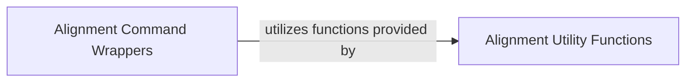

## Details

One paragraph explaining the functionality which is represented by this graph. What the main flow is and what is its purpose.

### Alignment Command Wrappers
This component serves as the primary interface for integrating and executing external multiple sequence alignment tools (e.g., MAFFT, MUSCLE, Clustal Omega). It encapsulates the complexities of command-line execution, tool-specific parameters, and output parsing, offering a consistent and simplified API for performing alignment operations. It acts as a facade, abstracting away the underlying tool implementations, aligning with the project's "Wrapper/Facade Pattern" and "Extension/Plugin Architecture."

**Related Classes/Methods**:

- <a href="https://github.com/modernatx/seqlike/blob/main/seqlike/AlignCommandline.py#L1-L1" target="_blank" rel="noopener noreferrer">`seqlike.AlignCommandline.MafftCommandline` (1:1)</a>
- <a href="https://github.com/modernatx/seqlike/blob/main/seqlike/AlignCommandline.py#L1-L1" target="_blank" rel="noopener noreferrer">`seqlike.AlignCommandline.MuscleCommandline` (1:1)</a>
- <a href="https://github.com/modernatx/seqlike/blob/main/seqlike/AlignCommandline.py#L1-L1" target="_blank" rel="noopener noreferrer">`seqlike.AlignCommandline.BowtieCommandline` (1:1)</a>
- <a href="https://github.com/modernatx/seqlike/blob/main/seqlike/AlignCommandline.py#L1-L1" target="_blank" rel="noopener noreferrer">`seqlike.AlignCommandline.BowtieBuildCommandline` (1:1)</a>

### Alignment Utility Functions
This component provides a collection of helper functions and internal logic that support the entire alignment workflow. Its responsibilities include pre-processing tasks such as padding sequence records to ensure uniform lengths for alignment, and post-processing tasks like aligning letter annotations to maintain data consistency across aligned sequences. It handles the intricate details of data preparation and manipulation before and after external tool execution, embodying the "Utility functions" pattern.

**Related Classes/Methods**:

- <a href="https://github.com/modernatx/seqlike/blob/main/seqlike/alignment_utils.py#L1-L1" target="_blank" rel="noopener noreferrer">`seqlike.alignment_utils` (1:1)</a>

### [FAQ](https://github.com/CodeBoarding/GeneratedOnBoardings/tree/main?tab=readme-ov-file#faq)