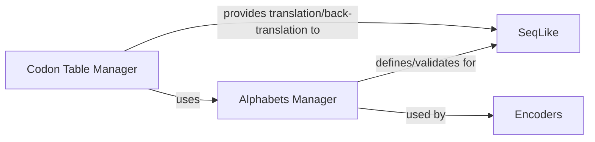

## Details

The `Biological Data Definitions` component is fundamental to the `seqlike` library, establishing the core rules and data structures for handling biological sequences. It is composed of two central components: the `Alphabets Manager` and the `Codon Table Manager`. These components are crucial as they provide the foundational definitions and validation mechanisms for all sequence-related operations within the library, ensuring biological accuracy and data consistency. Without these precise definitions and utilities, the `SeqLike` object and all higher-level functionalities (e.g., mutations, alignments, encodings, visualizations) would lack the necessary biological context and validation, making the library unreliable for bioinformatics tasks. They are the "data definitions" that underpin the entire system.

### Alphabets Manager
This component centralizes the definition and management of various biological alphabets, including standard and ambiguous characters for DNA, RNA, and Protein sequences. It provides essential utility functions to validate if a given sequence conforms to a specific biological alphabet, acting as a foundational layer for data integrity across the library.

**Related Classes/Methods**:

- <a href="https://github.com/modernatx/seqlike/blob/main/seqlike/alphabets.py" target="_blank" rel="noopener noreferrer">`seqlike/alphabets.py`</a>

### Codon Table Manager
This component manages genetic code tables, encompassing the standard genetic code and various organism-specific codon usage tables. It provides core functionalities for translating nucleotide sequences into amino acid sequences and for back-translating amino acid sequences into nucleotide sequences, supporting both deterministic and probabilistic approaches.

**Related Classes/Methods**:

- <a href="https://github.com/modernatx/seqlike/blob/main/seqlike/codon_tables.py" target="_blank" rel="noopener noreferrer">`seqlike/codon_tables.py`</a>

### [FAQ](https://github.com/CodeBoarding/GeneratedOnBoardings/tree/main?tab=readme-ov-file#faq)