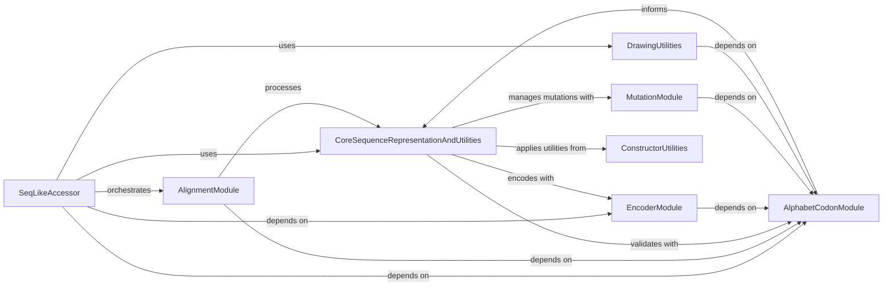

## Component Details

This architecture defines the core components for handling biological sequence data. The central `CoreSequenceRepresentationAndUtilities` component establishes the fundamental data models (`SeqLike` and `SequenceLike`) and provides basic sequence manipulation functionalities. Higher-level analytical operations are managed by `SeqLikeAccessor`, which orchestrates alignment processes via the `AlignmentModule` and leverages `EncoderModule` for sequence representation conversions, `AlphabetCodonModule` for alphabet and codon table management, and `DrawingUtilities` for visualization. The `MutationModule` handles sequence mutations, while `ConstructorUtilities` aids in `SeqLike` object creation. The overall flow involves `CoreSequenceRepresentationAndUtilities` as the data backbone, with other components providing specialized functionalities that interact with and extend its capabilities.

### CoreSequenceRepresentationAndUtilities
Defines the fundamental `SeqLike` and `SequenceLike` objects, serving as the central data model for biological sequences. It provides methods for basic sequence manipulation (translation, reverse complement, ungapping, slicing) and incorporates general utility functions for sequence record processing and validation.

**Related Classes/Methods**:

- <a href="https://github.com/modernatx/seqlike/blob/master/seqlike/SeqLike.py#L65-L707" target="_blank" rel="noopener noreferrer">`seqlike.SeqLike.SeqLike` (65:707)</a>
- <a href="https://github.com/modernatx/seqlike/blob/master/seqlike/SeqLike.py#L122-L156" target="_blank" rel="noopener noreferrer">`seqlike.SeqLike.SeqLike.__init__` (122:156)</a>
- <a href="https://github.com/modernatx/seqlike/blob/master/seqlike/SeqLike.py#L162-L183" target="_blank" rel="noopener noreferrer">`seqlike.SeqLike.SeqLike.nt` (162:183)</a>
- <a href="https://github.com/modernatx/seqlike/blob/master/seqlike/SeqLike.py#L185-L221" target="_blank" rel="noopener noreferrer">`seqlike.SeqLike.SeqLike.aa` (185:221)</a>
- <a href="https://github.com/modernatx/seqlike/blob/master/seqlike/SeqLike.py#L259-L292" target="_blank" rel="noopener noreferrer">`seqlike.SeqLike.SeqLike.translate` (259:292)</a>
- <a href="https://github.com/modernatx/seqlike/blob/master/seqlike/SeqLike.py#L294-L342" target="_blank" rel="noopener noreferrer">`seqlike.SeqLike.SeqLike.back_translate` (294:342)</a>
- <a href="https://github.com/modernatx/seqlike/blob/master/seqlike/SeqLike.py#L344-L378" target="_blank" rel="noopener noreferrer">`seqlike.SeqLike.SeqLike.reverse_complement` (344:378)</a>
- <a href="https://github.com/modernatx/seqlike/blob/master/seqlike/SeqLike.py#L381-L395" target="_blank" rel="noopener noreferrer">`seqlike.SeqLike.SeqLike.ungap` (381:395)</a>
- <a href="https://github.com/modernatx/seqlike/blob/master/seqlike/SeqLike.py#L397-L436" target="_blank" rel="noopener noreferrer">`seqlike.SeqLike.SeqLike.pad_to` (397:436)</a>
- <a href="https://github.com/modernatx/seqlike/blob/master/seqlike/SeqLike.py#L480-L488" target="_blank" rel="noopener noreferrer">`seqlike.SeqLike.SeqLike.slice` (480:488)</a>
- <a href="https://github.com/modernatx/seqlike/blob/master/seqlike/SeqLike.py#L545-L626" target="_blank" rel="noopener noreferrer">`seqlike.SeqLike.SeqLike.__getitem__` (545:626)</a>
- <a href="https://github.com/modernatx/seqlike/blob/master/seqlike/SeqLike.py#L628-L647" target="_blank" rel="noopener noreferrer">`seqlike.SeqLike.SeqLike.__add__` (628:647)</a>
- <a href="https://github.com/modernatx/seqlike/blob/master/seqlike/SeqLike.py#L649-L681" target="_blank" rel="noopener noreferrer">`seqlike.SeqLike.SeqLike.__radd__` (649:681)</a>
- <a href="https://github.com/modernatx/seqlike/blob/master/seqlike/SeqLike.py#L683-L684" target="_blank" rel="noopener noreferrer">`seqlike.SeqLike.SeqLike.__sub__` (683:684)</a>
- <a href="https://github.com/modernatx/seqlike/blob/master/seqlike/SeqLike.py#L686-L700" target="_blank" rel="noopener noreferrer">`seqlike.SeqLike.SeqLike.__deepcopy__` (686:700)</a>
- <a href="https://github.com/modernatx/seqlike/blob/master/seqlike/SeqLike.py#L702-L707" target="_blank" rel="noopener noreferrer">`seqlike.SeqLike.SeqLike.scan` (702:707)</a>
- <a href="https://github.com/modernatx/seqlike/blob/master/seqlike/SeqLike.py#L747-L778" target="_blank" rel="noopener noreferrer">`seqlike.SeqLike._construct_seqlike` (747:778)</a>
- <a href="https://github.com/modernatx/seqlike/blob/master/seqlike/SeqLike.py#L892-L958" target="_blank" rel="noopener noreferrer">`seqlike.SeqLike.swap_representation` (892:958)</a>
- <a href="https://github.com/modernatx/seqlike/blob/master/seqlike/SeqLike.py#L962-L970" target="_blank" rel="noopener noreferrer">`seqlike.SeqLike.determine__type_and_alphabet` (962:970)</a>
- <a href="https://github.com/modernatx/seqlike/blob/master/seqlike/SeqLike.py#L1001-L1017" target="_blank" rel="noopener noreferrer">`seqlike.SeqLike.determine_alphabet` (1001:1017)</a>
- <a href="https://github.com/modernatx/seqlike/blob/master/seqlike/SeqLike.py#L1021-L1028" target="_blank" rel="noopener noreferrer">`seqlike.SeqLike.record_from` (1021:1028)</a>
- <a href="https://github.com/modernatx/seqlike/blob/master/seqlike/SeqLike.py#L1099-L1124" target="_blank" rel="noopener noreferrer">`seqlike.SeqLike._add` (1099:1124)</a>
- <a href="https://github.com/modernatx/seqlike/blob/master/seqlike/SeqLike.py#L1197-L1219" target="_blank" rel="noopener noreferrer">`seqlike.SeqLike._sub` (1197:1219)</a>
- `seqlike.SequenceLike.SequenceLike` (full file reference)
- `seqlike.SequenceLike.SequenceLike.__init__` (full file reference)
- `seqlike.SequenceLike.SequenceLike.__str__` (full file reference)
- `seqlike.SequenceLike.SequenceLike.__deepcopy__` (full file reference)
- <a href="https://github.com/modernatx/seqlike/blob/master/seqlike/utils/sequences.py#L23-L227" target="_blank" rel="noopener noreferrer">`seqlike.utils.sequences.ungap` (23:227)</a>
- <a href="https://github.com/modernatx/seqlike/blob/master/seqlike/utils/sequences.py#L230-L258" target="_blank" rel="noopener noreferrer">`seqlike.utils.sequences.slice_seqrec` (230:258)</a>
- <a href="https://github.com/modernatx/seqlike/blob/master/seqlike/utils/sequences.py#L231-L232" target="_blank" rel="noopener noreferrer">`seqlike.utils.sequences.slice_seqrec.slice_str` (231:232)</a>
- <a href="https://github.com/modernatx/seqlike/blob/master/seqlike/utils/sequences.py#L6-L20" target="_blank" rel="noopener noreferrer">`seqlike.utils.sequences.add_seqnums_to_letter_annotations` (6:20)</a>
- `seqlike.utils.validation` (full file reference)

### SeqLikeAccessor
This component offers higher-level analytical functionalities for sequence data. It includes methods for sequence alignment, consensus generation, and degeneracy calculations, leveraging the core sequence representation.

**Related Classes/Methods**:

- <a href="https://github.com/modernatx/seqlike/blob/master/seqlike/SeqLikeAccessor.py#L34-L526" target="_blank" rel="noopener noreferrer">`seqlike.SeqLikeAccessor` (34:526)</a>

### AlignmentModule
This component is responsible for orchestrating sequence alignment processes. It integrates with external alignment tools (like MAFFT, MUSCLE, Clustal Omega) and provides utilities for preparing sequences for alignment and processing alignment results.

**Related Classes/Methods**:

- `seqlike.AlignCommandline` (full file reference)
- `seqlike.alignment_commands` (full file reference)
- `seqlike.alignment_utils` (full file reference)

### EncoderModule
This component handles the conversion of biological sequences between different internal representations, such as string, index arrays, and one-hot encoded arrays. It provides the necessary encoders and decoders for these transformations.

**Related Classes/Methods**:

- `seqlike.encoders` (full file reference)

### AlphabetCodonModule
This component defines and manages the various biological alphabets (e.g., DNA, RNA, Amino Acid) and provides functionalities related to codon tables for genetic code translation.

**Related Classes/Methods**:

- `seqlike.alphabets` (full file reference)
- `seqlike.codon_tables` (full file reference)

### MutationModule
This component provides data structures and methods for representing, parsing, and managing individual sequence mutations and collections of mutations. It supports operations like adding and subtracting mutations from sequences.

**Related Classes/Methods**:

- `seqlike.Mutation` (full file reference)
- <a href="https://github.com/modernatx/seqlike/blob/master/seqlike/MutationSet.py#L8-L67" target="_blank" rel="noopener noreferrer">`seqlike.MutationSet` (8:67)</a>

### DrawingUtilities
This component provides utilities for drawing and visualizing sequence-related data.

**Related Classes/Methods**:

- `seqlike.draw_utils` (full file reference)

### ConstructorUtilities
This component provides utility functions related to the construction of `SeqLike` objects.

**Related Classes/Methods**:

- `seqlike.utils.constructor` (full file reference)

### [FAQ](https://github.com/CodeBoarding/GeneratedOnBoardings/tree/main?tab=readme-ov-file#faq)