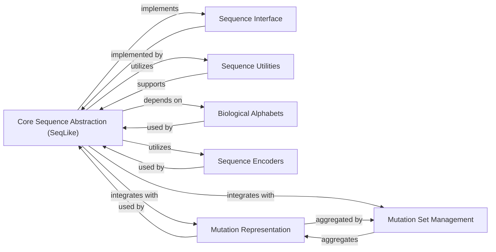

## Details

One paragraph explaining the functionality which is represented by this graph. What the main flow is and what is its purpose.

### Core Sequence Abstraction (SeqLike)
This is the primary concrete implementation of the `SequenceLike` interface. It acts as the central data carrier and hub for most sequence-related operations, providing functionalities such as initialization from various formats, type conversion (e.g., nucleotide to amino acid), reverse complementation, ungapping, slicing, and basic sequence arithmetic. It integrates capabilities from other modules to offer a comprehensive and unified API for sequence handling.

**Related Classes/Methods**:

- <a href="https://github.com/modernatx/seqlike/blob/main/seqlike/SeqLike.py#L1-L1" target="_blank" rel="noopener noreferrer">`seqlike/SeqLike.py` (1:1)</a>

### Sequence Interface
An abstract base class (`SequenceLike`) that defines the contract and common API for all sequence-like objects. It establishes a blueprint for how any sequence object should behave, ensuring consistency and extensibility across the library for future sequence types or specialized implementations.

**Related Classes/Methods**:

- <a href="https://github.com/modernatx/seqlike/blob/main/seqlike/SequenceLike.py#L1-L1" target="_blank" rel="noopener noreferrer">`seqlike/SequenceLike.py` (1:1)</a>

### Sequence Utilities
This component encapsulates a collection of essential utility functions for general sequence manipulation, validation, and construction routines. These functions provide reusable, atomic operations that underpin the functionality of the `Core Sequence Abstraction`, ensuring data integrity and efficient processing.

**Related Classes/Methods**:

- <a href="https://github.com/modernatx/seqlike/blob/main/seqlike/utils/sequences.py#L1-L1" target="_blank" rel="noopener noreferrer">`seqlike/utils/sequences.py` (1:1)</a>
- <a href="https://github.com/modernatx/seqlike/blob/main/seqlike/utils/validation.py#L1-L1" target="_blank" rel="noopener noreferrer">`seqlike/utils/validation.py` (1:1)</a>
- <a href="https://github.com/modernatx/seqlike/blob/main/seqlike/utils/constructor.py#L1-L1" target="_blank" rel="noopener noreferrer">`seqlike/utils/constructor.py` (1:1)</a>

### Biological Alphabets
Defines and manages the various biological alphabets (e.g., DNA, RNA, Protein, ambiguous codes) crucial for correctly interpreting, validating, and manipulating sequence data. It ensures that sequence operations are contextually aware of the biological type, preventing invalid operations.

**Related Classes/Methods**:

- <a href="https://github.com/modernatx/seqlike/blob/main/seqlike/alphabets.py#L1-L1" target="_blank" rel="noopener noreferrer">`seqlike/alphabets.py` (1:1)</a>

### Sequence Encoders
Handles the encoding and decoding of biological sequences, facilitating their conversion into numerical or other internal representations. This is vital for computational analysis, integration with machine learning models, or specific algorithms that require non-string sequence formats.

**Related Classes/Methods**:

- <a href="https://github.com/modernatx/seqlike/blob/main/seqlike/encoders.py#L1-L1" target="_blank" rel="noopener noreferrer">`seqlike/encoders.py` (1:1)</a>

### Mutation Representation
Defines the data structures and logic for representing individual genetic mutations, such as substitutions, insertions, and deletions. It provides a standardized and structured way to describe changes within a biological sequence.

**Related Classes/Methods**:

- <a href="https://github.com/modernatx/seqlike/blob/main/seqlike/Mutation.py#L1-L1" target="_blank" rel="noopener noreferrer">`seqlike/Mutation.py` (1:1)</a>

### Mutation Set Management
Manages collections of genetic mutations, providing functionalities to store, query, and operate on sets of mutations. This is particularly useful when dealing with multiple variations in a sequence, such as in a patient's genome or a protein variant.

**Related Classes/Methods**:

- <a href="https://github.com/modernatx/seqlike/blob/main/seqlike/MutationSet.py#L1-L1" target="_blank" rel="noopener noreferrer">`seqlike/MutationSet.py` (1:1)</a>

### [FAQ](https://github.com/CodeBoarding/GeneratedOnBoardings/tree/main?tab=readme-ov-file#faq)