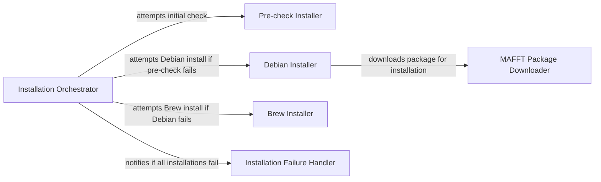

## Component Details

This graph illustrates the structure and flow of the 'Installation and Setup' subsystem within the 'seqlike' library. Its primary purpose is to manage the installation of external bioinformatics tools, specifically MAFFT, by providing OS-specific installation methods and download utilities. The central 'Installation Orchestrator' attempts various installation strategies, including pre-checks, Debian-specific installations, and Homebrew installations, and handles failures by notifying the user.

### Installation Orchestrator
This component manages the overall installation process for MAFFT, attempting different methods sequentially until one succeeds or all fail. It acts as the central control flow for the `seqlike` setup.

**Related Classes/Methods**:

- <a href="https://github.com/modernatx/seqlike/blob/master/setup.py#L27-L40" target="_blank" rel="noopener noreferrer">`seqlike.setup.InstallWrapper.run` (27:40)</a>

### Pre-check Installer
This component is responsible for checking if MAFFT is already installed on the system by running the `which mafft` command. It serves as an initial verification step before attempting new installations.

**Related Classes/Methods**:

- <a href="https://github.com/modernatx/seqlike/blob/master/setup.py#L43-L46" target="_blank" rel="noopener noreferrer">`seqlike.setup.no_install` (43:46)</a>

### Debian Installer
This component handles the installation of MAFFT on Debian-based systems. It checks for `apt-get`, updates packages, installs `ghostscript`, and then uses `dpkg` to install the downloaded MAFFT `.deb` package.

**Related Classes/Methods**:

- <a href="https://github.com/modernatx/seqlike/blob/master/setup.py#L59-L70" target="_blank" rel="noopener noreferrer">`seqlike.setup.debian_install` (59:70)</a>

### Brew Installer
This component attempts to install MAFFT using Homebrew. It first checks if `brew` is available, then updates Homebrew, and finally installs MAFFT via `brew install mafft`.

**Related Classes/Methods**:

- <a href="https://github.com/modernatx/seqlike/blob/master/setup.py#L49-L56" target="_blank" rel="noopener noreferrer">`seqlike.setup.brew_install` (49:56)</a>

### MAFFT Package Downloader
This component is responsible for downloading the MAFFT installation package (either `.deb` or `.rpm`) from the official MAFFT website. It ensures the package is available locally before installation attempts.

**Related Classes/Methods**:

- <a href="https://github.com/modernatx/seqlike/blob/master/setup.py#L89-L107" target="_blank" rel="noopener noreferrer">`seqlike.setup.download_mafft` (89:107)</a>

### Installation Failure Handler
This component issues a warning to the user when all automated installation attempts for MAFFT have failed. It provides guidance on manual installation.

**Related Classes/Methods**:

- <a href="https://github.com/modernatx/seqlike/blob/master/setup.py#L78-L86" target="_blank" rel="noopener noreferrer">`seqlike.setup.warning_install` (78:86)</a>

### [FAQ](https://github.com/CodeBoarding/GeneratedOnBoardings/tree/main?tab=readme-ov-file#faq)