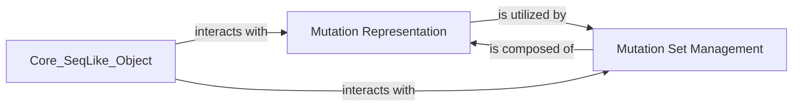

## Details

The `Mutation Management` subsystem is critical for handling sequence variations within the `seqlike` bioinformatics library. It is designed with a clear separation of concerns, leveraging Object-Oriented Design principles to represent and manage individual mutations and collections thereof.

### Mutation Representation
This component defines the foundational structure for representing individual sequence mutations. It includes the abstract base class `seqlike.Mutation.Mutation` and its specialized concrete subclasses (`seqlike.Mutation.Substitution`, `seqlike.Mutation.Insertion`, `seqlike.Mutation.Deletion`) which encapsulate different types of genetic changes (substitutions, insertions, and deletions, respectively). It also provides the `seqlike.Mutation.parse_mutation` utility, acting as a factory or facade to convert raw string representations of mutations into structured `Mutation` objects. This component is fundamental for accurately modeling and interpreting sequence variations within the bioinformatics domain.

**Related Classes/Methods**:

- <a href="https://github.com/modernatx/seqlike/blob/main/seqlike/Mutation.py" target="_blank" rel="noopener noreferrer">`seqlike.Mutation.Mutation`</a>
- <a href="https://github.com/modernatx/seqlike/blob/main/seqlike/Mutation.py" target="_blank" rel="noopener noreferrer">`seqlike.Mutation.Substitution`</a>
- <a href="https://github.com/modernatx/seqlike/blob/main/seqlike/Mutation.py" target="_blank" rel="noopener noreferrer">`seqlike.Mutation.Insertion`</a>
- <a href="https://github.com/modernatx/seqlike/blob/main/seqlike/Mutation.py" target="_blank" rel="noopener noreferrer">`seqlike.Mutation.Deletion`</a>
- <a href="https://github.com/modernatx/seqlike/blob/main/seqlike/Mutation.py" target="_blank" rel="noopener noreferrer">`seqlike.Mutation.parse_mutation`</a>

### Mutation Set Management
This component is responsible for the aggregation, storage, and manipulation of multiple `Mutation` objects. The `seqlike.MutationSet.MutationSet` class provides functionalities to combine, iterate over, and perform operations on collections of mutations, enabling efficient handling of complex mutation profiles. It acts as a container and manager for the individual mutation representations, allowing for batch processing and analysis of sequence changes.

**Related Classes/Methods**:

- <a href="https://github.com/modernatx/seqlike/blob/main/seqlike/MutationSet.py#L8-L67" target="_blank" rel="noopener noreferrer">`seqlike.MutationSet.MutationSet` (8:67)</a>

### [FAQ](https://github.com/CodeBoarding/GeneratedOnBoardings/tree/main?tab=readme-ov-file#faq)