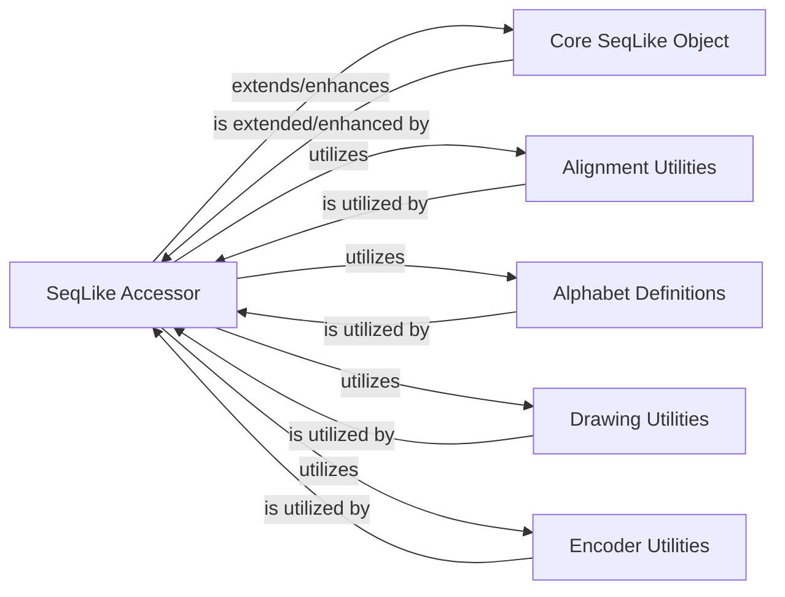

## Details

The SeqLike Accessor component is a crucial extension within the seqlike library, designed to enhance the Core Sequence Abstraction by providing advanced functionalities for handling collections of biological sequences. Its significance stems from its role in enabling ergonomic and fluent data analysis, particularly for multiple sequence alignments.

### SeqLike Accessor [[Expand]](./SeqLike_Accessor.md)
This component extends the capabilities of the Core Sequence Abstraction, specifically designed for handling collections of sequences, such as multiple sequence alignments. It provides an ergonomic interface for advanced data analysis, including calculating sequence counts, generating consensus sequences, performing one-hot encoding on collections, and integrating with visualization tools for collective sequence data. It embodies the "Extension/Plugin Architecture" and "Fluent Interface" patterns, allowing for method chaining and a more intuitive user experience when working with sequence collections.

**Related Classes/Methods**:

- <a href="https://github.com/modernatx/seqlike/blob/main/seqlike/SeqLikeAccessor.py#L34-L526" target="_blank" rel="noopener noreferrer">`seqlike.SeqLikeAccessor` (34:526)</a>

### Core SeqLike Object
The primary concrete implementation of the Core Sequence Abstraction for biological sequences, offering a consistent API for basic sequence operations.

**Related Classes/Methods**:

- <a href="https://github.com/modernatx/seqlike/blob/main/seqlike/SeqLike.py#L65-L707" target="_blank" rel="noopener noreferrer">`seqlike.SeqLike` (65:707)</a>

### Alignment Utilities
Provides utilities for performing sequence alignments and related operations, potentially integrating with external alignment tools.

**Related Classes/Methods**:

- <a href="https://github.com/modernatx/seqlike/blob/main/seqlike/alignment_utils.py#L1-L1" target="_blank" rel="noopener noreferrer">`seqlike.alignment_utils` (1:1)</a>
- <a href="https://github.com/modernatx/seqlike/blob/main/seqlike/alignment_commands.py#L1-L1" target="_blank" rel="noopener noreferrer">`seqlike.alignment_commands` (1:1)</a>

### Alphabet Definitions
Defines and manages various biological alphabets (e.g., DNA, RNA, Protein) and their validation rules.

**Related Classes/Methods**:

- <a href="https://github.com/modernatx/seqlike/blob/main/seqlike/alphabets.py#L1-L1" target="_blank" rel="noopener noreferrer">`seqlike.alphabets` (1:1)</a>

### Drawing Utilities
Provides functionalities for visualizing sequence data, such as consensus sequences or sequence logos.

**Related Classes/Methods**:

- <a href="https://github.com/modernatx/seqlike/blob/main/seqlike/draw_utils.py#L1-L1" target="_blank" rel="noopener noreferrer">`seqlike.draw_utils` (1:1)</a>

### Encoder Utilities
Offers functionalities for encoding biological sequences into numerical representations (e.g., one-hot encoding).

**Related Classes/Methods**:

- <a href="https://github.com/modernatx/seqlike/blob/main/seqlike/encoders.py#L1-L1" target="_blank" rel="noopener noreferrer">`seqlike.encoders` (1:1)</a>

### [FAQ](https://github.com/CodeBoarding/GeneratedOnBoardings/tree/main?tab=readme-ov-file#faq)