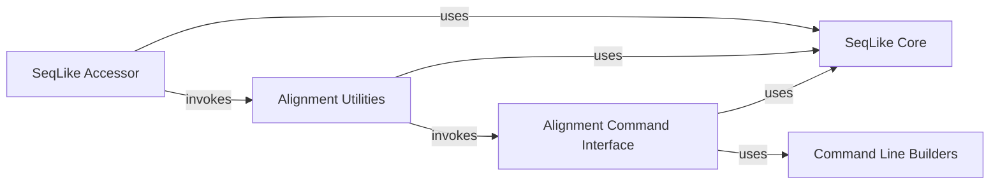

## Component Details

The Sequence Alignment subsystem in `seqlike` provides a comprehensive set of tools for performing multiple sequence alignments using external command-line aligners like MAFFT, MUSCLE, and Clustal Omega. The core `SeqLike` object serves as the fundamental data structure for handling biological sequences. The `SeqLike Accessor` acts as an entry point, allowing users to initiate alignment operations on collections of `SeqLike` objects. The `Alignment Utilities` component orchestrates the alignment process, preparing sequences, managing annotations, and invoking the specific aligner commands. The `Alignment Command Interface` provides wrappers for each external tool, handling the execution of command-line processes and parsing their outputs. Finally, the `Command Line Builders` component assists in constructing the necessary command-line arguments for these external tools. The overall flow involves the `SeqLike Accessor` calling `Alignment Utilities`, which then utilizes `Alignment Command Interface` and `Command Line Builders` to interact with external aligners, ultimately returning aligned `SeqLike` objects.

### SeqLike Core
Provides the fundamental `SeqLike` object, which is an omnibus object for various representations of biological sequences (e.g., string, Seq, SeqRecord). It handles conversions between these formats and provides basic sequence manipulation methods like translation, reverse complement, and padding.

**Related Classes/Methods**:

- <a href="https://github.com/modernatx/seqlike/blob/master/seqlike/SeqLike.py#L65-L707" target="_blank" rel="noopener noreferrer">`seqlike.seqlike.SeqLike.SeqLike` (65:707)</a>

### SeqLike Accessor
Provides an accessor method to initiate alignment operations on collections of `SeqLike` objects, typically from a pandas Series. It serves as an entry point for users to trigger alignments.

**Related Classes/Methods**:

- <a href="https://github.com/modernatx/seqlike/blob/master/seqlike/SeqLikeAccessor.py#L204-L215" target="_blank" rel="noopener noreferrer">`seqlike.seqlike.SeqLikeAccessor.SeqLikeAccessor.align` (204:215)</a>

### Alignment Utilities
Contains utility functions for sequence alignment, including the main `align` function that orchestrates the alignment process by preparing sequences, calling specific aligners, and handling letter annotations.

**Related Classes/Methods**:

- <a href="https://github.com/modernatx/seqlike/blob/master/seqlike/alignment_utils.py#L80-L117" target="_blank" rel="noopener noreferrer">`seqlike.seqlike.alignment_utils.align` (80:117)</a>
- <a href="https://github.com/modernatx/seqlike/blob/master/seqlike/alignment_utils.py#L59-L77" target="_blank" rel="noopener noreferrer">`seqlike.seqlike.alignment_utils.align_letter_annotations` (59:77)</a>
- <a href="https://github.com/modernatx/seqlike/blob/master/seqlike/alignment_utils.py#L12-L56" target="_blank" rel="noopener noreferrer">`seqlike.seqlike.alignment_utils.copy_annotations_from_unaligned` (12:56)</a>

### Alignment Command Interface
Provides specific wrapper functions for external alignment tools like MAFFT, MUSCLE, and Clustal Omega, and encapsulates the generic logic for executing these commands, handling file input/output, and processing stdout. It also includes functions for padding sequences and processing alignment outputs like distance matrices and phylogenetic trees.

**Related Classes/Methods**:

- <a href="https://github.com/modernatx/seqlike/blob/master/seqlike/alignment_commands.py#L18-L25" target="_blank" rel="noopener noreferrer">`seqlike.seqlike.alignment_commands.pad_seq_records_for_alignment` (18:25)</a>
- <a href="https://github.com/modernatx/seqlike/blob/master/seqlike/alignment_commands.py#L43-L58" target="_blank" rel="noopener noreferrer">`seqlike.seqlike.alignment_commands._generic_aligner_commandline_file` (43:58)</a>
- <a href="https://github.com/modernatx/seqlike/blob/master/seqlike/alignment_commands.py#L28-L40" target="_blank" rel="noopener noreferrer">`seqlike.seqlike.alignment_commands._generic_aligner_commandline_stdout` (28:40)</a>
- <a href="https://github.com/modernatx/seqlike/blob/master/seqlike/alignment_commands.py#L61-L80" target="_blank" rel="noopener noreferrer">`seqlike.seqlike.alignment_commands._generic_alignment` (61:80)</a>
- <a href="https://github.com/modernatx/seqlike/blob/master/seqlike/alignment_commands.py#L83-L101" target="_blank" rel="noopener noreferrer">`seqlike.seqlike.alignment_commands.mafft_alignment` (83:101)</a>
- <a href="https://github.com/modernatx/seqlike/blob/master/seqlike/alignment_commands.py#L104-L129" target="_blank" rel="noopener noreferrer">`seqlike.seqlike.alignment_commands.muscle_alignment` (104:129)</a>
- <a href="https://github.com/modernatx/seqlike/blob/master/seqlike/alignment_commands.py#L132-L149" target="_blank" rel="noopener noreferrer">`seqlike.seqlike.alignment_commands.clustal_omega_alignment` (132:149)</a>
- <a href="https://github.com/modernatx/seqlike/blob/master/seqlike/alignment_commands.py#L152-L175" target="_blank" rel="noopener noreferrer">`seqlike.seqlike.alignment_commands.clustal_omega_distance_matrix` (152:175)</a>
- <a href="https://github.com/modernatx/seqlike/blob/master/seqlike/alignment_commands.py#L178-L212" target="_blank" rel="noopener noreferrer">`seqlike.seqlike.alignment_commands.clustal_omega_alignment_tree` (178:212)</a>
- <a href="https://github.com/modernatx/seqlike/blob/master/seqlike/alignment_commands.py#L215-L232" target="_blank" rel="noopener noreferrer">`seqlike.seqlike.alignment_commands.clustalw_alignment_tree` (215:232)</a>
- <a href="https://github.com/modernatx/seqlike/blob/master/seqlike/alignment_commands.py#L195-L207" target="_blank" rel="noopener noreferrer">`seqlike.seqlike.alignment_commands.clustal_omega_alignment_tree.skbio2phylo` (195:207)</a>

### Command Line Builders
Defines classes that help construct command-line arguments for external alignment tools, such as MAFFT and MUSCLE, facilitating the interaction with these external executables.

**Related Classes/Methods**:

- <a href="https://github.com/modernatx/seqlike/blob/master/seqlike/AlignCommandline.py#L10-L10" target="_blank" rel="noopener noreferrer">`seqlike.seqlike.AlignCommandline.MafftCommandline` (10:10)</a>
- <a href="https://github.com/modernatx/seqlike/blob/master/seqlike/AlignCommandline.py#L13-L13" target="_blank" rel="noopener noreferrer">`seqlike.seqlike.AlignCommandline.MuscleCommandline` (13:13)</a>

### [FAQ](https://github.com/CodeBoarding/GeneratedOnBoardings/tree/main?tab=readme-ov-file#faq)