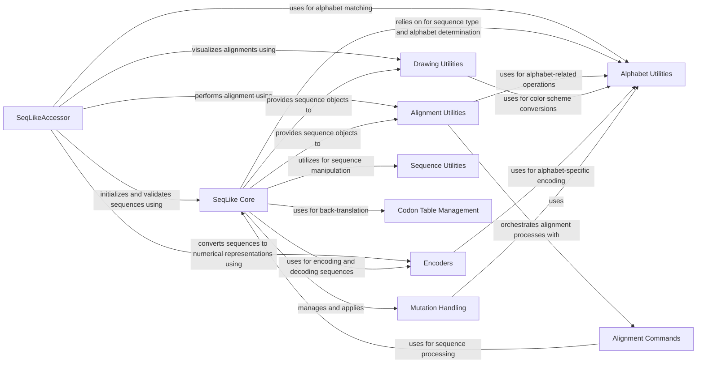

## Component Details

This component overview describes the structure, flow, and purpose of the 'Sequence Analysis, Accessors & Visualization' subsystem. The core functionality revolves around the `SeqLikeAccessor` component, which provides high-level interfaces for various sequence analyses. It interacts with `SeqLike Core` for fundamental sequence operations, `Alignment Utilities` and `Drawing Utilities` for alignment and visualization, `Encoders` for numerical representations, and `Alphabet Utilities` for alphabet-aware operations. `Mutation Handling` manages sequence mutations, while `Sequence Utilities` and `Codon Table Management` provide general sequence manipulation and back-translation capabilities. `Alignment Commands` wraps external alignment tools, orchestrated by `Alignment Utilities`. The overall flow involves `SeqLikeAccessor` initiating analyses, delegating to specialized components, and `SeqLike Core` serving as the central data provider and manipulator for sequence objects.

### SeqLikeAccessor
Provides high-level interfaces for performing various analyses on collections of `SeqLike` objects, including plotting, weblogo generation, sequence counting, and deriving consensus/degenerate sequences. It validates and matches alphabets of input sequences and leverages other components for specific functionalities like alignment, drawing, and encoding.

**Related Classes/Methods**:

- <a href="https://github.com/modernatx/seqlike/blob/master/seqlike/SeqLikeAccessor.py#L34-L526" target="_blank" rel="noopener noreferrer">`seqlike.seqlike.SeqLikeAccessor.SeqLikeAccessor` (34:526)</a>
- <a href="https://github.com/modernatx/seqlike/blob/master/seqlike/SeqLikeAccessor.py#L49-L51" target="_blank" rel="noopener noreferrer">`seqlike.seqlike.SeqLikeAccessor.SeqLikeAccessor.__init__` (49:51)</a>
- <a href="https://github.com/modernatx/seqlike/blob/master/seqlike/SeqLikeAccessor.py#L54-L70" target="_blank" rel="noopener noreferrer">`seqlike.seqlike.SeqLikeAccessor.SeqLikeAccessor._validate` (54:70)</a>
- <a href="https://github.com/modernatx/seqlike/blob/master/seqlike/SeqLikeAccessor.py#L73-L96" target="_blank" rel="noopener noreferrer">`seqlike.seqlike.SeqLikeAccessor.SeqLikeAccessor._match_alphabets` (73:96)</a>
- <a href="https://github.com/modernatx/seqlike/blob/master/seqlike/SeqLikeAccessor.py#L106-L133" target="_blank" rel="noopener noreferrer">`seqlike.seqlike.SeqLikeAccessor.SeqLikeAccessor.plot` (106:133)</a>
- <a href="https://github.com/modernatx/seqlike/blob/master/seqlike/SeqLikeAccessor.py#L135-L202" target="_blank" rel="noopener noreferrer">`seqlike.seqlike.SeqLikeAccessor.SeqLikeAccessor.weblogo` (135:202)</a>
- <a href="https://github.com/modernatx/seqlike/blob/master/seqlike/SeqLikeAccessor.py#L204-L215" target="_blank" rel="noopener noreferrer">`seqlike.seqlike.SeqLikeAccessor.SeqLikeAccessor.align` (204:215)</a>
- <a href="https://github.com/modernatx/seqlike/blob/master/seqlike/SeqLikeAccessor.py#L236-L250" target="_blank" rel="noopener noreferrer">`seqlike.seqlike.SeqLikeAccessor.SeqLikeAccessor.as_counts` (236:250)</a>
- <a href="https://github.com/modernatx/seqlike/blob/master/seqlike/SeqLikeAccessor.py#L252-L266" target="_blank" rel="noopener noreferrer">`seqlike.seqlike.SeqLikeAccessor.SeqLikeAccessor.as_counts_df` (252:266)</a>
- <a href="https://github.com/modernatx/seqlike/blob/master/seqlike/SeqLikeAccessor.py#L268-L280" target="_blank" rel="noopener noreferrer">`seqlike.seqlike.SeqLikeAccessor.SeqLikeAccessor.as_counts_by_alphabet` (268:280)</a>
- <a href="https://github.com/modernatx/seqlike/blob/master/seqlike/SeqLikeAccessor.py#L292-L312" target="_blank" rel="noopener noreferrer">`seqlike.seqlike.SeqLikeAccessor.SeqLikeAccessor._extend_ambiguous_counts` (292:312)</a>
- <a href="https://github.com/modernatx/seqlike/blob/master/seqlike/SeqLikeAccessor.py#L314-L339" target="_blank" rel="noopener noreferrer">`seqlike.seqlike.SeqLikeAccessor.SeqLikeAccessor.consensus` (314:339)</a>
- <a href="https://github.com/modernatx/seqlike/blob/master/seqlike/SeqLikeAccessor.py#L341-L385" target="_blank" rel="noopener noreferrer">`seqlike.seqlike.SeqLikeAccessor.SeqLikeAccessor.degenerate` (341:385)</a>
- <a href="https://github.com/modernatx/seqlike/blob/master/seqlike/SeqLikeAccessor.py#L410-L430" target="_blank" rel="noopener noreferrer">`seqlike.seqlike.SeqLikeAccessor.SeqLikeAccessor.slice_to_ref` (410:430)</a>
- <a href="https://github.com/modernatx/seqlike/blob/master/seqlike/SeqLikeAccessor.py#L448-L468" target="_blank" rel="noopener noreferrer">`seqlike.seqlike.SeqLikeAccessor.SeqLikeAccessor.to_onehot` (448:468)</a>
- <a href="https://github.com/modernatx/seqlike/blob/master/seqlike/SeqLikeAccessor.py#L470-L491" target="_blank" rel="noopener noreferrer">`seqlike.seqlike.SeqLikeAccessor.SeqLikeAccessor.to_index` (470:491)</a>
- <a href="https://github.com/modernatx/seqlike/blob/master/seqlike/SeqLikeAccessor.py#L397-L398" target="_blank" rel="noopener noreferrer">`seqlike.seqlike.SeqLikeAccessor.SeqLikeAccessor.max_length` (397:398)</a>
- <a href="https://github.com/modernatx/seqlike/blob/master/seqlike/SeqLikeAccessor.py#L400-L408" target="_blank" rel="noopener noreferrer">`seqlike.seqlike.SeqLikeAccessor.SeqLikeAccessor.get_seq_by_id` (400:408)</a>
- <a href="https://github.com/modernatx/seqlike/blob/master/seqlike/SeqLikeAccessor.py#L217-L234" target="_blank" rel="noopener noreferrer">`seqlike.seqlike.SeqLikeAccessor.SeqLikeAccessor.as_alignment` (217:234)</a>
- `seqlike.seqlike.SeqLikeAccessor.SeqLikeAccessor.weblogo.highlight_consensus` (180:189)

### SeqLike Core
The SeqLike Core component is fundamental for representing and manipulating biological sequences. It handles sequence initialization, type and alphabet determination, translation, reverse complementation, and basic sequence operations like slicing and concatenation. It also manages internal representations (amino acid and nucleotide records) and encoding.

**Related Classes/Methods**:

- <a href="https://github.com/modernatx/seqlike/blob/master/seqlike/SeqLike.py#L65-L707" target="_blank" rel="noopener noreferrer">`seqlike.seqlike.SeqLike.SeqLike` (65:707)</a>
- <a href="https://github.com/modernatx/seqlike/blob/master/seqlike/SeqLike.py#L122-L156" target="_blank" rel="noopener noreferrer">`seqlike.seqlike.SeqLike.SeqLike.__init__` (122:156)</a>
- <a href="https://github.com/modernatx/seqlike/blob/master/seqlike/SeqLike.py#L40-L41" target="_blank" rel="noopener noreferrer">`seqlike.seqlike.SeqLike.SeqLike.__str__` (40:41)</a>
- <a href="https://github.com/modernatx/seqlike/blob/master/seqlike/SeqLike.py#L686-L700" target="_blank" rel="noopener noreferrer">`seqlike.seqlike.SeqLike.SeqLike.__deepcopy__` (686:700)</a>
- <a href="https://github.com/modernatx/seqlike/blob/master/seqlike/SeqLike.py#L162-L183" target="_blank" rel="noopener noreferrer">`seqlike.seqlike.SeqLike.SeqLike.nt` (162:183)</a>
- <a href="https://github.com/modernatx/seqlike/blob/master/seqlike/SeqLike.py#L185-L221" target="_blank" rel="noopener noreferrer">`seqlike.seqlike.SeqLike.SeqLike.aa` (185:221)</a>
- <a href="https://github.com/modernatx/seqlike/blob/master/seqlike/SeqLike.py#L259-L292" target="_blank" rel="noopener noreferrer">`seqlike.seqlike.SeqLike.SeqLike.translate` (259:292)</a>
- <a href="https://github.com/modernatx/seqlike/blob/master/seqlike/SeqLike.py#L294-L342" target="_blank" rel="noopener noreferrer">`seqlike.seqlike.SeqLike.SeqLike.back_translate` (294:342)</a>
- <a href="https://github.com/modernatx/seqlike/blob/master/seqlike/SeqLike.py#L344-L378" target="_blank" rel="noopener noreferrer">`seqlike.seqlike.SeqLike.SeqLike.reverse_complement` (344:378)</a>
- <a href="https://github.com/modernatx/seqlike/blob/master/seqlike/SeqLike.py#L381-L395" target="_blank" rel="noopener noreferrer">`seqlike.seqlike.SeqLike.SeqLike.ungap` (381:395)</a>
- <a href="https://github.com/modernatx/seqlike/blob/master/seqlike/SeqLike.py#L397-L436" target="_blank" rel="noopener noreferrer">`seqlike.seqlike.SeqLike.SeqLike.pad_to` (397:436)</a>
- <a href="https://github.com/modernatx/seqlike/blob/master/seqlike/SeqLike.py#L438-L462" target="_blank" rel="noopener noreferrer">`seqlike.seqlike.SeqLike.SeqLike.seq_num_to_idx` (438:462)</a>
- <a href="https://github.com/modernatx/seqlike/blob/master/seqlike/SeqLike.py#L480-L488" target="_blank" rel="noopener noreferrer">`seqlike.seqlike.SeqLike.SeqLike.slice` (480:488)</a>
- <a href="https://github.com/modernatx/seqlike/blob/master/seqlike/SeqLike.py#L545-L626" target="_blank" rel="noopener noreferrer">`seqlike.seqlike.SeqLike.SeqLike.__getitem__` (545:626)</a>
- <a href="https://github.com/modernatx/seqlike/blob/master/seqlike/SeqLike.py#L628-L647" target="_blank" rel="noopener noreferrer">`seqlike.seqlike.SeqLike.SeqLike.__add__` (628:647)</a>
- <a href="https://github.com/modernatx/seqlike/blob/master/seqlike/SeqLike.py#L649-L681" target="_blank" rel="noopener noreferrer">`seqlike.seqlike.SeqLike.SeqLike.__radd__` (649:681)</a>
- <a href="https://github.com/modernatx/seqlike/blob/master/seqlike/SeqLike.py#L683-L684" target="_blank" rel="noopener noreferrer">`seqlike.seqlike.SeqLike.SeqLike.__sub__` (683:684)</a>
- <a href="https://github.com/modernatx/seqlike/blob/master/seqlike/SeqLike.py#L702-L707" target="_blank" rel="noopener noreferrer">`seqlike.seqlike.SeqLike.SeqLike.scan` (702:707)</a>
- <a href="https://github.com/modernatx/seqlike/blob/master/seqlike/SeqLike.py#L710-L725" target="_blank" rel="noopener noreferrer">`seqlike.seqlike.SeqLike.ntSeqLike` (710:725)</a>
- <a href="https://github.com/modernatx/seqlike/blob/master/seqlike/SeqLike.py#L728-L743" target="_blank" rel="noopener noreferrer">`seqlike.seqlike.SeqLike.aaSeqLike` (728:743)</a>
- <a href="https://github.com/modernatx/seqlike/blob/master/seqlike/SeqLike.py#L747-L778" target="_blank" rel="noopener noreferrer">`seqlike.seqlike.SeqLike._construct_seqlike` (747:778)</a>
- <a href="https://github.com/modernatx/seqlike/blob/master/seqlike/SeqLike.py#L892-L958" target="_blank" rel="noopener noreferrer">`seqlike.seqlike.SeqLike.swap_representation` (892:958)</a>
- <a href="https://github.com/modernatx/seqlike/blob/master/seqlike/SeqLike.py#L962-L970" target="_blank" rel="noopener noreferrer">`seqlike.seqlike.SeqLike.determine__type_and_alphabet` (962:970)</a>
- <a href="https://github.com/modernatx/seqlike/blob/master/seqlike/SeqLike.py#L1001-L1017" target="_blank" rel="noopener noreferrer">`seqlike.seqlike.SeqLike.determine_alphabet` (1001:1017)</a>
- <a href="https://github.com/modernatx/seqlike/blob/master/seqlike/SeqLike.py#L1021-L1028" target="_blank" rel="noopener noreferrer">`seqlike.seqlike.SeqLike.record_from` (1021:1028)</a>
- <a href="https://github.com/modernatx/seqlike/blob/master/seqlike/SeqLike.py#L1099-L1124" target="_blank" rel="noopener noreferrer">`seqlike.seqlike.SeqLike._add` (1099:1124)</a>
- <a href="https://github.com/modernatx/seqlike/blob/master/seqlike/SeqLike.py#L1197-L1219" target="_blank" rel="noopener noreferrer">`seqlike.seqlike.SeqLike._sub` (1197:1219)</a>

### Alignment Utilities
The Alignment Utilities component provides functionalities for sequence alignment, including aligning sequences while preserving letter annotations and handling different alignment algorithms. It acts as an orchestrator for various alignment commands.

**Related Classes/Methods**:

- <a href="https://github.com/modernatx/seqlike/blob/master/seqlike/alignment_utils.py#L59-L77" target="_blank" rel="noopener noreferrer">`seqlike.seqlike.alignment_utils.align_letter_annotations` (59:77)</a>
- <a href="https://github.com/modernatx/seqlike/blob/master/seqlike/alignment_utils.py#L80-L117" target="_blank" rel="noopener noreferrer">`seqlike.seqlike.alignment_utils.align` (80:117)</a>

### Drawing Utilities
The Drawing Utilities component is responsible for visualizing sequence alignments. It handles color scheme conversions, applies matching color schemes, and draws the alignment as an image, allowing for customization of labels and grouping. It also uses alphabet information for coloring.

**Related Classes/Methods**:

- <a href="https://github.com/modernatx/seqlike/blob/master/seqlike/draw_utils.py#L107-L125" target="_blank" rel="noopener noreferrer">`seqlike.seqlike.draw_utils.convert_colorscheme_to_color_map` (107:125)</a>
- <a href="https://github.com/modernatx/seqlike/blob/master/seqlike/draw_utils.py#L128-L146" target="_blank" rel="noopener noreferrer">`seqlike.seqlike.draw_utils.apply_matching_colorscheme` (128:146)</a>
- <a href="https://github.com/modernatx/seqlike/blob/master/seqlike/draw_utils.py#L174-L247" target="_blank" rel="noopener noreferrer">`seqlike.seqlike.draw_utils.draw_alignment` (174:247)</a>
- <a href="https://github.com/modernatx/seqlike/blob/master/seqlike/draw_utils.py#L250-L415" target="_blank" rel="noopener noreferrer">`seqlike.seqlike.draw_utils.view_alignment` (250:415)</a>
- <a href="https://github.com/modernatx/seqlike/blob/master/seqlike/draw_utils.py#L84-L104" target="_blank" rel="noopener noreferrer">`seqlike.seqlike.draw_utils.convert_weblogo_color` (84:104)</a>
- <a href="https://github.com/modernatx/seqlike/blob/master/seqlike/draw_utils.py#L149-L171" target="_blank" rel="noopener noreferrer">`seqlike.seqlike.draw_utils.find_font` (149:171)</a>
- <a href="https://github.com/modernatx/seqlike/blob/master/seqlike/draw_utils.py#L295-L306" target="_blank" rel="noopener noreferrer">`seqlike.seqlike.draw_utils.view_alignment.get_colors_for_matching` (295:306)</a>
- <a href="https://github.com/modernatx/seqlike/blob/master/seqlike/draw_utils.py#L282-L293" target="_blank" rel="noopener noreferrer">`seqlike.seqlike.draw_utils.view_alignment.get_colors` (282:293)</a>
- <a href="https://github.com/modernatx/seqlike/blob/master/seqlike/draw_utils.py#L34-L44" target="_blank" rel="noopener noreferrer">`seqlike.seqlike.draw_utils.aa_chemistry_simple` (34:44)</a>

### Encoders
The Encoders component provides methods for converting biological sequences into different numerical representations, such as one-hot encoding and index encoding, which are crucial for machine learning applications and quantitative analysis of sequences. It relies on alphabet definitions.

**Related Classes/Methods**:

- <a href="https://github.com/modernatx/seqlike/blob/master/seqlike/encoders.py#L18-L28" target="_blank" rel="noopener noreferrer">`seqlike.seqlike.encoders.onehot_encoder_from_alphabet` (18:28)</a>
- <a href="https://github.com/modernatx/seqlike/blob/master/seqlike/encoders.py#L58-L67" target="_blank" rel="noopener noreferrer">`seqlike.seqlike.encoders.array_to_string` (58:67)</a>
- <a href="https://github.com/modernatx/seqlike/blob/master/seqlike/encoders.py#L5-L15" target="_blank" rel="noopener noreferrer">`seqlike.seqlike.encoders.index_encoder_from_alphabet` (5:15)</a>

### Alphabet Utilities
The Alphabet Utilities component provides functions to determine the type of biological sequence (e.g., Nucleotide or Amino Acid) based on predefined alphabets. It helps in validating and categorizing sequences, and is used by various other components for alphabet-aware operations.

**Related Classes/Methods**:

- <a href="https://github.com/modernatx/seqlike/blob/master/seqlike/alphabets.py#L45-L47" target="_blank" rel="noopener noreferrer">`seqlike.seqlike.alphabets.is_NT` (45:47)</a>
- <a href="https://github.com/modernatx/seqlike/blob/master/seqlike/alphabets.py#L50-L51" target="_blank" rel="noopener noreferrer">`seqlike.seqlike.alphabets.is_AA` (50:51)</a>
- <a href="https://github.com/modernatx/seqlike/blob/master/seqlike/alphabets.py#L54-L55" target="_blank" rel="noopener noreferrer">`seqlike.seqlike.alphabets.is_STANDARD_AA` (54:55)</a>
- <a href="https://github.com/modernatx/seqlike/blob/master/seqlike/alphabets.py#L58-L59" target="_blank" rel="noopener noreferrer">`seqlike.seqlike.alphabets.is_STANDARD_NT` (58:59)</a>

### Mutation Handling
The Mutation Handling component deals with the representation and manipulation of sequence mutations. It provides classes for individual mutations and sets of mutations, including parsing mutation strings and performing operations like addition and subtraction of mutations. It relies on alphabet definitions for mutation validation.

**Related Classes/Methods**:

- <a href="https://github.com/modernatx/seqlike/blob/master/seqlike/Mutation.py#L10-L100" target="_blank" rel="noopener noreferrer">`seqlike.seqlike.Mutation.Mutation` (10:100)</a>
- <a href="https://github.com/modernatx/seqlike/blob/master/seqlike/Mutation.py#L15-L20" target="_blank" rel="noopener noreferrer">`seqlike.seqlike.Mutation.Mutation.__init__` (15:20)</a>
- <a href="https://github.com/modernatx/seqlike/blob/master/seqlike/Mutation.py#L23-L24" target="_blank" rel="noopener noreferrer">`seqlike.seqlike.Mutation.Mutation.__repr__` (23:24)</a>
- <a href="https://github.com/modernatx/seqlike/blob/master/seqlike/Mutation.py#L27-L30" target="_blank" rel="noopener noreferrer">`seqlike.seqlike.Mutation.Mutation.__sub__` (27:30)</a>
- <a href="https://github.com/modernatx/seqlike/blob/master/seqlike/Mutation.py#L33-L34" target="_blank" rel="noopener noreferrer">`seqlike.seqlike.Mutation.Mutation.__deepcopy__` (33:34)</a>
- <a href="https://github.com/modernatx/seqlike/blob/master/seqlike/Mutation.py#L37-L38" target="_blank" rel="noopener noreferrer">`seqlike.seqlike.Mutation.Mutation.__str__` (37:38)</a>
- <a href="https://github.com/modernatx/seqlike/blob/master/seqlike/Mutation.py#L41-L44" target="_blank" rel="noopener noreferrer">`seqlike.seqlike.Mutation.Mutation.__add__` (41:44)</a>
- <a href="https://github.com/modernatx/seqlike/blob/master/seqlike/Mutation.py#L103-L113" target="_blank" rel="noopener noreferrer">`seqlike.seqlike.Mutation.parse_mutation` (103:113)</a>
- <a href="https://github.com/modernatx/seqlike/blob/master/seqlike/Mutation.py#L116-L116" target="_blank" rel="noopener noreferrer">`seqlike.seqlike.Mutation.Substitution` (116:116)</a>
- <a href="https://github.com/modernatx/seqlike/blob/master/seqlike/MutationSet.py#L8-L67" target="_blank" rel="noopener noreferrer">`seqlike.seqlike.MutationSet.MutationSet` (8:67)</a>
- <a href="https://github.com/modernatx/seqlike/blob/master/seqlike/MutationSet.py#L15-L31" target="_blank" rel="noopener noreferrer">`seqlike.seqlike.MutationSet.MutationSet.__init__` (15:31)</a>
- <a href="https://github.com/modernatx/seqlike/blob/master/seqlike/MutationSet.py#L44-L47" target="_blank" rel="noopener noreferrer">`seqlike.seqlike.MutationSet.MutationSet.__add__` (44:47)</a>
- <a href="https://github.com/modernatx/seqlike/blob/master/seqlike/MutationSet.py#L61-L67" target="_blank" rel="noopener noreferrer">`seqlike.seqlike.MutationSet.MutationSet.to_str` (61:67)</a>
- <a href="https://github.com/modernatx/seqlike/blob/master/seqlike/MutationSet.py#L71-L87" target="_blank" rel="noopener noreferrer">`seqlike.seqlike.MutationSet._add` (71:87)</a>

### Sequence Utilities
The Sequence Utilities component offers general utility functions for sequence manipulation, such as removing gaps from sequences and slicing sequence records. These utilities support various operations on `SeqLike` objects.

**Related Classes/Methods**:

- <a href="https://github.com/modernatx/seqlike/blob/master/seqlike/utils/sequences.py#L23-L227" target="_blank" rel="noopener noreferrer">`seqlike.seqlike.utils.sequences.ungap` (23:227)</a>
- <a href="https://github.com/modernatx/seqlike/blob/master/seqlike/utils/sequences.py#L230-L258" target="_blank" rel="noopener noreferrer">`seqlike.seqlike.utils.sequences.slice_seqrec` (230:258)</a>

### Codon Table Management
The Codon Table Management component provides functionality to convert codon tables into callable backtranslation maps. This is essential for translating amino acid sequences back into nucleotide sequences, supporting both deterministic and probabilistic approaches.

**Related Classes/Methods**:

- <a href="https://github.com/modernatx/seqlike/blob/master/seqlike/codon_tables.py#L10-L20" target="_blank" rel="noopener noreferrer">`seqlike.seqlike.codon_tables.codon_table_to_codon_map` (10:20)</a>

### Alignment Commands
The Alignment Commands component encapsulates various multiple sequence alignment algorithms (e.g., MAFFT, MUSCLE, Clustal Omega, ClustalW). It provides wrappers for executing these external alignment tools and handling their outputs, including generating distance matrices and alignment trees.

**Related Classes/Methods**:

- <a href="https://github.com/modernatx/seqlike/blob/master/seqlike/alignment_commands.py#L18-L25" target="_blank" rel="noopener noreferrer">`seqlike.seqlike.alignment_commands.pad_seq_records_for_alignment` (18:25)</a>
- <a href="https://github.com/modernatx/seqlike/blob/master/seqlike/alignment_commands.py#L43-L58" target="_blank" rel="noopener noreferrer">`seqlike.seqlike.alignment_commands._generic_aligner_commandline_file` (43:58)</a>
- <a href="https://github.com/modernatx/seqlike/blob/master/seqlike/alignment_commands.py#L61-L80" target="_blank" rel="noopener noreferrer">`seqlike.seqlike.alignment_commands._generic_alignment` (61:80)</a>
- <a href="https://github.com/modernatx/seqlike/blob/master/seqlike/alignment_commands.py#L83-L101" target="_blank" rel="noopener noreferrer">`seqlike.seqlike.alignment_commands.mafft_alignment` (83:101)</a>
- <a href="https://github.com/modernatx/seqlike/blob/master/seqlike/alignment_commands.py#L104-L129" target="_blank" rel="noopener noreferrer">`seqlike.seqlike.alignment_commands.muscle_alignment` (104:129)</a>
- <a href="https://github.com/modernatx/seqlike/blob/master/seqlike/alignment_commands.py#L132-L149" target="_blank" rel="noopener noreferrer">`seqlike.seqlike.alignment_commands.clustal_omega_alignment` (132:149)</a>
- <a href="https://github.com/modernatx/seqlike/blob/master/seqlike/alignment_commands.py#L152-L175" target="_blank" rel="noopener noreferrer">`seqlike.seqlike.alignment_commands.clustal_omega_distance_matrix` (152:175)</a>
- <a href="https://github.com/modernatx/seqlike/blob/master/seqlike/alignment_commands.py#L178-L212" target="_blank" rel="noopener noreferrer">`seqlike.seqlike.alignment_commands.clustal_omega_alignment_tree` (178:212)</a>
- <a href="https://github.com/modernatx/seqlike/blob/master/seqlike/alignment_commands.py#L215-L232" target="_blank" rel="noopener noreferrer">`seqlike.seqlike.alignment_commands.clustalw_alignment_tree` (215:232)</a>

### [FAQ](https://github.com/CodeBoarding/GeneratedOnBoardings/tree/main?tab=readme-ov-file#faq)