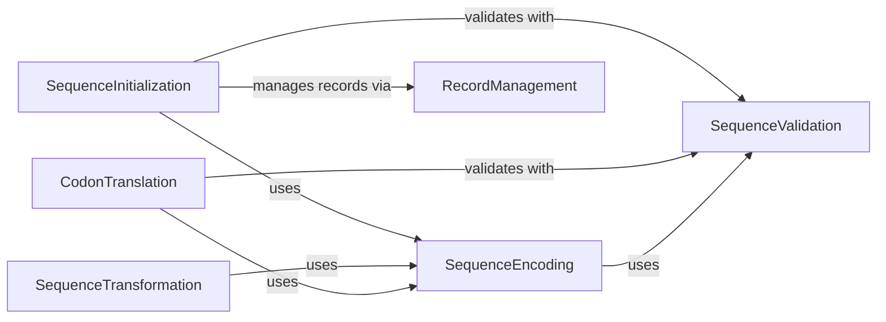

## Component Details

The Sequence Data Transformation component in `seqlike` is responsible for the comprehensive management of biological sequence data, encompassing their initial creation, numerical encoding, validation against defined alphabets, and various transformations including codon-based translation. It provides a robust framework for handling diverse sequence types (DNA, RNA, protein) and their interconversions, ensuring data integrity and facilitating downstream computational analyses.

### SequenceInitialization
Responsible for the initial creation and setup of SeqLike and SequenceLike objects, handling various input types, and establishing internal representations. It leverages encoding and validation functionalities during initialization.

**Related Classes/Methods**:

- <a href="https://github.com/modernatx/seqlike/blob/master/seqlike/SeqLike.py#L122-L156" target="_blank" rel="noopener noreferrer">`seqlike.seqlike.SeqLike.SeqLike.__init__` (122:156)</a>
- <a href="https://github.com/modernatx/seqlike/blob/master/seqlike/SeqLike.py#L747-L778" target="_blank" rel="noopener noreferrer">`seqlike.seqlike.SeqLike._construct_seqlike` (747:778)</a>
- <a href="https://github.com/modernatx/seqlike/blob/master/seqlike/SequenceLike.py#L10-L14" target="_blank" rel="noopener noreferrer">`seqlike.seqlike.SequenceLike.SequenceLike.__init__` (10:14)</a>

### SequenceEncoding
Provides core functionalities for encoding biological sequences into numerical representations (one-hot, index) and decoding numerical arrays back into string or symbol representations. It relies on defined alphabets for accurate encoding/decoding.

**Related Classes/Methods**:

- <a href="https://github.com/modernatx/seqlike/blob/master/seqlike/encoders.py#L18-L28" target="_blank" rel="noopener noreferrer">`seqlike.seqlike.encoders.onehot_encoder_from_alphabet` (18:28)</a>
- <a href="https://github.com/modernatx/seqlike/blob/master/seqlike/encoders.py#L5-L15" target="_blank" rel="noopener noreferrer">`seqlike.seqlike.encoders.index_encoder_from_alphabet` (5:15)</a>
- <a href="https://github.com/modernatx/seqlike/blob/master/seqlike/encoders.py#L58-L67" target="_blank" rel="noopener noreferrer">`seqlike.seqlike.encoders.array_to_string` (58:67)</a>
- <a href="https://github.com/modernatx/seqlike/blob/master/seqlike/encoders.py#L31-L55" target="_blank" rel="noopener noreferrer">`seqlike.seqlike.encoders.array_to_symbols` (31:55)</a>

### SequenceValidation
Ensures the integrity and correctness of biological sequences by validating their types (DNA, RNA, Amino Acid) and adherence to standard or custom alphabets. It provides utility functions for checking sequence characteristics.

**Related Classes/Methods**:

- <a href="https://github.com/modernatx/seqlike/blob/master/seqlike/alphabets.py#L45-L47" target="_blank" rel="noopener noreferrer">`seqlike.seqlike.alphabets.is_NT` (45:47)</a>
- <a href="https://github.com/modernatx/seqlike/blob/master/seqlike/alphabets.py#L50-L51" target="_blank" rel="noopener noreferrer">`seqlike.seqlike.alphabets.is_AA` (50:51)</a>
- <a href="https://github.com/modernatx/seqlike/blob/master/seqlike/alphabets.py#L54-L55" target="_blank" rel="noopener noreferrer">`seqlike.seqlike.alphabets.is_STANDARD_AA` (54:55)</a>
- <a href="https://github.com/modernatx/seqlike/blob/master/seqlike/alphabets.py#L58-L59" target="_blank" rel="noopener noreferrer">`seqlike.seqlike.alphabets.is_STANDARD_NT` (58:59)</a>
- <a href="https://github.com/modernatx/seqlike/blob/master/seqlike/alphabets.py#L62-L85" target="_blank" rel="noopener noreferrer">`seqlike.seqlike.alphabets._is_seqtype` (62:85)</a>
- <a href="https://github.com/modernatx/seqlike/blob/master/seqlike/SeqLike.py#L1001-L1017" target="_blank" rel="noopener noreferrer">`seqlike.seqlike.SeqLike.determine_alphabet` (1001:1017)</a>
- <a href="https://github.com/modernatx/seqlike/blob/master/seqlike/SeqLike.py#L962-L970" target="_blank" rel="noopener noreferrer">`seqlike.seqlike.SeqLike.determine__type_and_alphabet` (962:970)</a>
- <a href="https://github.com/modernatx/seqlike/blob/master/seqlike/SeqLike.py#L847-L864" target="_blank" rel="noopener noreferrer">`seqlike.seqlike.SeqLike.validate_sequence` (847:864)</a>

### SequenceTransformation
Offers methods to transform sequence data, including converting sequence representations (e.g., to one-hot encoding), calculating letter counts, and swapping internal data structures. It often utilizes encoding functionalities.

**Related Classes/Methods**:

- <a href="https://github.com/modernatx/seqlike/blob/master/seqlike/SeqLikeAccessor.py#L236-L250" target="_blank" rel="noopener noreferrer">`seqlike.seqlike.SeqLikeAccessor.SeqLikeAccessor.as_counts` (236:250)</a>
- <a href="https://github.com/modernatx/seqlike/blob/master/seqlike/SeqLikeAccessor.py#L448-L468" target="_blank" rel="noopener noreferrer">`seqlike.seqlike.SeqLikeAccessor.SeqLikeAccessor.to_onehot` (448:468)</a>
- <a href="https://github.com/modernatx/seqlike/blob/master/seqlike/SeqLike.py#L892-L958" target="_blank" rel="noopener noreferrer">`seqlike.seqlike.SeqLike.swap_representation` (892:958)</a>

### CodonTranslation
Manages the processes of translating nucleotide sequences into amino acid sequences and back-translating amino acid sequences into nucleotide sequences, utilizing codon tables and ensuring the validity of codon maps.

**Related Classes/Methods**:

- <a href="https://github.com/modernatx/seqlike/blob/master/seqlike/SeqLike.py#L294-L342" target="_blank" rel="noopener noreferrer">`seqlike.seqlike.SeqLike.back_translate` (294:342)</a>
- <a href="https://github.com/modernatx/seqlike/blob/master/seqlike/SeqLike.py#L828-L843" target="_blank" rel="noopener noreferrer">`seqlike.seqlike.SeqLike.validate_codon_map` (828:843)</a>
- <a href="https://github.com/modernatx/seqlike/blob/master/seqlike/codon_tables.py#L130-L178" target="_blank" rel="noopener noreferrer">`seqlike.seqlike.codon_tables.codon_table_to_codon_map` (130:178)</a>

### RecordManagement
Responsible for creating and managing sequence records, including deep copying of sequence data and adding sequence numbers to annotations, facilitating the handling of sequence metadata.

**Related Classes/Methods**:

- <a href="https://github.com/modernatx/seqlike/blob/master/seqlike/SeqLike.py#L1021-L1028" target="_blank" rel="noopener noreferrer">`seqlike.seqlike.SeqLike.record_from` (1021:1028)</a>
- <a href="https://github.com/modernatx/seqlike/blob/master/seqlike/utils/sequences.py#L6-L20" target="_blank" rel="noopener noreferrer">`seqlike.seqlike.utils.sequences.add_seqnums_to_letter_annotations` (6:20)</a>

### [FAQ](https://github.com/CodeBoarding/GeneratedOnBoardings/tree/main?tab=readme-ov-file#faq)