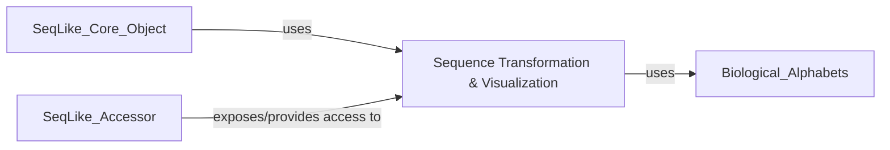

## Details

Component Overview: Sequence Transformation & Visualization

Description: This component is crucial for preparing biological sequences for computational analysis and for visually interpreting sequence data. It encompasses two primary functionalities:
1. Sequence Transformation (Encoding): Handled by `seqlike/encoders.py`, this part focuses on converting biological sequences into various numerical or symbolic representations, such as arrays or one-hot encodings. This transformation is essential for integrating sequence data with machine learning models, statistical analyses, or other numerical pipelines.
2. Sequence Visualization: Managed by `seqlike/draw_utils.py`, this part provides utilities for generating graphical representations of sequence data. This includes creating WebLogos to illustrate sequence conservation and rendering sequence alignments with custom color schemes, thereby significantly enhancing data interpretability and facilitating biological insights.

Source Files:
* `seqlike/encoders.py`
* `seqlike/draw_utils.py`

Why these components are fundamental:

* `seqlike/encoders.py` (Sequence Encoders): This module is fundamental because it acts as the bridge between raw, character-based biological sequences and the numerical formats required by modern computational tools, particularly machine learning algorithms. In bioinformatics, many advanced analyses (e.g., predicting protein function, identifying regulatory elements) rely on numerical representations of sequences. Without robust and flexible encoding capabilities, the `seqlike` library would be severely limited in its ability to support such data-driven applications, making it a cornerstone for computational integration.

* `seqlike/draw_utils.py` (Sequence Visualizers): This module is fundamental for the interpretability and usability of the `seqlike` library. Biological sequence data is inherently complex, and visual aids are indispensable for identifying patterns, conserved regions, mutations, and overall sequence characteristics. By providing functions to generate informative visualizations like WebLogos (which summarize sequence conservation at each position) and richly colored alignments, this module empowers users to quickly grasp complex biological information, validate hypotheses, and present findings effectively. It transforms raw data into actionable insights, which is critical in bioinformatics.

### Sequence Transformation & Visualization [[Expand]](./Sequence_Transformation_Visualization.md)
This component is crucial for preparing biological sequences for computational analysis and for visually interpreting sequence data. It encompasses two primary functionalities: 1. Sequence Transformation (Encoding): Handled by `seqlike/encoders.py`, this part focuses on converting biological sequences into various numerical or symbolic representations, such as arrays or one-hot encodings. This transformation is essential for integrating sequence data with machine learning models, statistical analyses, or other numerical pipelines. 2. Sequence Visualization: Managed by `seqlike/draw_utils.py`, this part provides utilities for generating graphical representations of sequence data. This includes creating WebLogos to illustrate sequence conservation and rendering sequence alignments with custom color schemes, thereby significantly enhancing data interpretability and facilitating biological insights.

**Related Classes/Methods**:

- <a href="https://github.com/modernatx/seqlike/blob/main/seqlike/encoders.py#L1-L1" target="_blank" rel="noopener noreferrer">`seqlike.encoders` (1:1)</a>
- <a href="https://github.com/modernatx/seqlike/blob/main/seqlike/draw_utils.py#L1-L1" target="_blank" rel="noopener noreferrer">`seqlike.draw_utils` (1:1)</a>

### [FAQ](https://github.com/CodeBoarding/GeneratedOnBoardings/tree/main?tab=readme-ov-file#faq)