```mermaid
graph LR
    Installation_and_Setup["Installation and Setup"]
    Core_Sequence_Representation_Utilities["Core Sequence Representation & Utilities"]
    Sequence_Data_Transformation["Sequence Data Transformation"]
    Sequence_Analysis_Accessors_Visualization["Sequence Analysis, Accessors & Visualization"]
    Sequence_Alignment["Sequence Alignment"]
    Installation_and_Setup -- "installs dependencies for" --> Sequence_Alignment
    Core_Sequence_Representation_Utilities -- "uses" --> Sequence_Data_Transformation
    Core_Sequence_Representation_Utilities -- "provides data to" --> Sequence_Analysis_Accessors_Visualization
    Sequence_Data_Transformation -- "provides services to" --> Core_Sequence_Representation_Utilities
    Sequence_Data_Transformation -- "provides services to" --> Sequence_Analysis_Accessors_Visualization
    Sequence_Data_Transformation -- "provides services to" --> Sequence_Alignment
    Sequence_Analysis_Accessors_Visualization -- "operates on" --> Core_Sequence_Representation_Utilities
    Sequence_Analysis_Accessors_Visualization -- "initiates" --> Sequence_Alignment
    Sequence_Analysis_Accessors_Visualization -- "uses" --> Sequence_Data_Transformation
    Sequence_Alignment -- "requires" --> Installation_and_Setup
    Sequence_Alignment -- "processes" --> Core_Sequence_Representation_Utilities
    Sequence_Alignment -- "uses" --> Sequence_Data_Transformation
    click Installation_and_Setup href "https://github.com/CodeBoarding/GeneratedOnBoardings/blob/main//seqlike/Installation and Setup.md" "Details"
    click Core_Sequence_Representation_Utilities href "https://github.com/CodeBoarding/GeneratedOnBoardings/blob/main//seqlike/Core Sequence Representation & Utilities.md" "Details"
    click Sequence_Data_Transformation href "https://github.com/CodeBoarding/GeneratedOnBoardings/blob/main//seqlike/Sequence Data Transformation.md" "Details"
    click Sequence_Analysis_Accessors_Visualization href "https://github.com/CodeBoarding/GeneratedOnBoardings/blob/main//seqlike/Sequence Analysis, Accessors & Visualization.md" "Details"
    click Sequence_Alignment href "https://github.com/CodeBoarding/GeneratedOnBoardings/blob/main//seqlike/Sequence Alignment.md" "Details"
```

## Component Details

The `seqlike` library provides a comprehensive framework for handling and analyzing biological sequences. Its core functionality revolves around the `SeqLike` object, which represents individual sequences and supports various manipulations like translation, reverse complementation, and mutation tracking. The library integrates with external bioinformatics tools for multiple sequence alignment and offers robust capabilities for sequence data transformation (encoding, alphabet management, codon tables). High-level accessors enable complex analyses, including plotting, weblogo generation, and consensus sequence derivation, making it a versatile tool for bioinformatics workflows.

### Installation and Setup
Manages the installation of external bioinformatics tools like MAFFT, ensuring the 'seqlike' library has necessary dependencies. It provides OS-specific installation methods and download utilities.

**Related Classes/Methods**:

- <a href="https://github.com/modernatx/seqlike/blob/master/setup.py#L27-L40" target="_blank" rel="noopener noreferrer">`seqlike.setup.InstallWrapper.run` (27:40)</a>
- <a href="https://github.com/modernatx/seqlike/blob/master/setup.py#L43-L46" target="_blank" rel="noopener noreferrer">`seqlike.setup.no_install` (43:46)</a>
- <a href="https://github.com/modernatx/seqlike/blob/master/setup.py#L59-L70" target="_blank" rel="noopener noreferrer">`seqlike.setup.debian_install` (59:70)</a>
- <a href="https://github.com/modernatx/seqlike/blob/master/setup.py#L49-L56" target="_blank" rel="noopener noreferrer">`seqlike.setup.brew_install` (49:56)</a>
- <a href="https://github.com/modernatx/seqlike/blob/master/setup.py#L78-L86" target="_blank" rel="noopener noreferrer">`seqlike.setup.warning_install` (78:86)</a>
- <a href="https://github.com/modernatx/seqlike/blob/master/setup.py#L89-L107" target="_blank" rel="noopener noreferrer">`seqlike.setup.download_mafft` (89:107)</a>

### Core Sequence Representation & Utilities
Defines the fundamental `SeqLike` and `SequenceLike` objects, serving as the central data model for biological sequences. It provides methods for basic sequence manipulation (translation, reverse complement, ungapping, slicing) and incorporates general utility functions for sequence record processing and validation.

**Related Classes/Methods**:

- <a href="https://github.com/modernatx/seqlike/blob/master/seqlike/SeqLike.py#L65-L707" target="_blank" rel="noopener noreferrer">`seqlike.seqlike.SeqLike.SeqLike` (65:707)</a>
- <a href="https://github.com/modernatx/seqlike/blob/master/seqlike/SeqLike.py#L122-L156" target="_blank" rel="noopener noreferrer">`seqlike.seqlike.SeqLike.SeqLike.__init__` (122:156)</a>
- <a href="https://github.com/modernatx/seqlike/blob/master/seqlike/SeqLike.py#L162-L183" target="_blank" rel="noopener noreferrer">`seqlike.seqlike.SeqLike.SeqLike.nt` (162:183)</a>
- <a href="https://github.com/modernatx/seqlike/blob/master/seqlike/SeqLike.py#L185-L221" target="_blank" rel="noopener noreferrer">`seqlike.seqlike.SeqLike.SeqLike.aa` (185:221)</a>
- <a href="https://github.com/modernatx/seqlike/blob/master/seqlike/SeqLike.py#L259-L292" target="_blank" rel="noopener noreferrer">`seqlike.seqlike.SeqLike.SeqLike.translate` (259:292)</a>
- <a href="https://github.com/modernatx/seqlike/blob/master/seqlike/SeqLike.py#L294-L342" target="_blank" rel="noopener noreferrer">`seqlike.seqlike.SeqLike.SeqLike.back_translate` (294:342)</a>
- <a href="https://github.com/modernatx/seqlike/blob/master/seqlike/SeqLike.py#L344-L378" target="_blank" rel="noopener noreferrer">`seqlike.seqlike.SeqLike.SeqLike.reverse_complement` (344:378)</a>
- <a href="https://github.com/modernatx/seqlike/blob/master/seqlike/SeqLike.py#L381-L395" target="_blank" rel="noopener noreferrer">`seqlike.seqlike.SeqLike.SeqLike.ungap` (381:395)</a>
- <a href="https://github.com/modernatx/seqlike/blob/master/seqlike/SeqLike.py#L397-L436" target="_blank" rel="noopener noreferrer">`seqlike.seqlike.SeqLike.SeqLike.pad_to` (397:436)</a>
- <a href="https://github.com/modernatx/seqlike/blob/master/seqlike/SeqLike.py#L480-L488" target="_blank" rel="noopener noreferrer">`seqlike.seqlike.SeqLike.SeqLike.slice` (480:488)</a>
- <a href="https://github.com/modernatx/seqlike/blob/master/seqlike/SeqLike.py#L545-L626" target="_blank" rel="noopener noreferrer">`seqlike.seqlike.SeqLike.SeqLike.__getitem__` (545:626)</a>
- <a href="https://github.com/modernatx/seqlike/blob/master/seqlike/SeqLike.py#L628-L647" target="_blank" rel="noopener noreferrer">`seqlike.seqlike.SeqLike.SeqLike.__add__` (628:647)</a>
- <a href="https://github.com/modernatx/seqlike/blob/master/seqlike/SeqLike.py#L649-L681" target="_blank" rel="noopener noreferrer">`seqlike.seqlike.SeqLike.SeqLike.__radd__` (649:681)</a>
- <a href="https://github.com/modernatx/seqlike/blob/master/seqlike/SeqLike.py#L683-L684" target="_blank" rel="noopener noreferrer">`seqlike.seqlike.SeqLike.SeqLike.__sub__` (683:684)</a>
- <a href="https://github.com/modernatx/seqlike/blob/master/seqlike/SeqLike.py#L686-L700" target="_blank" rel="noopener noreferrer">`seqlike.seqlike.SeqLike.SeqLike.__deepcopy__` (686:700)</a>
- <a href="https://github.com/modernatx/seqlike/blob/master/seqlike/SeqLike.py#L702-L707" target="_blank" rel="noopener noreferrer">`seqlike.seqlike.SeqLike.SeqLike.scan` (702:707)</a>
- <a href="https://github.com/modernatx/seqlike/blob/master/seqlike/SeqLike.py#L747-L778" target="_blank" rel="noopener noreferrer">`seqlike.seqlike.SeqLike._construct_seqlike` (747:778)</a>
- <a href="https://github.com/modernatx/seqlike/blob/master/seqlike/SeqLike.py#L892-L958" target="_blank" rel="noopener noreferrer">`seqlike.seqlike.SeqLike.swap_representation` (892:958)</a>
- <a href="https://github.com/modernatx/seqlike/blob/master/seqlike/SeqLike.py#L962-L970" target="_blank" rel="noopener noreferrer">`seqlike.seqlike.SeqLike.determine__type_and_alphabet` (962:970)</a>
- <a href="https://github.com/modernatx/seqlike/blob/master/seqlike/SeqLike.py#L1001-L1017" target="_blank" rel="noopener noreferrer">`seqlike.seqlike.SeqLike.determine_alphabet` (1001:1017)</a>
- <a href="https://github.com/modernatx/seqlike/blob/master/seqlike/SeqLike.py#L1021-L1028" target="_blank" rel="noopener noreferrer">`seqlike.seqlike.SeqLike.record_from` (1021:1028)</a>
- <a href="https://github.com/modernatx/seqlike/blob/master/seqlike/SeqLike.py#L1099-L1124" target="_blank" rel="noopener noreferrer">`seqlike.seqlike.SeqLike._add` (1099:1124)</a>
- <a href="https://github.com/modernatx/seqlike/blob/master/seqlike/SeqLike.py#L1197-L1219" target="_blank" rel="noopener noreferrer">`seqlike.seqlike.SeqLike._sub` (1197:1219)</a>
- `seqlike.seqlike.SequenceLike.SequenceLike` (full file reference)
- `seqlike.seqlike.SequenceLike.SequenceLike.__init__` (full file reference)
- `seqlike.seqlike.SequenceLike.SequenceLike.__str__` (full file reference)
- `seqlike.seqlike.SequenceLike.SequenceLike.__deepcopy__` (full file reference)
- <a href="https://github.com/modernatx/seqlike/blob/master/seqlike/utils/sequences.py#L23-L227" target="_blank" rel="noopener noreferrer">`seqlike.seqlike.utils.sequences.ungap` (23:227)</a>
- <a href="https://github.com/modernatx/seqlike/blob/master/seqlike/utils/sequences.py#L230-L258" target="_blank" rel="noopener noreferrer">`seqlike.seqlike.utils.sequences.slice_seqrec` (230:258)</a>
- <a href="https://github.com/modernatx/seqlike/blob/master/seqlike/utils/sequences.py#L231-L232" target="_blank" rel="noopener noreferrer">`seqlike.seqlike.utils.sequences.slice_seqrec.slice_str` (231:232)</a>
- <a href="https://github.com/modernatx/seqlike/blob/master/seqlike/utils/sequences.py#L6-L20" target="_blank" rel="noopener noreferrer">`seqlike.seqlike.utils.sequences.add_seqnums_to_letter_annotations` (6:20)</a>
- `seqlike.seqlike.utils.validation` (full file reference)

### Sequence Data Transformation
Manages the encoding and decoding of biological sequences into numerical representations (one-hot, index), defines and validates sequence alphabets (DNA, RNA, protein), and handles codon table conversions for translation and back-translation.

**Related Classes/Methods**:

- <a href="https://github.com/modernatx/seqlike/blob/master/seqlike/encoders.py#L18-L28" target="_blank" rel="noopener noreferrer">`seqlike.seqlike.encoders.onehot_encoder_from_alphabet` (18:28)</a>
- <a href="https://github.com/modernatx/seqlike/blob/master/seqlike/encoders.py#L5-L15" target="_blank" rel="noopener noreferrer">`seqlike.seqlike.encoders.index_encoder_from_alphabet` (5:15)</a>
- <a href="https://github.com/modernatx/seqlike/blob/master/seqlike/encoders.py#L58-L67" target="_blank" rel="noopener noreferrer">`seqlike.seqlike.encoders.array_to_string` (58:67)</a>
- <a href="https://github.com/modernatx/seqlike/blob/master/seqlike/encoders.py#L31-L55" target="_blank" rel="noopener noreferrer">`seqlike.seqlike.encoders.array_to_symbols` (31:55)</a>
- <a href="https://github.com/modernatx/seqlike/blob/master/seqlike/alphabets.py#L45-L47" target="_blank" rel="noopener noreferrer">`seqlike.seqlike.alphabets.is_NT` (45:47)</a>
- <a href="https://github.com/modernatx/seqlike/blob/master/seqlike/alphabets.py#L50-L51" target="_blank" rel="noopener noreferrer">`seqlike.seqlike.alphabets.is_AA` (50:51)</a>
- <a href="https://github.com/modernatx/seqlike/blob/master/seqlike/alphabets.py#L54-L55" target="_blank" rel="noopener noreferrer">`seqlike.seqlike.alphabets.is_STANDARD_AA` (54:55)</a>
- <a href="https://github.com/modernatx/seqlike/blob/master/seqlike/alphabets.py#L58-L59" target="_blank" rel="noopener noreferrer">`seqlike.seqlike.alphabets.is_STANDARD_NT` (58:59)</a>
- <a href="https://github.com/modernatx/seqlike/blob/master/seqlike/alphabets.py#L62-L85" target="_blank" rel="noopener noreferrer">`seqlike.seqlike.alphabets._is_seqtype` (62:85)</a>
- `seqlike.seqlike.codon_tables.codon_table_to_codon_map` (full file reference)
- `seqlike.seqlike.codon_tables.validate_codon_map` (full file reference)

### Sequence Analysis, Accessors & Visualization
Provides high-level interfaces for performing various analyses on collections of `SeqLike` objects, including plotting, weblogo generation, sequence counting, and deriving consensus/degenerate sequences. It also defines classes and methods for representing and manipulating sequence mutations, and handles the drawing and visualization of sequence alignments and related data.

**Related Classes/Methods**:

- <a href="https://github.com/modernatx/seqlike/blob/master/seqlike/SeqLikeAccessor.py#L34-L526" target="_blank" rel="noopener noreferrer">`seqlike.seqlike.SeqLikeAccessor.SeqLikeAccessor` (34:526)</a>
- <a href="https://github.com/modernatx/seqlike/blob/master/seqlike/SeqLikeAccessor.py#L49-L51" target="_blank" rel="noopener noreferrer">`seqlike.seqlike.SeqLikeAccessor.SeqLikeAccessor.__init__` (49:51)</a>
- <a href="https://github.com/modernatx/seqlike/blob/master/seqlike/SeqLikeAccessor.py#L54-L70" target="_blank" rel="noopener noreferrer">`seqlike.seqlike.SeqLikeAccessor.SeqLikeAccessor._validate` (54:70)</a>
- <a href="https://github.com/modernatx/seqlike/blob/master/seqlike/SeqLikeAccessor.py#L73-L96" target="_blank" rel="noopener noreferrer">`seqlike.seqlike.SeqLikeAccessor.SeqLikeAccessor._match_alphabets` (73:96)</a>
- <a href="https://github.com/modernatx/seqlike/blob/master/seqlike/SeqLikeAccessor.py#L106-L133" target="_blank" rel="noopener noreferrer">`seqlike.seqlike.SeqLikeAccessor.SeqLikeAccessor.plot` (106:133)</a>
- <a href="https://github.com/modernatx/seqlike/blob/master/seqlike/SeqLikeAccessor.py#L135-L202" target="_blank" rel="noopener noreferrer">`seqlike.seqlike.SeqLikeAccessor.SeqLikeAccessor.weblogo` (135:202)</a>
- <a href="https://github.com/modernatx/seqlike/blob/master/seqlike/SeqLikeAccessor.py#L204-L215" target="_blank" rel="noopener noreferrer">`seqlike.seqlike.SeqLikeAccessor.SeqLikeAccessor.align` (204:215)</a>
- <a href="https://github.com/modernatx/seqlike/blob/master/seqlike/SeqLikeAccessor.py#L236-L250" target="_blank" rel="noopener noreferrer">`seqlike.seqlike.SeqLikeAccessor.SeqLikeAccessor.as_counts` (236:250)</a>
- <a href="https://github.com/modernatx/seqlike/blob/master/seqlike/SeqLikeAccessor.py#L252-L266" target="_blank" rel="noopener noreferrer">`seqlike.seqlike.SeqLikeAccessor.SeqLikeAccessor.as_counts_df` (252:266)</a>
- <a href="https://github.com/modernatx/seqlike/blob/master/seqlike/SeqLikeAccessor.py#L268-L280" target="_blank" rel="noopener noreferrer">`seqlike.seqlike.SeqLikeAccessor.SeqLikeAccessor.as_counts_by_alphabet` (268:280)</a>
- <a href="https://github.com/modernatx/seqlike/blob/master/seqlike/SeqLikeAccessor.py#L292-L312" target="_blank" rel="noopener noreferrer">`seqlike.seqlike.SeqLikeAccessor.SeqLikeAccessor._extend_ambiguous_counts` (292:312)</a>
- <a href="https://github.com/modernatx/seqlike/blob/master/seqlike/SeqLikeAccessor.py#L314-L339" target="_blank" rel="noopener noreferrer">`seqlike.seqlike.SeqLikeAccessor.SeqLikeAccessor.consensus` (314:339)</a>
- <a href="https://github.com/modernatx/seqlike/blob/master/seqlike/SeqLikeAccessor.py#L341-L385" target="_blank" rel="noopener noreferrer">`seqlike.seqlike.SeqLikeAccessor.SeqLikeAccessor.degenerate` (341:385)</a>
- <a href="https://github.com/modernatx/seqlike/blob/master/seqlike/SeqLikeAccessor.py#L410-L430" target="_blank" rel="noopener noreferrer">`seqlike.seqlike.SeqLikeAccessor.SeqLikeAccessor.slice_to_ref` (410:430)</a>
- <a href="https://github.com/modernatx/seqlike/blob/master/seqlike/SeqLikeAccessor.py#L448-L468" target="_blank" rel="noopener noreferrer">`seqlike.seqlike.SeqLikeAccessor.SeqLikeAccessor.to_onehot` (448:468)</a>
- <a href="https://github.com/modernatx/seqlike/blob/master/seqlike/SeqLikeAccessor.py#L470-L491" target="_blank" rel="noopener noreferrer">`seqlike.seqlike.SeqLikeAccessor.SeqLikeAccessor.to_index` (470:491)</a>
- <a href="https://github.com/modernatx/seqlike/blob/master/seqlike/SeqLikeAccessor.py#L397-L398" target="_blank" rel="noopener noreferrer">`seqlike.seqlike.SeqLikeAccessor.SeqLikeAccessor.max_length` (397:398)</a>
- <a href="https://github.com/modernatx/seqlike/blob/master/seqlike/SeqLikeAccessor.py#L400-L408" target="_blank" rel="noopener noreferrer">`seqlike.seqlike.SeqLikeAccessor.SeqLikeAccessor.get_seq_by_id` (400:408)</a>
- <a href="https://github.com/modernatx/seqlike/blob/master/seqlike/SeqLikeAccessor.py#L217-L234" target="_blank" rel="noopener noreferrer">`seqlike.seqlike.SeqLikeAccessor.SeqLikeAccessor.as_alignment` (217:234)</a>
- `seqlike.seqlike.SeqLikeAccessor.SeqLikeAccessor.weblogo.highlight_consensus` (full file reference)
- `seqlike.seqlike.Mutation.Mutation` (full file reference)
- `seqlike.seqlike.Mutation.Mutation.__init__` (full file reference)
- `seqlike.seqlike.Mutation.Mutation.__repr__` (full file reference)
- `seqlike.seqlike.Mutation.Mutation.__sub__` (full file reference)
- `seqlike.seqlike.Mutation.Mutation.__deepcopy__` (full file reference)
- `seqlike.seqlike.Mutation.Mutation.__str__` (full file reference)
- `seqlike.seqlike.Mutation.Mutation.__add__` (full file reference)
- `seqlike.seqlike.Mutation.parse_mutation` (full file reference)
- `seqlike.seqlike.Mutation.Substitution` (full file reference)
- <a href="https://github.com/modernatx/seqlike/blob/master/seqlike/MutationSet.py#L8-L67" target="_blank" rel="noopener noreferrer">`seqlike.seqlike.MutationSet.MutationSet` (8:67)</a>
- <a href="https://github.com/modernatx/seqlike/blob/master/seqlike/MutationSet.py#L15-L31" target="_blank" rel="noopener noreferrer">`seqlike.seqlike.MutationSet.MutationSet.__init__` (15:31)</a>
- <a href="https://github.com/modernatx/seqlike/blob/master/seqlike/MutationSet.py#L44-L47" target="_blank" rel="noopener noreferrer">`seqlike.seqlike.MutationSet.MutationSet.__add__` (44:47)</a>
- <a href="https://github.com/modernatx/seqlike/blob/master/seqlike/MutationSet.py#L61-L67" target="_blank" rel="noopener noreferrer">`seqlike.seqlike.MutationSet.MutationSet.to_str` (61:67)</a>
- <a href="https://github.com/modernatx/seqlike/blob/master/seqlike/MutationSet.py#L71-L87" target="_blank" rel="noopener noreferrer">`seqlike.seqlike.MutationSet._add` (71:87)</a>
- <a href="https://github.com/modernatx/seqlike/blob/master/seqlike/draw_utils.py#L107-L125" target="_blank" rel="noopener noreferrer">`seqlike.seqlike.draw_utils.convert_colorscheme_to_color_map` (107:125)</a>
- <a href="https://github.com/modernatx/seqlike/blob/master/seqlike/draw_utils.py#L128-L146" target="_blank" rel="noopener noreferrer">`seqlike.seqlike.draw_utils.apply_matching_colorscheme` (128:146)</a>
- <a href="https://github.com/modernatx/seqlike/blob/master/seqlike/draw_utils.py#L174-L247" target="_blank" rel="noopener noreferrer">`seqlike.seqlike.draw_utils.draw_alignment` (174:247)</a>
- <a href="https://github.com/modernatx/seqlike/blob/master/seqlike/draw_utils.py#L250-L415" target="_blank" rel="noopener noreferrer">`seqlike.seqlike.draw_utils.view_alignment` (250:415)</a>
- <a href="https://github.com/modernatx/seqlike/blob/master/seqlike/draw_utils.py#L84-L104" target="_blank" rel="noopener noreferrer">`seqlike.seqlike.draw_utils.convert_weblogo_color` (84:104)</a>
- <a href="https://github.com/modernatx/seqlike/blob/master/seqlike/draw_utils.py#L149-L171" target="_blank" rel="noopener noreferrer">`seqlike.seqlike.draw_utils.find_font` (149:171)</a>
- <a href="https://github.com/modernatx/seqlike/blob/master/seqlike/draw_utils.py#L295-L306" target="_blank" rel="noopener noreferrer">`seqlike.seqlike.draw_utils.view_alignment.get_colors_for_matching` (295:306)</a>
- <a href="https://github.com/modernatx/seqlike/blob/master/seqlike/draw_utils.py#L282-L293" target="_blank" rel="noopener noreferrer">`seqlike.seqlike.draw_utils.view_alignment.get_colors` (282:293)</a>
- <a href="https://github.com/modernatx/seqlike/blob/master/seqlike/draw_utils.py#L34-L44" target="_blank" rel="noopener noreferrer">`seqlike.seqlike.draw_utils.aa_chemistry_simple` (34:44)</a>

### Sequence Alignment
Provides utilities and command-line interfaces for performing multiple sequence alignments using external tools (MAFFT, MUSCLE, Clustal Omega). It handles sequence preparation, execution of aligners, and processing of alignment outputs (distance matrices, phylogenetic trees).

**Related Classes/Methods**:

- <a href="https://github.com/modernatx/seqlike/blob/master/seqlike/alignment_utils.py#L80-L117" target="_blank" rel="noopener noreferrer">`seqlike.seqlike.alignment_utils.align` (80:117)</a>
- <a href="https://github.com/modernatx/seqlike/blob/master/seqlike/alignment_utils.py#L59-L77" target="_blank" rel="noopener noreferrer">`seqlike.seqlike.alignment_utils.align_letter_annotations` (59:77)</a>
- <a href="https://github.com/modernatx/seqlike/blob/master/seqlike/alignment_utils.py#L12-L56" target="_blank" rel="noopener noreferrer">`seqlike.seqlike.alignment_utils.copy_annotations_from_unaligned` (12:56)</a>
- <a href="https://github.com/modernatx/seqlike/blob/master/seqlike/alignment_commands.py#L18-L25" target="_blank" rel="noopener noreferrer">`seqlike.seqlike.alignment_commands.pad_seq_records_for_alignment` (18:25)</a>
- <a href="https://github.com/modernatx/seqlike/blob/master/seqlike/alignment_commands.py#L43-L58" target="_blank" rel="noopener noreferrer">`seqlike.seqlike.alignment_commands._generic_aligner_commandline_file` (43:58)</a>
- <a href="https://github.com/modernatx/seqlike/blob/master/seqlike/alignment_commands.py#L61-L80" target="_blank" rel="noopener noreferrer">`seqlike.seqlike.alignment_commands._generic_alignment` (61:80)</a>
- <a href="https://github.com/modernatx/seqlike/blob/master/seqlike/alignment_commands.py#L83-L101" target="_blank" rel="noopener noreferrer">`seqlike.seqlike.alignment_commands.mafft_alignment` (83:101)</a>
- <a href="https://github.com/modernatx/seqlike/blob/master/seqlike/alignment_commands.py#L104-L129" target="_blank" rel="noopener noreferrer">`seqlike.seqlike.alignment_commands.muscle_alignment` (104:129)</a>
- <a href="https://github.com/modernatx/seqlike/blob/master/seqlike/alignment_commands.py#L132-L149" target="_blank" rel="noopener noreferrer">`seqlike.seqlike.alignment_commands.clustal_omega_alignment` (132:149)</a>
- <a href="https://github.com/modernatx/seqlike/blob/master/seqlike/alignment_commands.py#L152-L175" target="_blank" rel="noopener noreferrer">`seqlike.seqlike.alignment_commands.clustal_omega_distance_matrix` (152:175)</a>
- <a href="https://github.com/modernatx/seqlike/blob/master/seqlike/alignment_commands.py#L178-L212" target="_blank" rel="noopener noreferrer">`seqlike.seqlike.alignment_commands.clustal_omega_alignment_tree` (178:212)</a>
- <a href="https://github.com/modernatx/seqlike/blob/master/seqlike/alignment_commands.py#L215-L232" target="_blank" rel="noopener noreferrer">`seqlike.seqlike.alignment_commands.clustalw_alignment_tree` (215:232)</a>
- <a href="https://github.com/modernatx/seqlike/blob/master/seqlike/alignment_commands.py#L28-L40" target="_blank" rel="noopener noreferrer">`seqlike.seqlike.alignment_commands._generic_aligner_commandline_stdout` (28:40)</a>
- <a href="https://github.com/modernatx/seqlike/blob/master/seqlike/alignment_commands.py#L195-L207" target="_blank" rel="noopener noreferrer">`seqlike.seqlike.alignment_commands.clustal_omega_alignment_tree.skbio2phylo` (195:207)</a>
- `seqlike.seqlike.AlignCommandline.MafftCommandline` (full file reference)
- `seqlike.seqlike.AlignCommandline.MuscleCommandline` (full file reference)

### [FAQ](https://github.com/CodeBoarding/GeneratedOnBoardings/tree/main?tab=readme-ov-file#faq)