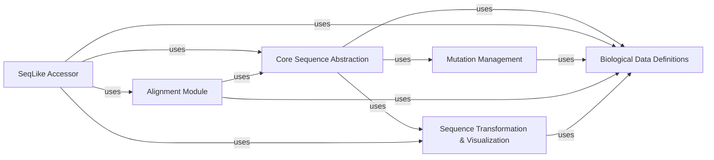

## Details

The `seqlike` library is structured around a core sequence abstraction, extended by specialized modules for advanced analysis, external tool integration, and data transformation. The architecture emphasizes modularity, clear separation of concerns, and a centralized approach to biological data definitions.

### Core Sequence Abstraction [[Expand]](./Core_Sequence_Abstraction.md)
This central component defines the fundamental representation and manipulation of individual biological sequences (DNA, RNA, Protein). It provides core functionalities such as initialization from various formats, type conversion (e.g., nucleotide to amino acid), reverse complementation, ungapping, slicing, and basic sequence arithmetic. It also encapsulates general sequence manipulation and validation routines, serving as the primary data carrier and foundational operation hub within the library.

**Related Classes/Methods**:

- <a href="https://github.com/modernatx/seqlike/blob/main/seqlike/SeqLike.py#L65-L707" target="_blank" rel="noopener noreferrer">`seqlike.SeqLike` (65:707)</a>
- <a href="https://github.com/modernatx/seqlike/blob/main/seqlike/SequenceLike.py#L1-L1" target="_blank" rel="noopener noreferrer">`seqlike.SequenceLike` (1:1)</a>
- <a href="https://github.com/modernatx/seqlike/blob/main/seqlike/utils/sequences.py#L1-L1" target="_blank" rel="noopener noreferrer">`seqlike.utils.sequences` (1:1)</a>
- <a href="https://github.com/modernatx/seqlike/blob/main/seqlike/utils/validation.py#L1-L1" target="_blank" rel="noopener noreferrer">`seqlike.utils.validation` (1:1)</a>
- <a href="https://github.com/modernatx/seqlike/blob/main/seqlike/utils/constructor.py#L1-L1" target="_blank" rel="noopener noreferrer">`seqlike.utils.constructor` (1:1)</a>

### SeqLike Accessor [[Expand]](./SeqLike_Accessor.md)
This component extends the capabilities of the `Core Sequence Abstraction`, specifically designed for handling collections of sequences, such as multiple sequence alignments. It provides an ergonomic interface for advanced data analysis, including calculating sequence counts, generating consensus sequences, performing one-hot encoding on collections, and integrating with visualization tools for collective sequence data.

**Related Classes/Methods**:

- <a href="https://github.com/modernatx/seqlike/blob/main/seqlike/SeqLikeAccessor.py#L34-L526" target="_blank" rel="noopener noreferrer">`seqlike.SeqLikeAccessor` (34:526)</a>

### Biological Data Definitions [[Expand]](./Biological_Data_Definitions.md)
This component centralizes the definition and validation of various biological alphabets (e.g., DNA, RNA, Protein, ambiguous characters) and manages genetic code tables. It provides essential utilities to check sequence types, ensure data consistency with respect to expected biological character sets, and facilitate accurate translation between nucleotide and amino acid sequences.

**Related Classes/Methods**:

- <a href="https://github.com/modernatx/seqlike/blob/main/seqlike/alphabets.py#L1-L1" target="_blank" rel="noopener noreferrer">`seqlike.alphabets` (1:1)</a>
- <a href="https://github.com/modernatx/seqlike/blob/main/seqlike/codon_tables.py#L1-L1" target="_blank" rel="noopener noreferrer">`seqlike.codon_tables` (1:1)</a>

### Mutation Management [[Expand]](./Mutation_Management.md)
This component is responsible for the representation, parsing, and management of individual sequence mutations (`Mutation`) and collections of mutations (`MutationSet`). It provides functionalities crucial for tracking, applying, and analyzing sequence changes within biological contexts.

**Related Classes/Methods**:

- <a href="https://github.com/modernatx/seqlike/blob/main/seqlike/Mutation.py#L1-L1" target="_blank" rel="noopener noreferrer">`seqlike.Mutation` (1:1)</a>
- <a href="https://github.com/modernatx/seqlike/blob/main/seqlike/MutationSet.py#L8-L67" target="_blank" rel="noopener noreferrer">`seqlike.MutationSet` (8:67)</a>

### Alignment Module [[Expand]](./Alignment_Module.md)
This module provides a unified interface for integrating and executing external multiple sequence alignment tools (e.g., MAFFT, MUSCLE). It abstracts away command-line complexities and offers helper functions for post-processing aligned sequences, including tasks like aligning letter annotations and ensuring consistency across alignments.

**Related Classes/Methods**:

- <a href="https://github.com/modernatx/seqlike/blob/main/seqlike/alignment_commands.py#L1-L1" target="_blank" rel="noopener noreferrer">`seqlike.alignment_commands` (1:1)</a>
- <a href="https://github.com/modernatx/seqlike/blob/main/seqlike/AlignCommandline.py#L1-L1" target="_blank" rel="noopener noreferrer">`seqlike.AlignCommandline` (1:1)</a>
- <a href="https://github.com/modernatx/seqlike/blob/main/seqlike/alignment_utils.py#L1-L1" target="_blank" rel="noopener noreferrer">`seqlike.alignment_utils` (1:1)</a>

### Sequence Transformation & Visualization [[Expand]](./Sequence_Transformation_Visualization.md)
This component handles the conversion of biological sequences into various numerical or symbolic representations, such as arrays or one-hot encodings, which is essential for integration with machine learning models or numerical analysis pipelines. Additionally, it provides utilities for visualizing sequence data, including generating graphical representations like WebLogos and rendering alignments with custom color schemes to enhance data interpretability.

**Related Classes/Methods**:

- <a href="https://github.com/modernatx/seqlike/blob/main/seqlike/encoders.py#L1-L1" target="_blank" rel="noopener noreferrer">`seqlike.encoders` (1:1)</a>
- <a href="https://github.com/modernatx/seqlike/blob/main/seqlike/draw_utils.py#L1-L1" target="_blank" rel="noopener noreferrer">`seqlike.draw_utils` (1:1)</a>

### [FAQ](https://github.com/CodeBoarding/GeneratedOnBoardings/tree/main?tab=readme-ov-file#faq)