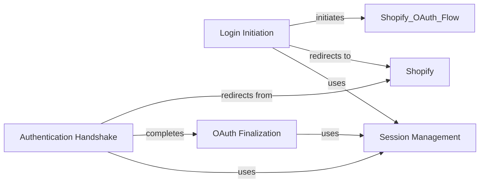

## Component Details

The Authentication Management component handles the entire authentication lifecycle for users accessing the Shopify application. It begins with the login view, which initiates the OAuth flow by redirecting the user to Shopify for authorization. Upon redirection back, the authenticate view verifies the request's authenticity. Finally, the finalize view completes the OAuth process by exchanging the authorization code for an access token, storing shop details, and setting up the user session. Session management is crucial throughout this process, maintaining the user's logged-in state.

### Login Initiation
The Login Initiation component is responsible for starting the Shopify OAuth flow. It constructs the authorization URL with the necessary parameters and redirects the user to Shopify's authorization page. This component sets the stage for the entire authentication process.
- **Related Classes/Methods**: `shopify_django_app.shopify_app.views:login`

### Authentication Handshake
The Authentication Handshake component handles the initial communication with Shopify after the user is redirected back from Shopify. It verifies the authenticity of the request using the hmac parameter and prepares for the finalization step.
- **Related Classes/Methods**: `shopify_django_app.shopify_app.views:authenticate`

### OAuth Finalization
The OAuth Finalization component completes the OAuth process. It exchanges the authorization code received from Shopify for a permanent access token. It also stores the shop details in the database and performs any necessary setup tasks, such as installing webhooks or creating recurring charges.
- **Related Classes/Methods**: `shopify_django_app.shopify_app.views:finalize`

### Session Management
The Session Management component is responsible for maintaining the user's logged-in state throughout the authentication process. It sets session variables to store the shop's access token and other relevant information, ensuring that the user remains authenticated during their interaction with the application.
- **Related Classes/Methods**: `shopify_django_app.shopify_app.views:login`, `shopify_django_app.shopify_app.views:authenticate`, `shopify_django_app.shopify_app.views:finalize`
