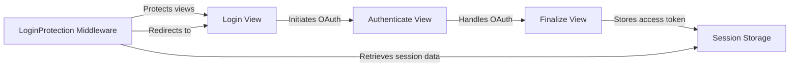

## Component Details

The authentication subsystem ensures that only authenticated users can access protected parts of the application. It consists of middleware that checks for valid Shopify sessions, views that handle the login and authentication process with Shopify's OAuth, and session storage to persist user authentication data. The flow starts with a user accessing a protected view, which triggers the LoginProtection middleware. If the user is not authenticated, they are redirected to the Login View. The Login View initiates the OAuth flow, redirecting the user to Shopify for authorization via the Authenticate View. Upon successful authorization, Shopify redirects the user back to the Finalize View, which exchanges the authorization code for an access token and stores it in Session Storage. Subsequent requests from the user are then authenticated using the stored session data.

### LoginProtection Middleware
This middleware intercepts incoming requests and checks if the user has a valid Shopify session. If a session is not found, the middleware redirects the user to the login page to initiate the authentication process, ensuring that only authenticated users can access protected views.
- **Related Classes/Methods**: `shopify_django_app.shopify_app.middleware.LoginProtection`

### Login View
The Login View is responsible for handling initial login requests. It presents a login form to the user or initiates the OAuth flow by redirecting the user to Shopify for authorization. This view serves as the entry point for the authentication process.
- **Related Classes/Methods**: `shopify_django_app.shopify_app.views:login`

### Authenticate View
The Authenticate View handles the OAuth authentication process with Shopify. It redirects the user to Shopify's authorization page, where the user grants permission to the application. Upon successful authorization, Shopify redirects the user back to the application with an authorization code.
- **Related Classes/Methods**: `shopify_django_app.shopify_app.views:authenticate`

### Finalize View
The Finalize View completes the OAuth authentication process. It exchanges the authorization code received from Shopify for an access token. This access token is then stored in the session storage, establishing a valid Shopify session for the user.
- **Related Classes/Methods**: `shopify_django_app.shopify_app.views:finalize`

### Session Storage
The Session Storage component is responsible for persisting user session data, including the Shopify access token. It provides methods for storing and retrieving session data, ensuring that the user's authentication status is maintained across multiple requests.
- **Related Classes/Methods**: `shopify_django_app.shopify_app.session_storage`
